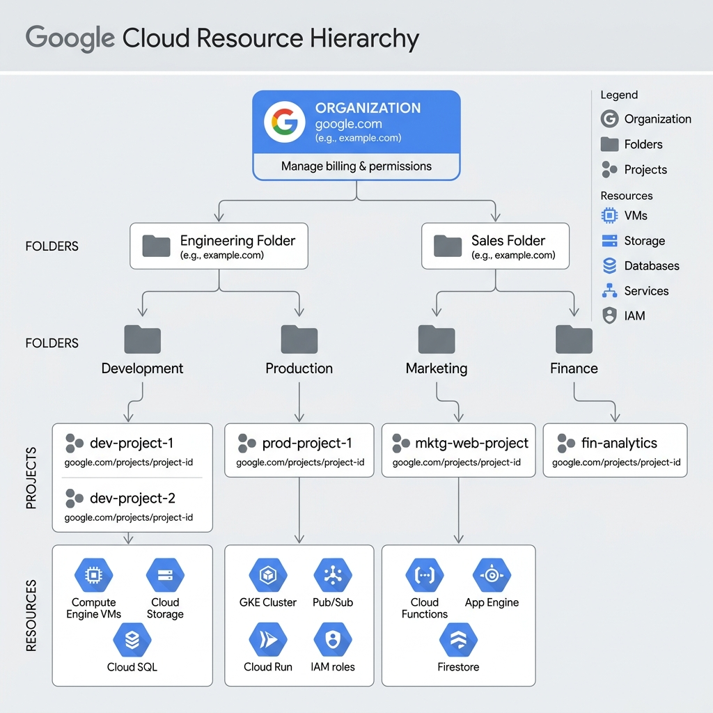
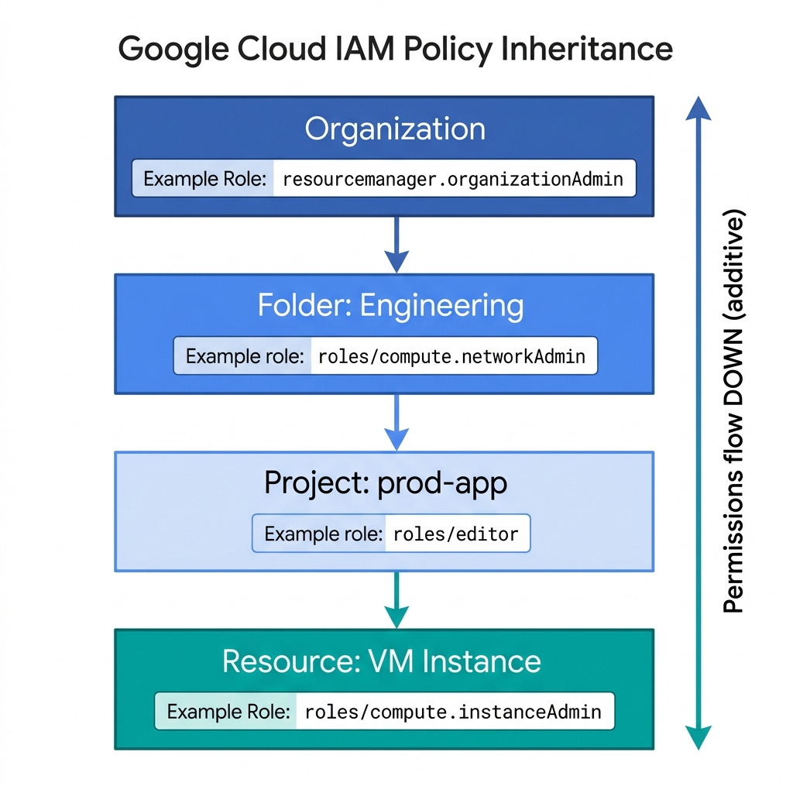

<!-- course-title: ACE: Associate Cloud Engineer Prep -->
<!-- layout: title -->


ACE: Associate Cloud Engineer Prep

# Chapter 1: The Google Cloud Foundation

---

# Chapter Objectives

- Structure organizational resource hierarchies and enforce Organization Policies
- Map user identities and grant granular IAM role bindings following least privilege
- Configure billing accounts, sub-accounts, budgets, and automated BigQuery exports
- Enable required Google Cloud APIs, inspect quotas, and query assets with Cloud Asset Inventory

---
<!-- layout: navigation -->
# Chapter 1

- **Resource Hierarchy & Org Policies**
- Cloud Identity & Basic IAM
- Billing Accounts & Budget Exports
- APIs, Quotas & Asset Inventory

---

# Google Cloud Resource Hierarchy

- All Google Cloud resources live in a strict four-level tree
- Provides the framework for **access control, policies, and billing**

```text
               [ Organization ]  <-- Root (domain-bound)
                     |
              +------+------+
              |             |
          [Folder]      [Folder] <-- Departments / Environments
              |             |
          [Project]     [Project] <-- Core container for resources
              |
      +-------+-------+
      |               |
   [GCE VM]       [GCS Bucket] <-- Resources
```

> [!NOTE]
> Policies inherit from top to bottom. A role granted at the Organization level applies to every folder, project, and resource below it.

---
<!-- layout: 2-column -->

# Organization Node

### What It Is
- Root of the hierarchy, bound to a **Google Workspace** or **Cloud Identity** domain
- Created automatically when you first link a domain to Google Cloud
- Every company should have exactly **one** Organization node

### Why It Matters
- Grants a single place to apply **Organization-wide policies**
- Required for features like VPC Service Controls and Access Context Manager
- Without it, projects are orphaned with no central governance

---

# Folders: Grouping Projects

- Folders group projects by **department** (Engineering, Sales) or **environment** (Dev, Staging, Prod)
- Can be nested up to **10 levels deep**
- IAM roles granted at a folder apply to all child projects

```bash
# Create a folder under an organization
gcloud resource-manager folders create \
  --display-name="Engineering" \
  --organization=ORGANIZATION_ID

# Create a sub-folder
gcloud resource-manager folders create \
  --display-name="Production" \
  --folder=PARENT_FOLDER_ID
```

---

# Projects: The Atomic Unit

- Every resource must belong to **exactly one** Project
- Projects isolate billing, APIs, and IAM permissions

| Identifier | Mutable? | Globally Unique? | Usage |
| :--- | :--- | :--- | :--- |
| **Project Name** | Yes | No | Display in Console |
| **Project ID** | No (Immutable) | **Yes (Worldwide)** | `gcloud` CLI & API calls |
| **Project Number** | No (Immutable) | **Yes (Worldwide)** | System-generated integer |

> [!IMPORTANT]
> Choose descriptive, standardized Project IDs during creation (e.g., `prod-web-app-01`). Once created, a Project ID can **never** be changed or reused after deletion.

---

# Organization Policies vs IAM

- **IAM** controls *who* can act (identity → role → resource)
- **Organization Policies** control *what* can be done (constraints applied to the resource tree)

```bash
# Apply an org policy constraint via YAML
gcloud resource-manager org-policies set-policy policy.yaml \
  --organization=ORGANIZATION_ID
```

> [!WARNING]
> Organization Policy constraints override local project configurations and apply to **all users**, including Organization Admins.

---
<!-- layout: 3-column -->

# Essential Org Policy Constraints

### Restrict Resource Locations
- `constraints/gcp.resourceLocations`
- Limits regions where resources can be created
- Use case: data sovereignty compliance

### Disable VM External IPs
- `constraints/compute.vmExternalIpAccess`
- Blocks public IPs on Compute Engine VMs
- Use case: enforce private-only networking

### Restrict Domain Sharing
- `constraints/iam.allowedPolicyMemberDomains`
- Limits IAM bindings to approved domains only
- Use case: prevent sharing with personal Gmail accounts

---
<!-- layout: title-image -->

# Resource Hierarchy Architecture


---
<!-- layout: navigation -->
# Chapter 1

- Resource Hierarchy & Org Policies
- **Cloud Identity & Basic IAM**
- Billing Accounts & Budget Exports
- APIs, Quotas & Asset Inventory

---
<!-- layout: 2-column -->

# Cloud Identity & User Management

### Cloud Identity
- Google's standalone Identity-as-a-Service (IDaaS)
- Provides user accounts and groups **without** requiring Google Workspace licenses
- Synchronizes with Active Directory / Entra ID via **Google Cloud Directory Sync (GCDS)**

### Best Practices
- **Never** assign IAM roles directly to individual users
- Always assign IAM roles to **Cloud Identity Groups** (e.g., `developers@company.com`)
- Enforce Multi-Factor Authentication (MFA/2SV) at the organization level

---
<!-- layout: 2-column -->

# IAM Core Model: Principal → Role → Resource

### The Three Parts
- **Principal (Who):** User, Group, Service Account, or Domain
- **Role (What):** Collection of permissions (e.g., `compute.instances.create`)
- **Resource (Where):** Project, Folder, Org, or individual resource

### Policy Binding
- A **Policy** is a list of bindings that attach roles to principals on a resource
- Effective permissions = union of all bindings at that level and all ancestors

---

# Basic Roles vs Predefined Roles

| Category | Examples | Scope | Production Use? |
| :--- | :--- | :--- | :--- |
| **Basic (Primitive)** | Owner, Editor, Viewer | Thousands of permissions across ALL services | **Avoid** — too broad |
| **Predefined** | `roles/compute.instanceAdmin.v1`, `roles/storage.objectViewer` | Scoped to one service | **Recommended** |
| **Custom** | User-defined role with hand-picked permissions | Exactly what you specify | When predefined roles grant too much |

> [!CAUTION]
> The **Editor** basic role grants write access to almost every Google Cloud resource in the project. Never use it for production service accounts.

---

# Granting IAM Roles via gcloud

```bash
# Grant Compute Admin role to a security group at project level
gcloud projects add-iam-policy-binding prod-app-01 \
  --member="group:cloud-ops@roi.com" \
  --role="roles/compute.admin"

# Grant Storage Object Viewer at bucket level
gcloud storage buckets add-iam-policy-binding gs://prod-data-bucket \
  --member="serviceAccount:reader-sa@prod-app-01.iam.gserviceaccount.com" \
  --role="roles/storage.objectViewer"
```

> [!TIP]
> Use `gcloud asset analyze-iam-policy` to inspect effective permissions across inherited parent folders and organizations.

---

# Policy Inheritance & Conflict Resolution

- Permissions propagate **downward**: Org → Folder → Project → Resource
- Child nodes inherit all permissions granted on parent nodes
- IAM grants are **additive only** — there is no standard "Deny"

```text
Organization:  roles/viewer granted to group:auditors@roi.com
    └── Folder (Engineering):  roles/compute.admin granted to group:engineers@roi.com
          └── Project (prod-web):  roles/storage.admin granted to user:ops@roi.com
```

- `auditors@roi.com` has **Viewer** on the project (inherited)
- `engineers@roi.com` has **Compute Admin** on the project (inherited)
- `ops@roi.com` has **Storage Admin** on the project (directly bound)

---
<!-- layout: title-image -->

# IAM Policy Inheritance Flow


---
<!-- layout: navigation -->
# Chapter 1

- Resource Hierarchy & Org Policies
- Cloud Identity & Basic IAM
- **Billing Accounts & Budget Exports**
- APIs, Quotas & Asset Inventory

---
<!-- layout: 2-column -->

# Billing Account Structure

### Cloud Billing Account
- Pays for Google Cloud resource usage
- Connected to a payment profile (Credit Card or Invoice)
- Can be linked to **one or many Projects**

### Key Billing Roles
- **Billing Account Administrator:** Manage billing setup, users, and payment methods
- **Billing Account User:** Link projects to the billing account
- **Billing Account Viewer:** View spend and export reports

---

# Linking Projects to Billing Accounts

- A project **must** be linked to a billing account to use any paid resources
- Unlinking a billing account **shuts down** all paid resources in the project

```bash
# Link a project to a billing account
gcloud billing projects link prod-app-01 \
  --billing-account=01A2B3-C4D5E6-F7G8H9

# List all projects linked to a billing account
gcloud billing projects list --billing-account=01A2B3-C4D5E6-F7G8H9
```

> [!WARNING]
> Unlinking a billing account does not delete resources — it stops them. Re-linking restores them, but some resources (like external IPs) may be released.

---

# Budget Alerts & Notifications

- Budgets track actual or forecasted spend against a target amount
- Trigger email notifications at configurable threshold percentages

| Threshold | Example Action |
| :--- | :--- |
| 50% of budget | Alert Ops Team |
| 90% of budget | Alert Management |
| 100% forecasted | Early warning before overspend |

> [!CAUTION]
> Budget Alerts **DO NOT stop or shut down resources!** A project will continue consuming resources and incurring charges even after 100% of the budget is exceeded.

---

# Programmatic Budget Responses with Pub/Sub

- Budget notifications can be sent to a **Pub/Sub topic** for programmatic action
- A Cloud Run function can listen and automatically disable billing

```bash
# Create a budget with Pub/Sub notifications
gcloud billing budgets create \
  --billing-account=01A2B3-C4D5E6-F7G8H9 \
  --display-name="Prod Monthly Cap" \
  --budget-amount=5000USD \
  --threshold-rules=percent=0.5,basis=CURRENT_SPEND \
  --threshold-rules=percent=0.9,basis=CURRENT_SPEND \
  --notifications-pubsub-topic=projects/prod-app-01/topics/budget-alerts
```

---

# Billing Exports to BigQuery

- Export detailed cost records to **BigQuery** for analytics and dashboards
- Three export types: Standard Usage Cost, Detailed Usage Cost, Pricing Data

```sql
-- Top 5 spending services over the last 30 days
SELECT service.description, SUM(cost) AS total_cost
FROM `billing_export.gcp_billing_export_v1_01234_56789`
WHERE _PARTITIONTIME >= TIMESTAMP_SUB(CURRENT_TIMESTAMP(), INTERVAL 30 DAY)
GROUP BY service.description
ORDER BY total_cost DESC
LIMIT 5;
```

> [!TIP]
> Combine BigQuery billing exports with **Looker Studio** dashboards for real-time cost visibility across all projects and teams.

---
<!-- layout: navigation -->
# Chapter 1

- Resource Hierarchy & Org Policies
- Cloud Identity & Basic IAM
- Billing Accounts & Budget Exports
- **APIs, Quotas & Asset Inventory**

---

# Managing Google Cloud APIs

- All interactions with Google Cloud occur through RESTful APIs
- Most APIs are **disabled** by default in new projects to reduce attack surface
- Enabling an API provisions default service accounts for that service

```bash
# List enabled services
gcloud services list --enabled

# Enable Compute Engine and Artifact Registry APIs
gcloud services enable compute.googleapis.com \
  artifactregistry.googleapis.com

# Disable an API (only if no resources depend on it)
gcloud services disable translate.googleapis.com
```

---
<!-- layout: 2-column -->

# Resource Quotas: Rate vs Allocation

Google Cloud enforces **Quotas** to prevent runaway costs and protect platform availability.

### Rate Quotas
- Limit API requests per time window (e.g., 6,000 Compute API calls/min)
- Reset automatically over time
- Throttled requests return HTTP `429 Too Many Requests`

### Allocation Quotas
- Limit total physical resources (e.g., 24 vCPUs per region, 50 static IPs)
- Do **not** reset — must request a **Quota Increase**
- Increases reviewed by Google (usually approved within hours)

---

# Checking and Requesting Quota Increases

```bash
# Check current CPU quota in us-central1
gcloud compute regions describe us-central1 \
  --format="table(quotas.metric,quotas.limit,quotas.usage)" \
  | grep CPUS

# Request a quota increase via the Console
# Navigation: IAM & Admin > Quotas > Filter by service > Edit Quotas
```

> [!NOTE]
> Some quotas (like GPU quotas) require a support case and may take longer to approve. Plan capacity requests ahead of production launches.

---

# Cloud Asset Inventory

- Full metadata inventory tracking **all** GCP resources, IAM policies, and org policies
- Supports real-time export to BigQuery and Pub/Sub for compliance auditing
- Query resources across the entire organization from a single API call

```bash
# Search all resources with "prod" in the name across the org
gcloud asset search-all-resources \
  --scope=organizations/ORGANIZATION_ID \
  --query="name:prod-*"

# Export full asset inventory to BigQuery for analysis
gcloud asset export \
  --organization=ORGANIZATION_ID \
  --output-bigquery-force \
  --content-type=resource \
  --bigquery-table=projects/audit/datasets/assets/tables/inventory
```

---

# Lab 1: Project Provisioning & IAM Security

**Time:** 30 minutes

**Lab guide:** [Lab 1 Instructions](https://example.com/labs/lab-01)

---

# What You Learned

- Structured organizational resource hierarchies and enforced Organization Policies
- Mapped user identities and granted granular IAM role bindings following least privilege
- Configured billing accounts, sub-accounts, budgets, and automated BigQuery exports
- Enabled required Google Cloud APIs, inspected quotas, and queried assets with Cloud Asset Inventory

---

# Q&A

Questions?
