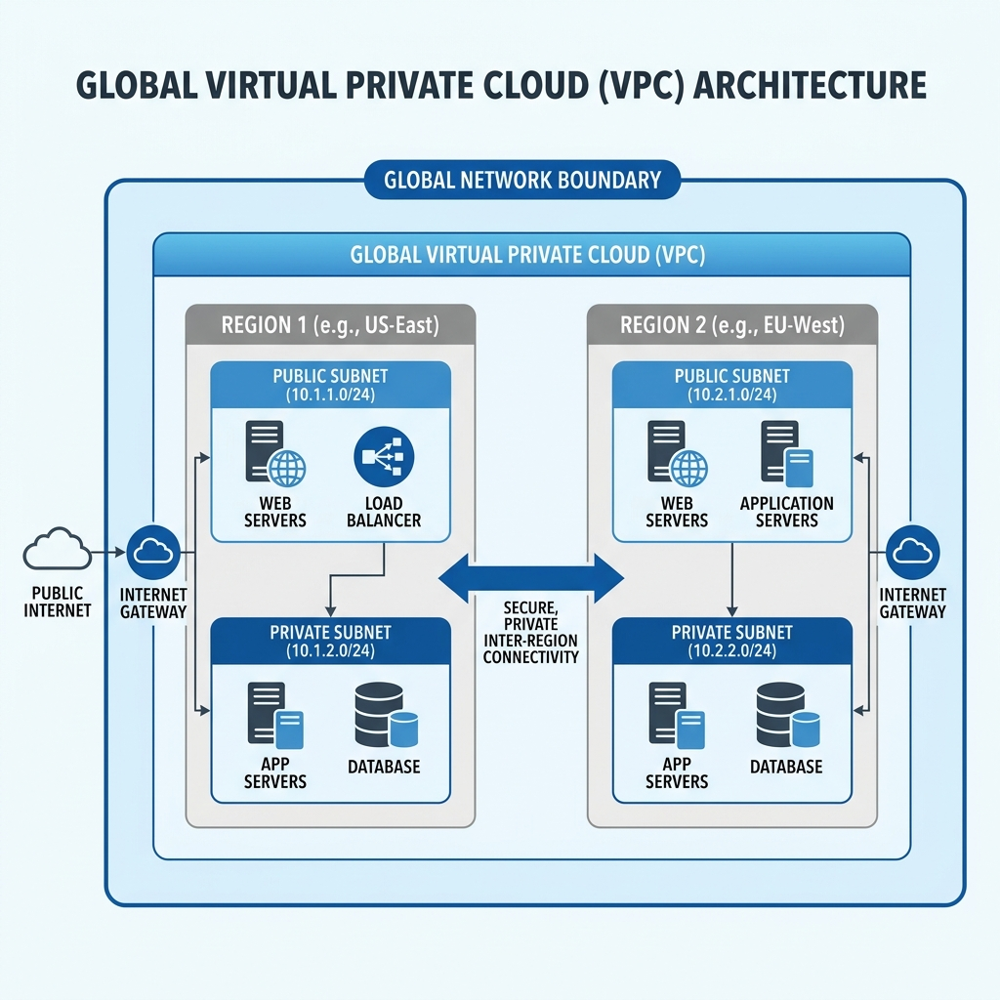

<!-- course-title: ACE: Associate Cloud Engineer Prep -->
<!-- layout: title -->


ACE: Associate Cloud Engineer Prep

# Chapter 2: Virtual Machines & Infrastructure as Code

---

# Chapter Objectives

- Architect custom Virtual Private Clouds (VPCs), subnets, and IP addressing schemes
- Provision, configure, and manage Compute Engine VM instances and Spot workloads
- Manage Persistent Disks, Custom Images, and automated snapshot schedules
- Automate cloud infrastructure deployment using Terraform and GCS remote backends

---
<!-- layout: navigation -->
# Chapter 2

- **VPC Architecture & Custom Networks**
- Compute Engine & Instance Configuration
- Disks, Snapshots & Images
- Infrastructure as Code with Terraform

---
<!-- layout: 2-column -->

# Virtual Private Cloud (VPC) Fundamentals

### VPC Scope
- A VPC is a **global resource** — it spans all Google Cloud regions without VPN or peering
- Lives inside a single Project
- Contains subnets, firewall rules, and routes

### Subnet Scope
- Subnets are **regional resources** (e.g., `us-central1`)
- Each subnet defines a primary IPv4 CIDR range (e.g., `10.1.0.0/24`)
- Can include **secondary IP ranges** for Kubernetes Pods and Services

---

# Auto Mode vs Custom Mode VPCs

| Feature | Auto Mode VPC | Custom Mode VPC |
| :--- | :--- | :--- |
| **Subnet Creation** | Auto-creates 1 subnet per region | You create subnets explicitly |
| **IP Ranges** | Fixed `/20` per region from `10.128.0.0/9` | You define CIDRs (e.g., `10.0.0.0/16`) |
| **Subnet Expansion** | Cannot easily change CIDRs | Expand CIDRs without downtime |
| **Production Fit** | Prototyping and demos only | **Required for production** |

```bash
# Create a Custom Mode VPC
gcloud compute networks create prod-vpc --subnet-mode=custom

# Create a subnet in the custom VPC
gcloud compute networks subnets create app-subnet \
  --network=prod-vpc --region=us-central1 \
  --range=10.10.1.0/24
```

---

# Subnet CIDR Expansion

- You can expand a subnet's range (e.g., `/24` → `/20`) **without disrupting** existing VMs
- The new netmask must be larger (smaller prefix number) and the base address must stay aligned
- You **cannot** shrink a subnet or change its base address

```bash
# Expand subnet from /24 to /20
gcloud compute networks subnets expand-ip-range app-subnet \
  --region=us-central1 --prefix-length=20
```

> [!WARNING]
> Plan your CIDR ranges carefully. Overlapping IP ranges between subnets in the same VPC or across peered VPCs will cause routing failures.

---

# Private Google Access

- Allows VMs with **only private IPs** to reach Google APIs (Cloud Storage, BigQuery) over internal Google backbone
- Enabled per subnet — not project-wide
- Traffic never leaves Google's network

```bash
# Enable Private Google Access on a subnet
gcloud compute networks subnets update app-subnet \
  --region=us-central1 --enable-private-ip-google-access
```

> [!TIP]
> Always enable Private Google Access on subnets where VMs don't have external IPs. Without it, those VMs cannot reach `googleapis.com` endpoints.

---
<!-- layout: title-image -->

# Global VPC Network Topology


---
<!-- layout: navigation -->
# Chapter 2

- VPC Architecture & Custom Networks
- **Compute Engine & Instance Configuration**
- Disks, Snapshots & Images
- Infrastructure as Code with Terraform

---
<!-- layout: 3-column -->

# Compute Engine Machine Families

### General Purpose (E2, N2, N2D)
- Best cost-to-performance ratio
- Web servers, dev environments, medium databases
- Supports custom machine types

### Compute Optimized (C2, C2D, H3)
- Highest per-core CPU performance
- HPC, gaming servers, batch processing
- Fixed shapes only

### Memory Optimized (M1, M2, M3)
- Massive RAM (up to 12 TB)
- SAP HANA, in-memory analytics, Redis
- Premium pricing tier

---

# Custom Machine Types

- Create VMs with **exact** vCPU and memory counts when standard shapes waste resources
- Available in E2 and N2 families
- Must follow per-family constraints (e.g., memory must be a multiple of 256 MB)

```bash
# Create a custom machine type: 6 vCPU, 20 GB RAM
gcloud compute instances create custom-vm \
  --zone=us-central1-a \
  --custom-cpu=6 \
  --custom-memory=20GB \
  --subnet=app-subnet
```

> [!TIP]
> Custom machine types can save 30–50% compared to the next-larger standard shape. Use the Pricing Calculator to compare.

---
<!-- layout: 2-column -->

# Standard vs Spot VMs

### Standard VM Instances
- Guaranteed availability per Compute Engine SLA
- Per-second billing after first minute
- Automatic **live migration** during host maintenance

### Spot VMs (formerly Preemptible)
- Excess compute capacity at **up to 91% discount**
- Can be terminated by Google at any time with 30-second warning
- No SLA or guaranteed availability
- Ideal for fault-tolerant batch workloads and GKE node pools

---

# Provisioning a Production VM

```bash
# Create a secure, production-ready VM
gcloud compute instances create prod-web-01 \
  --zone=us-central1-a \
  --machine-type=n2-standard-4 \
  --subnet=app-subnet \
  --no-address \
  --service-account="web-sa@prod-app.iam.gserviceaccount.com" \
  --scopes="https://www.googleapis.com/auth/cloud-platform" \
  --metadata=startup-script='#!/bin/bash
apt-get update && apt-get install -y nginx' \
  --tags=web-server
```

> [!IMPORTANT]
> Always use `--no-address` for backend servers. Use **Cloud NAT** for outbound internet access and **IAP** for inbound SSH.

---

# Startup Scripts & Metadata

- **Startup scripts** run automatically when a VM boots (first boot and every reboot)
- Stored in instance metadata or referenced from a GCS bucket
- Use for package installation, agent configuration, app deployment

```bash
# Reference a startup script stored in Cloud Storage
gcloud compute instances create app-server \
  --zone=us-central1-a \
  --machine-type=e2-medium \
  --metadata=startup-script-url=gs://config-bucket/startup.sh
```

> [!NOTE]
> Startup scripts run as `root`. Check `/var/log/syslog` on Debian/Ubuntu or use the serial console for debugging boot failures.

---

# OS Login vs Project SSH Keys

- **Project SSH Keys (Legacy):** Anyone with `compute.instanceAdmin` can add a key to project metadata and SSH into **all** VMs
- **OS Login (Recommended):** Binds SSH access to Google Cloud IAM identities

```bash
# Enable OS Login project-wide
gcloud compute project-info add-metadata \
  --metadata enable-oslogin=TRUE

# SSH into a VM using OS Login (IAM-managed)
gcloud compute ssh prod-web-01 --zone=us-central1-a
```

| Feature | Project SSH Keys | OS Login |
| :--- | :--- | :--- |
| Key management | Manual | Automatic via IAM |
| Access scope | All VMs in project | Per-VM via IAM roles |
| Audit logging | Limited | Full Cloud Audit Log |

---
<!-- layout: navigation -->
# Chapter 2

- VPC Architecture & Custom Networks
- Compute Engine & Instance Configuration
- **Disks, Snapshots & Images**
- Infrastructure as Code with Terraform

---
<!-- layout: 2-column -->

# Persistent Disk Types

Compute Engine separates compute (VM) from storage (Persistent Disk). Disks survive VM deletion.

### Disk Options
- **Standard PD (`pd-standard`):** HDD for sequential backup/log workloads
- **Balanced PD (`pd-balanced`):** Cost-effective SSD for general workloads
- **SSD PD (`pd-ssd`):** High-IOPS SSD for databases
- **Extreme PD (`pd-extreme`):** Provision IOPS independently (up to 120K IOPS)

---

# Zonal vs Regional Persistent Disks

| Feature | Zonal PD | Regional PD |
| :--- | :--- | :--- |
| **Replication** | Within single zone | Across **2 zones** in a region |
| **Failover** | Manual (attach to new VM) | Automatic with MIG health checks |
| **Cost** | Standard pricing | ~2x standard pricing |
| **Use Case** | Dev/test, non-critical | HA production databases |

```bash
# Create a regional SSD persistent disk
gcloud compute disks create prod-db-disk \
  --type=pd-ssd --size=500GB \
  --region=us-central1 \
  --replica-zones=us-central1-a,us-central1-b
```

---

# Custom Images & Machine Images

- **Custom Image:** Snapshot of a boot disk used as a golden image template
- **Machine Image:** Complete backup of a VM including disks, metadata, and configuration

```bash
# Create a custom image from an existing VM's boot disk
gcloud compute images create golden-web-v1 \
  --source-disk=prod-web-01 \
  --source-disk-zone=us-central1-a \
  --family=web-server

# Launch a new VM from the image family (auto-picks latest)
gcloud compute instances create web-02 \
  --zone=us-central1-b \
  --image-family=web-server
```

---

# Snapshot Scheduling & Lifecycle

- Snapshots are **incremental** — first is full, subsequent copy only changed blocks
- Schedule automated snapshots with resource policies

```bash
# Create a daily snapshot schedule retaining 14 days
gcloud compute resource-policies create snapshot-schedule daily-backup \
  --region=us-central1 \
  --max-retention-days=14 \
  --start-time=02:00 \
  --daily-schedule

# Attach the schedule to a disk
gcloud compute disks add-resource-policies prod-db-disk \
  --resource-policies=daily-backup \
  --zone=us-central1-a
```

> [!TIP]
> Snapshots are stored in Cloud Storage and are globally accessible. You can restore a snapshot to a disk in any region.

---
<!-- layout: navigation -->
# Chapter 2

- VPC Architecture & Custom Networks
- Compute Engine & Instance Configuration
- Disks, Snapshots & Images
- **Infrastructure as Code with Terraform**

---

# Why Infrastructure as Code?

- Manual Console/CLI provisioning doesn't scale and is error-prone
- **Terraform** by HashiCorp declares target cloud state in code (HCL)
- Benefits: version control, code review, repeatable environments, drift detection

```hcl
# Configure the Google Cloud Provider
terraform {
  required_providers {
    google = {
      source  = "hashicorp/google"
      version = "~> 5.0"
    }
  }
}

provider "google" {
  project = "prod-infrastructure-01"
  region  = "us-central1"
}
```

---

# Core Terraform Workflow

| Step | Command | What Happens |
| :--- | :--- | :--- |
| **Initialize** | `terraform init` | Downloads provider plugins, sets up backend |
| **Plan** | `terraform plan` | Shows diff between desired state and actual state |
| **Apply** | `terraform apply` | Creates/updates resources to match config |
| **Destroy** | `terraform destroy` | Tears down all managed resources |

> [!IMPORTANT]
> Always run `terraform plan` before `terraform apply` in production. Review the diff carefully — Terraform will destroy and recreate resources that require replacement.

---

# Provisioning GCP Resources with HCL

```hcl
# Create a Custom Subnet
resource "google_compute_subnetwork" "app_subnet" {
  name          = "app-subnet-01"
  ip_cidr_range = "10.10.1.0/24"
  region        = "us-central1"
  network       = google_compute_network.prod_vpc.id
}

# Create a Compute Engine VM
resource "google_compute_instance" "app_server" {
  name         = "app-server-01"
  machine_type = "e2-medium"
  zone         = "us-central1-a"

  boot_disk {
    initialize_params {
      image = "debian-cloud/debian-12"
      type  = "pd-balanced"
    }
  }

  network_interface {
    subnetwork = google_compute_subnetwork.app_subnet.id
  }
}
```

---

# Remote State in Cloud Storage

- Terraform stores resource mappings in `terraform.tfstate`
- **Local state fails** for teams: no locking, secrets in plaintext, no collaboration
- Use GCS as a **remote backend** with object-level locking

```hcl
terraform {
  backend "gcs" {
    bucket = "tf-state-prod-infrastructure-01"
    prefix = "terraform/state/compute"
  }
}
```

> [!CAUTION]
> Always enable **Object Versioning** on your GCS state bucket. This lets you recover from corrupted or accidentally deleted state files.

---

# Lab 2: Automated Infrastructure with Terraform

**Time:** 45 minutes

**Lab guide:** [Lab 2 Instructions](https://example.com/labs/lab-02)

---

# What You Learned

- Architected custom Virtual Private Clouds (VPCs), subnets, and IP addressing schemes
- Provisioned, configured, and managed Compute Engine VM instances and Spot workloads
- Managed Persistent Disks, Custom Images, and automated snapshot schedules
- Automated cloud infrastructure deployment using Terraform and GCS remote backends

---

# Q&A

Questions?
