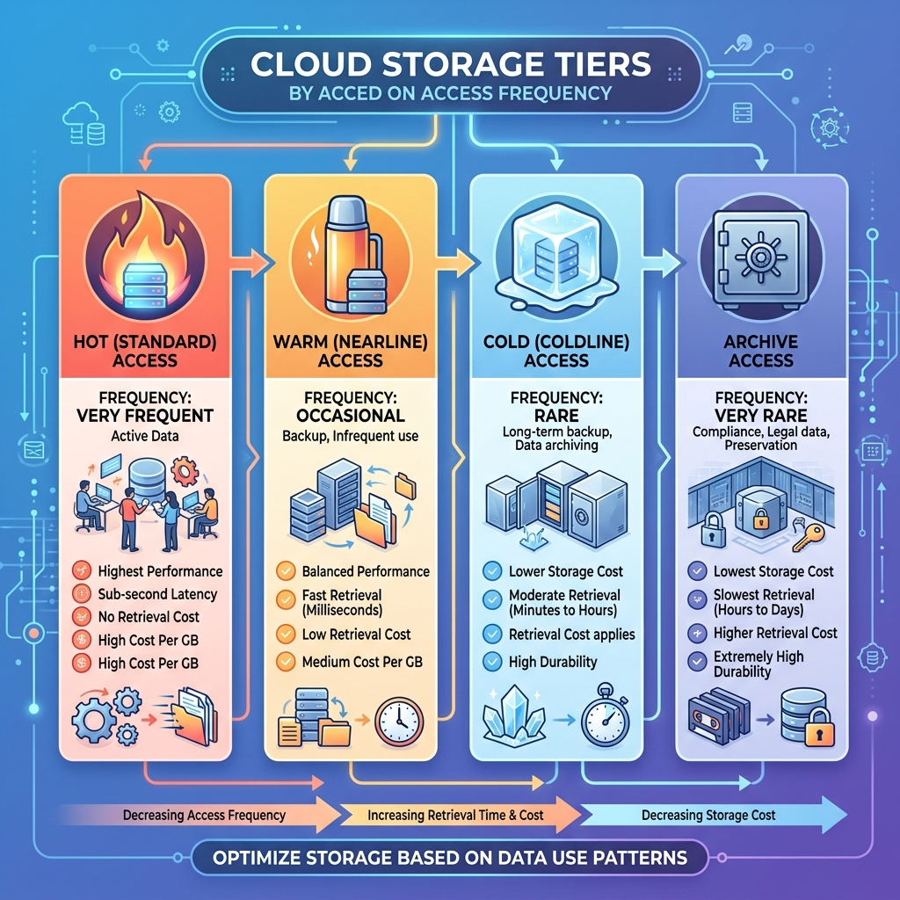
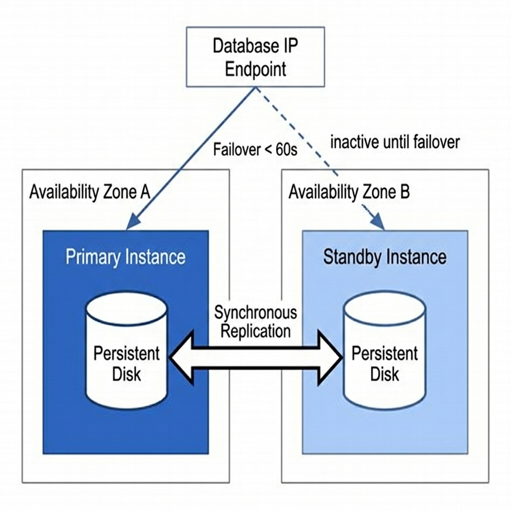

<!-- course-title: ACE: Associate Cloud Engineer Prep -->
<!-- layout: title -->


ACE: Associate Cloud Engineer Prep

# Chapter 3: Storage & Database Solutions

---

# Chapter Objectives

- Configure Cloud Storage buckets, storage classes, lifecycle policies, and encryption
- Deploy and manage high-availability Cloud SQL, AlloyDB, and Cloud Spanner instances
- Evaluate NoSQL and analytical data stores including Firestore, Bigtable, and BigQuery
- Implement data migration pipelines using Storage Transfer Service and Database Migration Service

---
<!-- layout: navigation -->
# Chapter 3

- **Cloud Storage (GCS) Deep Dive**
- Managed Relational Databases
- NoSQL & Analytical Data Stores
- Data Ingestion & Migration Tools

---
<!-- layout: 2-column -->

# Cloud Storage Fundamentals

### Key Characteristics
- Fully managed object storage with **11 nines** (99.999999999%) durability
- Stores unstructured data: blobs, images, backups, logs, CSVs
- Organizes data into **Buckets** containing **Objects**

### Bucket Rules
- Bucket names are **globally unique worldwide** across all Google Cloud customers
- Cannot be nested — flat namespace only
- Location type: Regional, Dual-Region, or Multi-Region

---

# Creating and Managing Buckets

```bash
# Create a regional bucket with uniform access control
gcloud storage buckets create gs://prod-assets-roi-2025 \
  --location=us-central1 \
  --uniform-bucket-level-access

# List all buckets in the project
gcloud storage ls

# Copy files to a bucket
gcloud storage cp ./report.csv gs://prod-assets-roi-2025/reports/
```

> [!NOTE]
> Use `--uniform-bucket-level-access` to disable legacy per-object ACLs. This simplifies access management by using only IAM policies.

---

# Storage Classes & Cost Optimization

| Storage Class | Min Retention | Best For | Retrieval Cost |
| :--- | :--- | :--- | :--- |
| **Standard** | None | Frequently accessed data | None |
| **Nearline** | 30 days | Read < once/month; monthly reports | Low |
| **Coldline** | 90 days | Read < once/quarter; disaster recovery | Medium |
| **Archive** | 365 days | Read < once/year; compliance archives | High |

> [!TIP]
> Early deletion incurs a pro-rated fee. Deleting a Coldline object after 30 days charges for the remaining 60 days of minimum retention.

---

# Object Lifecycle Management

Automate storage class transitions and deletions to minimize costs.

```json
{
  "rule": [
    {
      "action": {"type": "SetStorageClass", "storageClass": "NEARLINE"},
      "condition": {"age": 30, "matchesStorageClass": ["STANDARD"]}
    },
    {
      "action": {"type": "SetStorageClass", "storageClass": "COLDLINE"},
      "condition": {"age": 90, "matchesStorageClass": ["NEARLINE"]}
    },
    {
      "action": {"type": "Delete"},
      "condition": {"age": 365}
    }
  ]
}
```

```bash
gcloud storage buckets update gs://prod-backups-roi \
  --lifecycle-file=lifecycle.json
```

---

# GCS Security: Encryption & Access

- **Default encryption:** All objects encrypted at rest with Google-managed keys (no config needed)
- **CMEK (Customer-Managed Encryption Keys):** You control the key in Cloud KMS
- **CSEK (Customer-Supplied Keys):** You provide the key with each API call (Google never stores it)

```bash
# Set a CMEK default key on a bucket
gcloud storage buckets update gs://prod-sensitive-data \
  --default-encryption-key=projects/prod/locations/us/keyRings/app/cryptoKeys/data-key
```

> [!IMPORTANT]
> If you delete or disable a CMEK key in Cloud KMS, all objects encrypted with that key become **permanently inaccessible**.

---
<!-- layout: title-image -->

# Choosing a Storage Class


---
<!-- layout: navigation -->
# Chapter 3

- Cloud Storage (GCS) Deep Dive
- **Managed Relational Databases**
- NoSQL & Analytical Data Stores
- Data Ingestion & Migration Tools

---
<!-- layout: 3-column -->

# Relational Database Selection Matrix

### Cloud SQL
- Managed MySQL, PostgreSQL, SQL Server
- Up to 64 TB storage
- Regional HA & Read Replicas

### AlloyDB for PostgreSQL
- Enterprise PostgreSQL-compatible engine
- Separate compute & columnar storage
- 4x faster analytical reads

### Cloud Spanner
- Global relational database
- External consistency (TrueTime API)
- Unlimited horizontal scale

---

# Cloud SQL High Availability

- HA uses a **primary** and **standby** instance in two different zones
- Synchronous replication at the block storage level
- Automatic failover in < 60 seconds without changing the database endpoint IP

```bash
# Create a Cloud SQL PostgreSQL instance with HA
gcloud sql instances create prod-db-01 \
  --database-version=POSTGRES_15 \
  --tier=db-custom-4-16384 \
  --region=us-central1 \
  --availability-type=REGIONAL \
  --storage-auto-increase
```

> [!WARNING]
> Regional HA **doubles** instance cost. Google provisions a full standby instance and replicates every write synchronously.

---

# Cloud SQL Read Replicas

- Read replicas offload read traffic from the primary instance
- Can be placed in different zones or even **different regions** (cross-region replicas)
- Replicas use **asynchronous replication** — slight lag is possible

```bash
# Create a read replica in a different zone
gcloud sql instances create prod-db-replica \
  --master-instance-name=prod-db-01 \
  --zone=us-central1-b

# Promote a replica to standalone (e.g., for disaster recovery)
gcloud sql instances promote-replica prod-db-replica
```

---
<!-- layout: title-image -->

# Cloud SQL HA Failover Architecture


---

# Backup & Point-In-Time Recovery (PITR)

- **Automated Backups:** Daily snapshots in configurable backup windows; retain up to 365 backups
- **PITR:** Uses Write-Ahead Logs (WAL) to restore to any second within the retention window (up to 7 days)

```bash
# Enable PITR on an existing instance
gcloud sql instances patch prod-db-01 \
  --enable-point-in-time-recovery \
  --retained-transaction-log-days=7

# Restore to a specific timestamp
gcloud sql instances restore-backup prod-db-01 \
  --backup-id=1700000000000 \
  --restore-instance=prod-db-restored
```

> [!TIP]
> Always test restore procedures in a non-production project before you need them in an emergency.

---
<!-- layout: navigation -->
# Chapter 3

- Cloud Storage (GCS) Deep Dive
- Managed Relational Databases
- **NoSQL & Analytical Data Stores**
- NoSQL & Analytical Data Stores
- Data Ingestion & Migration Tools

---
<!-- layout: 2-column -->

# Firestore (Document NoSQL)

### Architecture
- Flexible hierarchical JSON document database
- Documents organized into **Collections** and **Subcollections**
- Automatic multi-region replication

### Best For
- Mobile/web user profiles and session state
- Real-time client listeners (live sync)
- Offline SDK support for disconnected apps

```bash
# Create a Firestore database in Native mode
gcloud firestore databases create --location=nam5
```

---

# Cloud Bigtable (Wide-Column NoSQL)

- Ultra-low latency (< 10ms) for high-throughput reads and writes
- Scales linearly to **petabytes** of data
- Row keys are the **only index** — design them carefully

| Use Case | Row Key Pattern |
| :--- | :--- |
| **IoT Telemetry** | `deviceID#reversedTimestamp` |
| **Financial Ticks** | `symbol#timestamp` |
| **User Events** | `userID#eventTimestamp` |

> [!WARNING]
> Monotonically increasing row keys (e.g., plain timestamps) cause hotspotting on a single Bigtable node. Always prefix with a distributed key.

---

# BigQuery: Serverless Data Warehouse

- Fully managed analytics engine executing SQL across petabytes
- Decouples **Compute (Slots)** from **Storage** — pay for each independently
- Supports standard SQL, nested/repeated fields, and ML via `BQML`

```sql
-- Query partitioned and clustered table efficiently
SELECT user_id, COUNT(event_id) AS event_count
FROM `prod-analytics.telemetry.user_events`
WHERE _PARTITIONDATE = CURRENT_DATE()
  AND country = 'US'
GROUP BY user_id
ORDER BY event_count DESC;
```

---

# BigQuery Cost Controls

- **On-Demand Pricing:** Pay per TB scanned ($6.25/TB)
- **Capacity Pricing:** Purchase dedicated Slots for predictable costs

| Optimization | Impact |
| :--- | :--- |
| **Partitioning** (by date/integer) | Scans only matching partitions |
| **Clustering** (by high-cardinality columns) | Sorts data within partitions for efficient filtering |
| **SELECT specific columns** | Avoids full-row scans |
| **Preview/dry-run** | Estimate bytes before running |

> [!IMPORTANT]
> Always partition and cluster production BigQuery tables. A full table scan on a 10 TB table costs ~$62 per query.

---
<!-- layout: navigation -->
# Chapter 3

- Cloud Storage (GCS) Deep Dive
- Managed Relational Databases
- NoSQL & Analytical Data Stores
- **Data Ingestion & Migration Tools**

---
<!-- layout: 2-column -->

# Data Transfer Tools

### `gcloud storage` CLI
- Parallelized multi-threaded upload/download
- Replaces legacy `gsutil` with up to 94% faster transfers

### Storage Transfer Service
- Fully managed imports from **AWS S3, Azure Blob, HTTP endpoints**
- Automated scheduling, checksum verification, and bandwidth throttling

### Transfer Appliance
- Physical storage server (up to 300 TB) shipped to your data center
- For offline migration of massive datasets where network transfer is impractical

---

# Database Migration Service (DMS)

- Managed service for migrating databases **to** Cloud SQL or AlloyDB
- Supports MySQL, PostgreSQL, SQL Server, and Oracle sources
- Continuous replication keeps source and destination in sync until cutover

```bash
# Create a DMS migration job
gcloud database-migration migration-jobs create mysql-to-cloudsql \
  --region=us-central1 \
  --type=CONTINUOUS \
  --source=source-conn-profile \
  --destination=destination-conn-profile
```

> [!NOTE]
> DMS supports both one-time snapshot migrations and continuous CDC (Change Data Capture) replication for minimal downtime cutovers.

---

# Lab 3: Storage Lifecycle & Database Provisioning

**Time:** 45 minutes

**Lab guide:** [Lab 3 Instructions](https://example.com/labs/lab-03)

---

# What You Learned

- Configured Cloud Storage buckets, storage classes, lifecycle policies, and encryption
- Deployed and managed high-availability Cloud SQL, AlloyDB, and Cloud Spanner instances
- Evaluated NoSQL and analytical data stores including Firestore, Bigtable, and BigQuery
- Implemented data migration pipelines using Storage Transfer Service and Database Migration Service

---

# Q&A

Questions?
