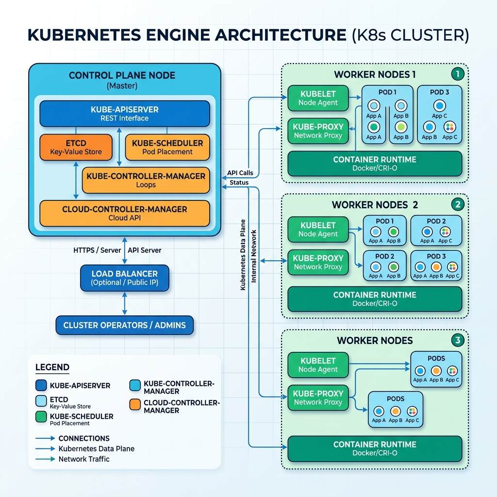

<!-- course-title: ACE: Associate Cloud Engineer Prep -->
<!-- layout: title -->


ACE: Associate Cloud Engineer Prep

# Chapter 4: Containerization & GKE

---

# Chapter Objectives

- Build container images and store them securely in Google Artifact Registry
- Analyze GKE cluster architecture, Control Plane management, and private networking
- Compare operational trade-offs between GKE Standard and GKE Autopilot modes
- Deploy, configure, and scale Kubernetes workloads using `kubectl` manifests

---
<!-- layout: navigation -->
# Chapter 4

- **Containers & Artifact Registry**
- GKE Cluster Architecture
- GKE Standard vs. Autopilot
- Deploying Workloads with kubectl

---
<!-- layout: 2-column -->

# Why Containers?

### The Problem
- "Works on my machine" — apps behave differently across dev, staging, and production
- VMs are heavyweight: each carries a full OS, consuming GB of disk and minutes to boot

### The Solution: Containers
- Package app code, runtime, libraries, and dependencies into a single portable image
- Share the host Linux kernel — millisecond startup, MB-sized images
- Consistent execution from laptop to Google Cloud

---

# Container Images & Dockerfiles

- A **Dockerfile** defines the build steps for a container image
- Each instruction creates an immutable layer; layers are cached for fast rebuilds

```dockerfile
FROM python:3.12-slim
WORKDIR /app
COPY requirements.txt .
RUN pip install -r requirements.txt
COPY . .
EXPOSE 8080
CMD ["python", "main.py"]
```

> [!TIP]
> Order Dockerfile instructions from least-changed to most-changed. `COPY requirements.txt` before `COPY .` means dependency installs are cached when only code changes.

---

# Building Images with Cloud Build

- **Cloud Build** compiles container images in the cloud — no local Docker daemon needed
- Triggered manually, by Git push, or by Pub/Sub event
- Build logs stream to Cloud Logging automatically

```bash
# Build and push image using Cloud Build
gcloud builds submit \
  --tag us-central1-docker.pkg.dev/prod-app/app-repo/web-app:v1.0 .

# Build using a cloudbuild.yaml for multi-step builds
gcloud builds submit --config=cloudbuild.yaml .
```

---

# Artifact Registry

- Google's managed repository for containers, Helm charts, Maven, npm, and Python packages
- **Replaces** Container Registry (gcr.io) — all new projects should use Artifact Registry
- Supports IAM-based access control, vulnerability scanning, and CMEK encryption

```bash
# Create a Docker repository
gcloud artifacts repositories create app-repo \
  --repository-format=docker \
  --location=us-central1 \
  --description="Production container images"

# Configure Docker to authenticate with Artifact Registry
gcloud auth configure-docker us-central1-docker.pkg.dev
```

> [!IMPORTANT]
> Grant GKE node service accounts `roles/artifactregistry.reader` on the repository. Without it, pods will fail to pull images.

---

# Vulnerability Scanning

- Artifact Registry automatically scans pushed container images for known CVEs
- Results appear in the Console and can trigger Cloud Build failure policies

```bash
# List vulnerabilities found in a specific image
gcloud artifacts docker images list \
  us-central1-docker.pkg.dev/prod-app/app-repo/web-app \
  --include-tags --show-occurrences
```

> [!WARNING]
> Scanning happens asynchronously after push. Always check scan results before deploying to production — a clean push does not mean a clean image.

---
<!-- layout: navigation -->
# Chapter 4

- Containers & Artifact Registry
- **GKE Cluster Architecture**
- GKE Standard vs. Autopilot
- Deploying Workloads with kubectl

---
<!-- layout: 2-column -->

# GKE Cluster Components

### Control Plane (Managed by Google)
- `kube-apiserver`: Serves the Kubernetes API
- `etcd`: Distributed key-value store for cluster state
- `kube-scheduler`: Assigns pods to nodes
- `kube-controller-manager`: Runs reconciliation loops
- Google patches, backs up, and scales the Control Plane (99.95% SLA)

### Worker Nodes
- Compute Engine VMs grouped into **Node Pools**
- Run `kubelet`, `kube-proxy`, and container runtime
- Execute user workloads in **Pods**

---

# Regional vs Zonal Clusters

| Feature | Zonal Cluster | Regional Cluster |
| :--- | :--- | :--- |
| **Control Plane** | Single zone | Replicated across 3 zones |
| **Node Distribution** | Single zone | Spread across 3 zones |
| **Upgrade Impact** | Cluster-wide downtime | Rolling upgrades, no downtime |
| **SLA** | 99.5% | **99.95%** |

> [!IMPORTANT]
> Always use **regional clusters** for production. Zonal clusters have a single point of failure in the control plane.

---

# Private GKE Clusters

- Worker nodes have **only private IPs** — no direct internet access
- Control Plane API endpoint restricted by **Master Authorized Networks**
- Outbound traffic (e.g., pulling container images) routes through **Cloud NAT**

```bash
# Create a private regional Autopilot cluster
gcloud container clusters create-auto prod-gke \
  --region=us-central1 \
  --enable-private-nodes \
  --enable-master-authorized-networks \
  --master-authorized-networks=10.0.0.0/16
```

---

# GKE Release Channels

- Google manages Kubernetes version upgrades automatically via **Release Channels**
- Channel determines how quickly you receive new versions

| Channel | Behavior | Best For |
| :--- | :--- | :--- |
| **Rapid** | Latest features, earliest patches | Dev/test environments |
| **Regular** | Balanced stability & features | Most production workloads |
| **Stable** | Longest soak time, proven stability | Risk-averse production |
| **Extended** | Up to 24 months on a single version | Regulated industries |

---
<!-- layout: title-image -->

# GKE Architecture Topology


---
<!-- layout: navigation -->
# Chapter 4

- Containers & Artifact Registry
- GKE Cluster Architecture
- **GKE Standard vs. Autopilot**
- Deploying Workloads with kubectl

---
<!-- layout: 2-column -->

# GKE Standard vs Autopilot

### GKE Standard
- **You** manage node pools, OS images, scaling, and security
- Full control over node configuration, SSH access, custom kernels
- Billed per **VM instance** (whether pods are running or not)

### GKE Autopilot (Recommended)
- **Google** manages nodes, patching, scaling, and security hardening
- No SSH to nodes, no custom OS images
- Billed per **Pod resource request** (CPU + memory + ephemeral storage)

---

# Autopilot vs Standard Comparison Table

| Feature | Standard | Autopilot |
| :--- | :--- | :--- |
| **Node management** | Manual node pools | Fully managed |
| **Billing** | Per VM instance | Per pod resource |
| **SLA** | 99.95% control plane | 99.9% control plane + pods |
| **Security baseline** | User-configured | Hardened by Google |
| **Node SSH** | Allowed | Blocked |
| **DaemonSets** | Allowed | Restricted |
| **GPU/TPU** | Full support | Supported (with limits) |

> [!TIP]
> Start with **Autopilot** for new projects. Move to Standard only if you need DaemonSets, privileged containers, or custom kernel modules.

---

# Pod Resource Requests in Autopilot

- In Autopilot, `requests` **equal** `limits` — you cannot over-commit resources
- Google provisions exactly the node capacity needed for your pod requests

```yaml
apiVersion: apps/v1
kind: Deployment
metadata:
  name: billing-api
spec:
  replicas: 3
  template:
    spec:
      containers:
      - name: api
        image: us-central1-docker.pkg.dev/prod-app/app-repo/api:v1.0
        resources:
          requests:
            cpu: "500m"
            memory: "1Gi"
```

> [!IMPORTANT]
> If you omit resource requests, Autopilot assigns defaults (250m CPU, 512Mi memory). Always set explicit requests to control billing and scheduling.

---
<!-- layout: navigation -->
# Chapter 4

- Containers & Artifact Registry
- GKE Cluster Architecture
- GKE Standard vs. Autopilot
- **Deploying Workloads with kubectl**

---

# Core Kubernetes Objects

- **Pod:** Smallest deployable unit — one or more co-located containers sharing network and storage
- **Deployment:** Manages a set of identical pod replicas with rolling update strategy
- **Service:** Stable network endpoint (IP + DNS) that routes traffic to healthy pods

```bash
# Connect kubectl to your GKE cluster
gcloud container clusters get-credentials prod-gke --region us-central1

# Verify nodes and system pods
kubectl get nodes -o wide
kubectl get pods -n kube-system
```

---

# Kubernetes Service Types

```yaml
apiVersion: v1
kind: Service
metadata:
  name: web-service
spec:
  type: LoadBalancer
  selector:
    app: web-app
  ports:
  - port: 80
    targetPort: 8080
```

| Type | Scope | GCP Infrastructure Created |
| :--- | :--- | :--- |
| **ClusterIP** | Internal to cluster | Virtual IP in overlay network |
| **NodePort** | VPC internal | High port (30000–32767) on every node |
| **LoadBalancer** | External/public | Google Cloud Network Load Balancer |

---

# ConfigMaps & Secrets

- **ConfigMap:** Store non-sensitive configuration (environment variables, config files)
- **Secret:** Store sensitive data (passwords, API keys) — base64-encoded, not encrypted by default

```bash
# Create a ConfigMap from literal values
kubectl create configmap app-config \
  --from-literal=DATABASE_HOST=10.0.1.5 \
  --from-literal=LOG_LEVEL=info

# Create a Secret from a file
kubectl create secret generic db-creds \
  --from-file=password=./db-password.txt
```

> [!WARNING]
> Kubernetes Secrets are base64-encoded, **not encrypted**. Enable **Application-Layer Secrets Encryption** in GKE to encrypt secrets at rest with Cloud KMS.

---

# Scaling & Rolling Updates

```bash
# Scale deployment to 10 replicas
kubectl scale deployment billing-api --replicas=10

# Rolling update to a new image version
kubectl set image deployment/billing-api \
  api=us-central1-docker.pkg.dev/prod-app/app-repo/api:v2.0

# Monitor rollout progress
kubectl rollout status deployment/billing-api

# Undo a failed rollout
kubectl rollout undo deployment/billing-api
```

---

# Horizontal Pod Autoscaler (HPA)

- Automatically scales pod replicas based on CPU, memory, or custom metrics
- Evaluates metrics every 15 seconds by default

```yaml
apiVersion: autoscaling/v2
kind: HorizontalPodAutoscaler
metadata:
  name: billing-api-hpa
spec:
  scaleTargetRef:
    apiVersion: apps/v1
    kind: Deployment
    name: billing-api
  minReplicas: 3
  maxReplicas: 50
  metrics:
  - type: Resource
    resource:
      name: cpu
      target:
        type: Utilization
        averageUtilization: 70
```

---

# Lab 4: Container Orchestration with GKE Autopilot

**Time:** 45 minutes

**Lab guide:** [Lab 4 Instructions](https://example.com/labs/lab-04)

---

# What You Learned

- Built container images and stored them securely in Google Artifact Registry
- Analyzed GKE cluster architecture, Control Plane management, and private networking
- Compared operational trade-offs between GKE Standard and GKE Autopilot modes
- Deployed, configured, and scaled Kubernetes workloads using `kubectl` manifests

---

# Q&A

Questions?
