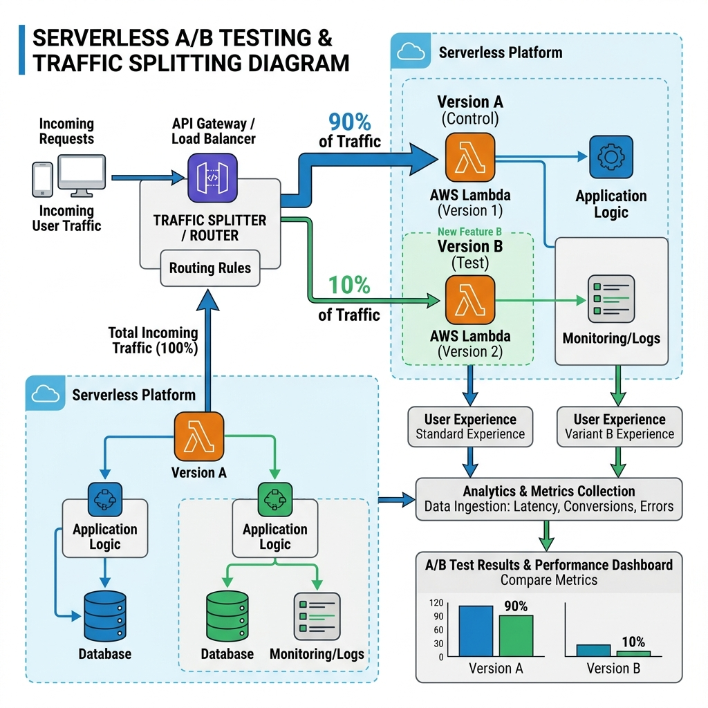
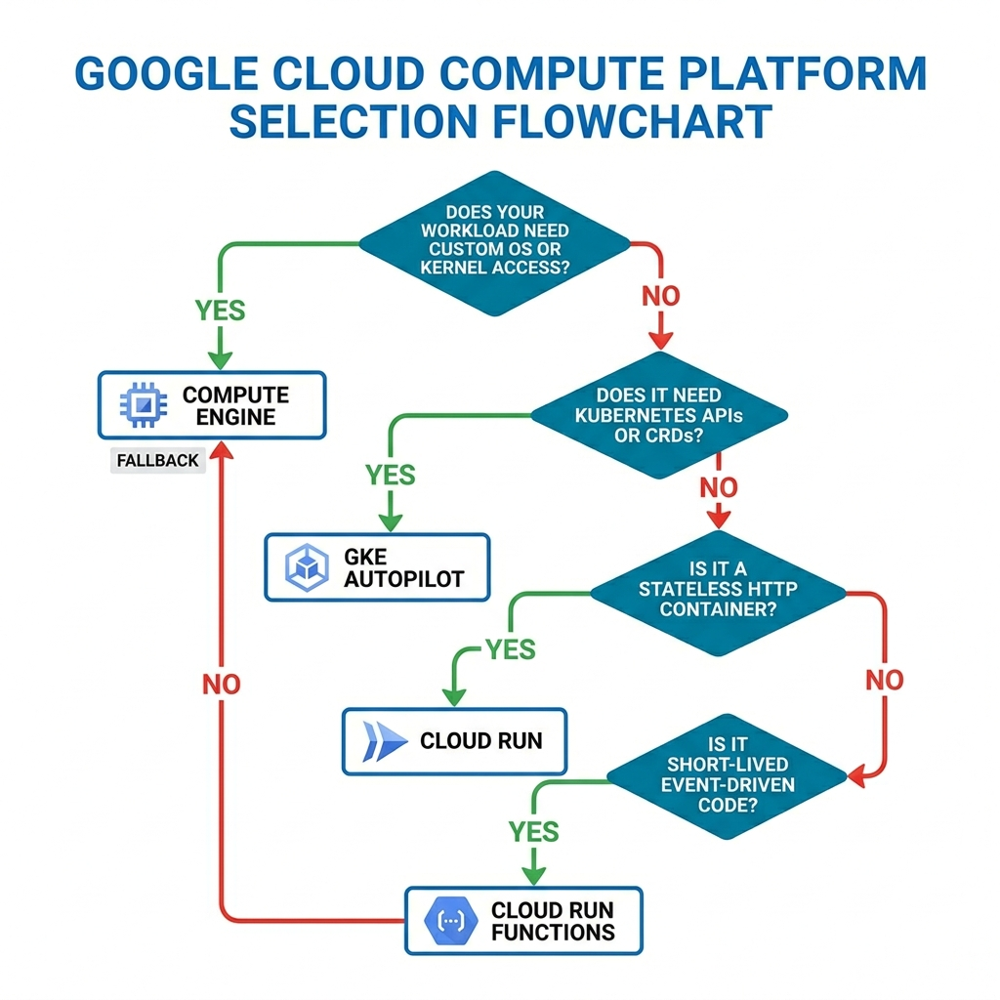

<!-- course-title: ACE: Associate Cloud Engineer Prep -->
<!-- layout: title -->


ACE: Associate Cloud Engineer Prep

# Chapter 5: Serverless Compute & Event-Driven Systems

---

# Chapter Objectives

- Architect stateless microservices on Cloud Run with concurrency and scaling controls
- Manage Cloud Run revisions, traffic splitting, and canary release strategies
- Implement event-driven architectures using Cloud Run Functions and Eventarc
- Select the optimal Google Cloud compute platform using decision frameworks

---
<!-- layout: navigation -->
# Chapter 5

- **Cloud Run Deep Dive**
- Revisions & Traffic Splitting
- Cloud Functions & Eventarc
- Compute Selection Decision Matrix

---
<!-- layout: 2-column -->

# What is Serverless?

### Core Principles
- **Zero server management:** No OS patching, VM provisioning, or SSH
- **Scale to zero:** 0 instances when no traffic → $0 compute cost
- **Pay per use:** Billed per request or per 100ms of execution time

### Cloud Run
- Serverless container platform — runs **any container image** in **any language**
- Built on Knative and Google's infrastructure
- Fully managed TLS/HTTPS endpoints with custom domains

---

# Cloud Run Container Contract

Containers must follow these rules to run on Cloud Run:

1. **Listen on `$PORT`:** Read the `PORT` environment variable (default `8080`)
2. **Stateless:** Local writes go to in-memory `/tmp` — ephemeral per instance
3. **Fast startup:** Must be ready to handle requests within seconds
4. **Linux x86_64:** ARM and Windows containers are not supported

```bash
# Deploy a container to Cloud Run
gcloud run deploy customer-api \
  --image=us-central1-docker.pkg.dev/prod-app/app-repo/api:v1.0 \
  --region=us-central1 \
  --allow-unauthenticated
```

---

# Concurrency Settings

- **Concurrency:** Number of simultaneous requests a single instance handles (default: 80, max: 1000)
- Unlike AWS Lambda (1 request per instance), Cloud Run processes **many requests per instance**
- Higher concurrency = fewer instances = lower cost (if your app can handle it)

```bash
# Set concurrency to 50 and max instances to 20
gcloud run deploy customer-api \
  --concurrency=50 \
  --max-instances=20 \
  --region=us-central1
```

> [!TIP]
> Set concurrency based on your app's thread model. A single-threaded Python/Flask app should use `--concurrency=1`. A Go or Java app with goroutines/threads can handle 80+.

---

# Cold Starts & Instance Controls

- **Cold start:** Latency spike when Cloud Run provisions a new instance from zero
- Mitigate with `--min-instances` to keep warm instances ready

| Setting | Effect | Cost Impact |
| :--- | :--- | :--- |
| `--min-instances=0` | Full scale-to-zero; cold starts possible | Lowest idle cost |
| `--min-instances=1` | 1 warm instance always ready | ~$15/month idle |
| `--max-instances=100` | Cap scaling to prevent downstream overload | Controls peak cost |

---

# CPU Allocation Modes

- **CPU allocated during requests only** (default): CPU throttled between requests — lowest cost
- **CPU always allocated:** CPU available even when idle — required for background processing

```bash
# Always-allocated CPU for background tasks
gcloud run deploy worker-service \
  --cpu-throttling=false \
  --min-instances=1
```

> [!NOTE]
> "CPU always allocated" mode is required for WebSocket connections, background queues, and any processing that happens outside a request/response cycle.

---
<!-- layout: navigation -->
# Chapter 5

- Cloud Run Deep Dive
- **Revisions & Traffic Splitting**
- Cloud Functions & Eventarc
- Compute Selection Decision Matrix

---

# Revision Immutability

- Every `gcloud run deploy` creates a new **immutable Revision**
- A revision snapshots: container image, env vars, memory, CPU, concurrency, and secrets
- Old revisions remain available for rollback or traffic splitting

```bash
# List all revisions of a service
gcloud run revisions list --service=customer-api --region=us-central1

# Describe a specific revision
gcloud run revisions describe customer-api-00003-abc \
  --region=us-central1
```

> [!NOTE]
> Updating an environment variable creates a new revision without rebuilding the container image.

---

# Traffic Splitting & Canary Releases

- Route percentages of traffic across multiple active revisions simultaneously
- Use for **canary releases**: send 5–10% of traffic to a new version before full rollout

```bash
# Route 90% to v1, 10% to v2
gcloud run services update-traffic customer-api \
  --region=us-central1 \
  --to-revisions=customer-api-00001-v1=90,customer-api-00002-v2=10

# Instant rollback to 100% v1
gcloud run services update-traffic customer-api \
  --region=us-central1 \
  --to-revisions=customer-api-00001-v1=100
```

---

# Tagged Revisions for Testing

- Assign a **tag** to a revision to get a dedicated URL for testing before sending real traffic
- Tagged URLs bypass traffic splitting — QA can test the new version directly

```bash
# Tag a revision for pre-production testing
gcloud run services update-traffic customer-api \
  --region=us-central1 \
  --set-tags=canary=customer-api-00002-v2

# Access the tagged URL: https://canary---customer-api-abc123.a.run.app
```

---
<!-- layout: title-image -->

# Cloud Run Traffic Splitting Flow


---
<!-- layout: navigation -->
# Chapter 5

- Cloud Run Deep Dive
- Revisions & Traffic Splitting
- **Cloud Functions & Eventarc**
- Compute Selection Decision Matrix

---
<!-- layout: 2-column -->

# Cloud Run Functions (v2)

### What They Are
- Lightweight serverless code execution without Dockerfiles or container management
- **v2 functions** are built on top of Cloud Run and Cloud Build under the hood

### Trigger Types
- **HTTP:** Webhooks, REST APIs, scheduled invocations
- **Cloud Storage:** Fire when objects are created, deleted, or archived
- **Cloud Pub/Sub:** Fire when messages are published to a topic

---

# Deploying a Cloud Run Function

```bash
# Deploy a Python function triggered by HTTP
gcloud functions deploy process-order \
  --gen2 \
  --runtime=python312 \
  --region=us-central1 \
  --trigger-http \
  --allow-unauthenticated \
  --entry-point=handle_request \
  --source=./src
```

```bash
# Deploy a function triggered by GCS object creation
gcloud functions deploy resize-image \
  --gen2 \
  --runtime=nodejs20 \
  --region=us-central1 \
  --trigger-event-filters="type=google.cloud.storage.object.v1.finalized" \
  --trigger-event-filters="bucket=prod-uploads" \
  --entry-point=processImage
```

---

# Eventarc: Unified Event Routing

- Delivers standardized **CloudEvents** from 90+ Google Cloud sources to Cloud Run
- Sources include: GCS, BigQuery, Cloud SQL, Firestore, Pub/Sub, and Cloud Audit Logs
- Single consistent event format regardless of source

```bash
# Create an Eventarc trigger for Audit Log events
gcloud eventarc triggers create storage-audit-trigger \
  --location=us-central1 \
  --destination-run-service=audit-processor \
  --event-filters="type=google.cloud.audit.log.v1.written" \
  --event-filters="serviceName=storage.googleapis.com" \
  --event-filters="methodName=storage.objects.create" \
  --service-account="eventarc-sa@prod-app.iam.gserviceaccount.com"
```

> [!IMPORTANT]
> Eventarc uses Audit Logs to catch events. You must enable **Data Access Audit Logs** for the triggering service.

---

# Cloud Run Functions vs Cloud Run

| Feature | Cloud Run Functions | Cloud Run |
| :--- | :--- | :--- |
| **Deploy artifact** | Source code (zip) | Container image |
| **Language support** | Node.js, Python, Go, Java, .NET, Ruby, PHP | Any language in any container |
| **Trigger types** | HTTP, GCS, Pub/Sub, Eventarc | HTTP, gRPC, Eventarc |
| **Custom dependencies** | `requirements.txt` / `package.json` | Full Dockerfile control |
| **Max timeout** | 60 minutes | 60 minutes |

> [!TIP]
> Use **Cloud Run Functions** for simple event handlers. Use **Cloud Run** when you need custom system libraries, multi-process architectures, or non-HTTP protocols.

---
<!-- layout: navigation -->
# Chapter 5

- Cloud Run Deep Dive
- Revisions & Traffic Splitting
- Cloud Functions & Eventarc
- **Compute Selection Decision Matrix**

---
<!-- layout: 3-column -->

# When to Use Each Compute Platform

### Compute Engine
- Custom OS or kernel requirements
- GPU/TPU workloads
- Stateful apps with local disk
- Lift-and-shift migrations

### GKE Autopilot
- Microservices architectures
- Kubernetes-native APIs & CRDs
- Long-running stateful processing
- Teams with K8s expertise

### Cloud Run
- Stateless HTTP APIs
- Scale-to-zero traffic patterns
- Rapid deployment cycles
- No infrastructure management

---
<!-- layout: title-image -->

# Compute Platform Decision Flowchart


---

# Lab 5: Canary Deployments on Cloud Run

**Time:** 30 minutes

**Lab guide:** [Lab 5 Instructions](https://example.com/labs/lab-05)

---

# What You Learned

- Architected stateless microservices on Cloud Run with concurrency and scaling controls
- Managed Cloud Run revisions, traffic splitting, and canary release strategies
- Implemented event-driven architectures using Cloud Run Functions and Eventarc
- Selected the optimal Google Cloud compute platform using decision frameworks

---

# Q&A

Questions?
