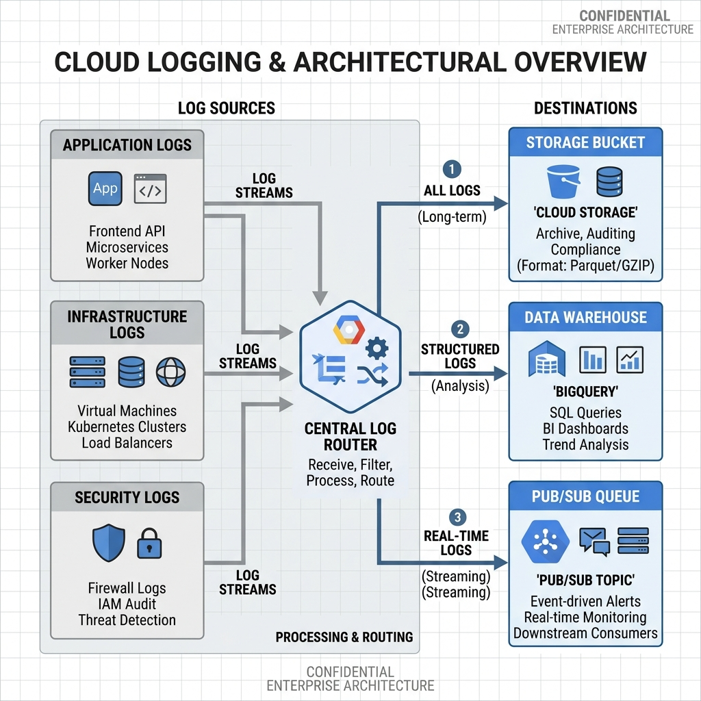

<!-- course-title: ACE: Associate Cloud Engineer Prep -->
<!-- layout: title -->


ACE: Associate Cloud Engineer Prep

# Chapter 6: Cloud Operations & Observability

---

# Chapter Objectives

- Configure Cloud Logging Log Routers, sinks, exclusions, and BigQuery exports
- Build custom Cloud Monitoring dashboards, log-based metrics, and alerting policies
- Install and configure the Ops Agent on Compute Engine VMs for OS-level telemetry
- Analyze application performance using Cloud Trace, Profiler, and Query Insights

---
<!-- layout: navigation -->
# Chapter 6

- **Cloud Logging & Log Router**
- Cloud Monitoring & Alerting
- Ops Agent & Managed Prometheus
- Cloud Diagnostics & APM

---
<!-- layout: 2-column -->

# Cloud Logging Architecture

### Log Ingestion
- Automatically ingests logs from Compute Engine, GKE, Cloud Run, and 100+ Google Cloud services
- All log entries pass through the **Log Router** before storage

### Log Buckets & Retention
- `_Required`: Admin Activity audit logs — **400 days** retention, cannot be modified or deleted
- `_Default`: All other logs — **30 days** default retention (configurable up to 3650 days)
- Custom buckets: User-defined retention for specific log types

---

# Log Router Mechanics

- The Log Router evaluates every log entry against **inclusion filters** on each Sink
- A log entry can match multiple sinks (copied to multiple destinations)
- **Exclusion filters** drop matching log entries before they are stored (saves cost)

```bash
# Create an exclusion filter to drop debug-level logs
gcloud logging sinks update _Default \
  --add-exclusion=name=drop-debug,filter='severity="DEBUG"'
```

> [!TIP]
> Use exclusion filters to reduce logging costs. Debug and info logs from health checks can generate massive volumes with zero operational value.

---

# Log Sinks & Export Destinations

```bash
# Create a sink exporting error logs to BigQuery
gcloud logging sinks create bq-errors \
  bigquery.googleapis.com/projects/prod-security/datasets/error_logs \
  --log-filter='severity>=ERROR'

# Create a sink sending all logs to Cloud Storage for archival
gcloud logging sinks create gcs-archive \
  storage.googleapis.com/prod-log-archive \
  --log-filter='resource.type="gce_instance"'
```

| Destination | Best For |
| :--- | :--- |
| **Cloud Storage** | Low-cost long-term archival (compliance) |
| **BigQuery** | SQL analysis, security auditing, dashboards |
| **Pub/Sub** | Streaming to third-party SIEM (Splunk, Datadog) |
| **Log Bucket** | Custom retention within Cloud Logging |

---

# Querying Logs with the Logs Explorer

- Logs Explorer provides a filter bar for structured log queries
- Supports field-level filtering, regex, and time range selection

```text
# Find all failed SSH login attempts on Compute Engine VMs
resource.type="gce_instance"
log_name="projects/prod-app/logs/syslog"
textPayload=~"Failed password"
severity>=WARNING
timestamp>="2025-07-01T00:00:00Z"
```

> [!NOTE]
> Save frequently-used queries as **Saved Queries** in the Console. Share them with your team for consistent incident investigation.

---
<!-- layout: title-image -->

# Log Router Architecture


---
<!-- layout: navigation -->
# Chapter 6

- Cloud Logging & Log Router
- **Cloud Monitoring & Alerting**
- Ops Agent & Managed Prometheus
- Cloud Diagnostics & APM

---
<!-- layout: 2-column -->

# Cloud Monitoring Overview

### Metrics Collection
- Automatically collects metrics from all Google Cloud services (CPU, memory, network, disk)
- Metrics Explorer lets you filter, group, and aggregate time-series data

### Custom Dashboards
- Combine line charts, stacked bars, gauges, and scorecards into operational views
- Share dashboards across teams via JSON export/import

---

# Creating Alerting Policies

Alerting policies notify your team when metrics breach thresholds.

| Component | Purpose |
| :--- | :--- |
| **Condition** | Metric + threshold + duration (e.g., CPU > 85% for 5 min) |
| **Notification Channel** | Email, SMS, PagerDuty, Slack webhook, Pub/Sub |
| **Documentation** | Runbook/playbook markdown for the on-call engineer |
| **Auto-close** | Duration after which the alert resolves automatically |

```bash
# Create an alerting policy from a YAML definition
gcloud alpha monitoring policies create \
  --policy-from-file=cpu-alert-policy.yaml
```

---

# Log-Based Metrics

Convert log patterns into numerical time-series metrics for alerting and dashboards.

### Counter Metrics
- Count log entries matching a filter (e.g., HTTP 500 errors per minute)

### Distribution Metrics
- Extract numeric values from structured logs (e.g., response latency in ms)

```bash
# Create a counter metric for HTTP 5xx errors
gcloud logging metrics create http_5xx_count \
  --description="Count of HTTP 5xx errors" \
  --log-filter='resource.type="cloud_run_revision"
    AND httpRequest.status>=500'
```

> [!TIP]
> Combine log-based metrics with alerting policies to get notified when error rates spike, even before users report problems.

---

# Uptime Checks

- Cloud Monitoring can probe your endpoints from multiple global locations every 1–15 minutes
- Checks HTTP(S), TCP, or custom content match conditions
- Failures trigger alerting policies automatically

```bash
# Create an HTTPS uptime check
gcloud monitoring uptime create customer-api-check \
  --display-name="Customer API Health" \
  --monitored-resource-type=uptime-url \
  --hostname=api.example.com \
  --path=/healthz \
  --check-interval=60s
```

---
<!-- layout: navigation -->
# Chapter 6

- Cloud Logging & Log Router
- Cloud Monitoring & Alerting
- **Ops Agent & Managed Prometheus**
- Cloud Diagnostics & APM

---
<!-- layout: 2-column -->

# The Ops Agent for Compute Engine

### The Problem
- Google Cloud hypervisors see **host-level** metrics only (CPU utilization, network bytes)
- They **cannot see inside** the guest OS: memory usage, disk space, application logs

### The Solution
- **Ops Agent** = Fluent Bit (logging) + OpenTelemetry Collector (metrics) in a single agent
- Reports guest OS metrics and application logs to Cloud Monitoring & Logging

---

# Installing the Ops Agent

```bash
# Install on a Debian/Ubuntu VM
curl -sSO https://dl.google.com/cloudagents/add-google-cloud-ops-agent-repo.sh
sudo bash add-google-cloud-ops-agent-repo.sh --also-install

# Verify the agent is running
sudo systemctl status google-cloud-ops-agent
```

```yaml
# /etc/google-cloud-ops-agent/config.yaml
logging:
  receivers:
    nginx_access:
      type: nginx_access
  service:
    pipelines:
      nginx:
        receivers: [nginx_access]
metrics:
  receivers:
    hostmetrics:
      type: hostmetrics
```

---

# Agent Policies for Fleet Management

- Install and configure the Ops Agent across **hundreds of VMs** using Agent Policies
- Policies use OS Config to push configuration changes automatically

```bash
# Create an agent policy for all VMs with label "env=prod"
gcloud compute instances ops-agents policies create prod-agent-policy \
  --os-types=short-name=debian,version=12 \
  --instances-filter='(resource.labels.env="prod")' \
  --agent-rules='type=ops-agent,version=current-major'
```

> [!NOTE]
> Agent Policies require the OS Config API to be enabled and the OS Config agent to be running on target VMs.

---

# Managed Service for Prometheus

- Fully managed, Google-hosted Prometheus backend for Kubernetes workloads
- **No self-managed Prometheus server** — Google handles storage, scaling, and HA
- Query with PromQL from Grafana or Cloud Monitoring

```bash
# Enable Managed Prometheus on a GKE cluster
gcloud container clusters update prod-gke \
  --region=us-central1 \
  --enable-managed-prometheus
```

---
<!-- layout: navigation -->
# Chapter 6

- Cloud Logging & Log Router
- Cloud Monitoring & Alerting
- Ops Agent & Managed Prometheus
- **Cloud Diagnostics & APM**

---
<!-- layout: 2-column -->

# Application Performance Monitoring

### Cloud Trace
- Distributed tracing across microservices
- Tracks request latency as it hops between Cloud Run, GKE, and Cloud SQL
- Auto-instrumented for many Google Cloud services

### Cloud Profiler
- Continuous CPU and memory profiling with < 1% overhead
- Pinpoints exact lines of code causing bottlenecks
- Supports Go, Java, Node.js, and Python

---

# Query Insights for Cloud SQL

- Built-in performance dashboard for Cloud SQL instances
- Identifies top queries by CPU time, execution count, and rows scanned
- Highlights lock contention and slow query patterns

```bash
# Enable Query Insights on a Cloud SQL instance
gcloud sql instances patch prod-db-01 \
  --insights-config-query-insights-enabled \
  --insights-config-record-application-tags \
  --insights-config-record-client-address
```

> [!TIP]
> Use Query Insights **before** scaling up your Cloud SQL tier. Often the fix is an index or query rewrite, not more CPU.

---

# Service Health & Error Reporting

- **Personalized Service Health:** Shows Google Cloud incidents affecting your specific projects and resources (not just global status)
- **Error Reporting:** Aggregates and deduplicates application exceptions across Cloud Run, GKE, and Compute Engine

```bash
# List recent error groups
gcloud beta error-reporting events list --limit=10
```

---

# Lab 6: Observability & Log-Based Alerting

**Time:** 30 minutes

**Lab guide:** [Lab 6 Instructions](https://example.com/labs/lab-06)

---

# What You Learned

- Configured Cloud Logging Log Routers, sinks, exclusions, and BigQuery exports
- Built custom Cloud Monitoring dashboards, log-based metrics, and alerting policies
- Installed and configured the Ops Agent on Compute Engine VMs for OS-level telemetry
- Analyzed application performance using Cloud Trace, Profiler, and Query Insights

---

# Q&A

Questions?
