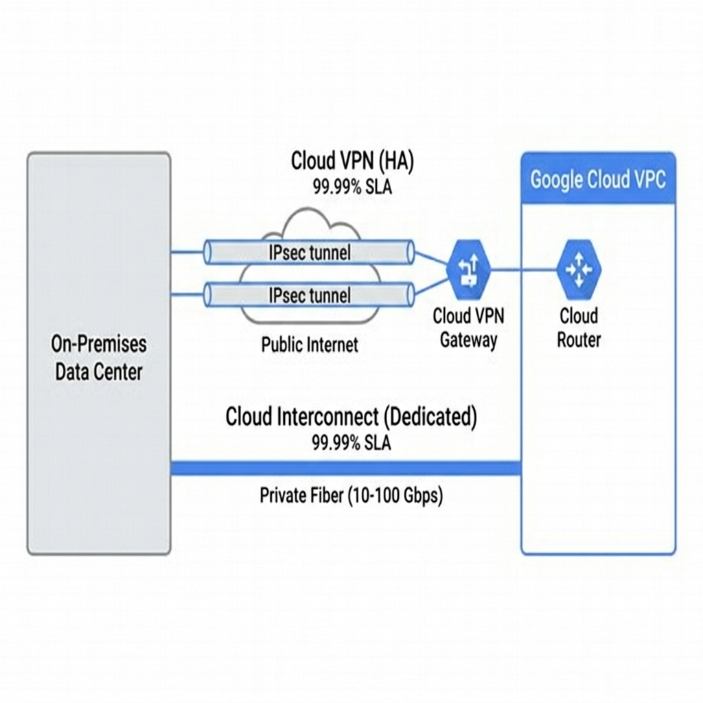

<!-- course-title: ACE: Associate Cloud Engineer Prep -->
<!-- layout: title -->


ACE: Associate Cloud Engineer Prep

# Chapter 7: Advanced Networking & Load Balancing

---

# Chapter Objectives

- Evaluate, architect, and configure the Google Cloud Load Balancing suite
- Implement VPC Firewall rules and Service Account-based targeting
- Establish hybrid connectivity using Cloud VPN and Cloud Interconnect
- Manage Cloud DNS, Cloud NAT, custom routes, and VPC Peering

---
<!-- layout: navigation -->
# Chapter 7

- **Cloud Load Balancing Suite**
- VPC Firewall Security
- Hybrid Connectivity
- Core Network Services

---
<!-- layout: 3-column -->

# Load Balancer Categories

### Global External (L7)
- HTTP(S) Application Load Balancer
- Single global Anycast IP
- URL routing, SSL termination, Cloud Armor WAF

### Global External (L4)
- TCP Proxy / SSL Proxy Load Balancer
- Non-HTTP TCP traffic
- Global Anycast IP

### Regional (L4)
- External/Internal Network Load Balancer
- Pass-through (no proxy) — preserves client IP
- Internal LB for multi-tier architectures

---

# Global HTTP(S) Load Balancer Architecture

```text
[Client] --> [Global Anycast IP] --> [URL Map (Host/Path Rules)]
                                            |
                                    [Backend Service]
                                            |
                          +-----------------+-----------------+
                          |                                   |
                [MIG: us-central1]                  [MIG: europe-west1]
```

- **Frontend:** Anycast IP + Forwarding Rule + managed SSL Certificate
- **URL Map:** Routes by host/path (e.g., `/api/*` → API backend, `/static/*` → GCS bucket)
- **Backend Service:** Health checks, session affinity, capacity scaling, Cloud CDN

---

# Health Checks & Backend Configuration

```bash
# Create a health check
gcloud compute health-checks create http web-health-check \
  --port=8080 --request-path=/healthz \
  --check-interval=10s --unhealthy-threshold=3

# Create a backend service with the health check
gcloud compute backend-services create web-backend \
  --protocol=HTTP --port-name=http \
  --health-checks=web-health-check --global

# Add a managed instance group as a backend
gcloud compute backend-services add-backend web-backend \
  --instance-group=web-mig-us \
  --instance-group-zone=us-central1-a --global
```

---

# Cloud CDN & Cloud Armor

- **Cloud CDN:** Caches responses at Google's edge PoPs for low-latency delivery
- **Cloud Armor:** Web Application Firewall (WAF) protecting against DDoS, SQL injection, XSS

```bash
# Enable Cloud CDN on a backend service
gcloud compute backend-services update web-backend \
  --enable-cdn --global

# Create a Cloud Armor security policy
gcloud compute security-policies create prod-waf-policy
gcloud compute security-policies rules create 1000 \
  --security-policy=prod-waf-policy \
  --expression="origin.region_code == 'CN'" \
  --action=deny-403
```

---
<!-- layout: 2-column -->

# Network Service Tiers

### Premium Tier (Default)
- Traffic enters Google's backbone at the **nearest edge PoP**
- Lowest latency, highest performance
- Required for Global Load Balancing

### Standard Tier
- Traffic routes over the **public internet** to the hosting region
- Lower cost, higher latency
- Regional Load Balancers only

> [!NOTE]
> Premium Tier is the default and recommended for all production workloads. Standard Tier saves ~25% on egress but sacrifices global load balancing.

---
<!-- layout: navigation -->
# Chapter 7

- Cloud Load Balancing Suite
- **VPC Firewall Security**
- Hybrid Connectivity
- Core Network Services

---
<!-- layout: 2-column -->

# VPC Firewall Rules

### Architecture
- Distributed stateful firewalls applied at the **VM hypervisor level**
- No single chokepoint — rules are enforced on every VM independently
- Evaluate both Ingress (incoming) and Egress (outgoing) traffic

### Rule Components
- **Priority:** `0`–`65535` (lowest number = highest priority, first match wins)
- **Action:** `allow` or `deny`
- **Protocol & Ports:** `tcp:80`, `tcp:443`, `udp:53`, `icmp`
- **Targets:** All instances, target tags, or target service accounts

---

# Target Tags vs Service Account Targets

| Feature | Network Tags | Service Account Targets |
| :--- | :--- | :--- |
| **Attached to** | VM instance metadata | VM identity |
| **Who can modify** | Anyone with `compute.instanceAdmin` | Only `iam.serviceAccountUser` holders |
| **Security risk** | Any admin can add a tag → bypass firewall | Controlled by IAM |
| **Production use** | Dev/test only | **Recommended for production** |

```bash
# Firewall rule targeting a service account (secure)
gcloud compute firewall-rules create allow-http-web \
  --network=prod-vpc --direction=INGRESS \
  --action=ALLOW --rules=tcp:80,tcp:443 \
  --target-service-accounts="web-sa@prod-app.iam.gserviceaccount.com"
```

---

# Implied and Default Firewall Rules

| Rule | Priority | Action | Scope |
| :--- | :--- | :--- | :--- |
| **Implied deny all ingress** | 65535 | Deny | All incoming traffic |
| **Implied allow all egress** | 65535 | Allow | All outgoing traffic |
| **Default allow internal** | 65534 | Allow | Traffic within VPC subnets |
| **Default allow SSH/RDP/ICMP** | 65534 | Allow | SSH (22), RDP (3389), ICMP from `0.0.0.0/0` |

> [!WARNING]
> The default `allow-ssh` and `allow-rdp` rules open SSH/RDP to the **entire internet** (`0.0.0.0/0`). Delete these in production and use IAP tunnels instead.

---

# Firewall Rules Logging & Troubleshooting

```bash
# Enable firewall rules logging for an existing rule
gcloud compute firewall-rules update allow-http-web \
  --enable-logging

# View firewall logs in Cloud Logging
# Filter: resource.type="gce_subnetwork"
#         logName="projects/PROJECT_ID/logs/compute.googleapis.com%2Ffirewall"
```

> [!TIP]
> Use **Firewall Insights** in the Console to identify overly permissive rules, shadowed rules, and rules that haven't matched traffic in 30+ days.

---
<!-- layout: navigation -->
# Chapter 7

- Cloud Load Balancing Suite
- VPC Firewall Security
- **Hybrid Connectivity**
- Core Network Services

---
<!-- layout: 2-column -->

# Cloud VPN vs Cloud Interconnect

### Cloud VPN (HA)
- Encrypted IPsec tunnels over the **public internet**
- **HA VPN:** 99.99% SLA with 2 interfaces and BGP routing
- Bandwidth: up to 3 Gbps per tunnel (aggregate with multiple tunnels)

### Cloud Interconnect
- Direct **private physical connection** to Google's network
- **Dedicated:** 10 or 100 Gbps circuits from your data center
- **Partner:** 50 Mbps–10 Gbps via a service provider
- Bypasses public internet — highest security and throughput

---

# HA VPN Configuration

```bash
# Create an HA VPN gateway
gcloud compute vpn-gateways create prod-vpn-gw \
  --network=prod-vpc --region=us-central1

# Create a Cloud Router for BGP
gcloud compute routers create prod-router \
  --network=prod-vpc --region=us-central1 \
  --asn=65001

# Create VPN tunnels (must create 2 for HA SLA)
gcloud compute vpn-tunnels create tunnel-0 \
  --vpn-gateway=prod-vpn-gw --interface=0 \
  --peer-gcp-gateway=peer-vpn-gw \
  --shared-secret=SECRET --router=prod-router \
  --region=us-central1
```

---

# BGP Routing with Cloud Router

- **Cloud Router** dynamically exchanges routes with on-premises routers using **BGP**
- No static route maintenance — new subnets propagate automatically
- Supports custom route advertisements and route priorities

```bash
# Add a BGP peer to the Cloud Router
gcloud compute routers add-bgp-peer prod-router \
  --peer-name=onprem-peer \
  --peer-asn=65002 \
  --interface=tunnel-0-iface \
  --region=us-central1
```

> [!IMPORTANT]
> HA VPN requires **two tunnels** with BGP for the 99.99% SLA. A single tunnel only provides 99.9% SLA.

---
<!-- layout: title-image -->

# Hybrid Connectivity Comparison


---
<!-- layout: navigation -->
# Chapter 7

- Cloud Load Balancing Suite
- VPC Firewall Security
- Hybrid Connectivity
- **Core Network Services**

---
<!-- layout: 2-column -->

# Cloud DNS

### Public Zones
- Internet-facing DNS records for your domain
- 100% SLA, globally distributed, low-latency resolution

### Private Zones
- VPC-internal DNS resolution (e.g., `db.internal` → `10.0.1.5`)
- Only resolvable from authorized VPCs
- No internet exposure

```bash
# Create a private DNS zone
gcloud dns managed-zones create internal-zone \
  --dns-name=internal.roi.com. \
  --visibility=private \
  --networks=prod-vpc
```

---

# Cloud NAT

- Enables VMs with **only private IPs** to make outbound internet connections
- Fully managed — no gateway VM to provision or maintain
- **Outbound only:** External clients cannot initiate inbound connections

```bash
# Create a Cloud NAT gateway
gcloud compute routers nats create prod-nat \
  --router=prod-router --region=us-central1 \
  --nat-all-subnet-ip-ranges \
  --auto-allocate-nat-external-ips
```

> [!NOTE]
> Cloud NAT is required for private GKE nodes to pull container images and for private VMs to download OS updates.

---

# VPC Network Peering

- Connect two VPCs so resources can communicate using **private IPs** across projects or organizations
- No data transfer through the public internet — stays on Google's backbone
- Each VPC can peer with up to **25** other VPCs

```bash
# Create a peering connection from VPC A to VPC B
gcloud compute networks peerings create vpc-a-to-b \
  --network=vpc-a \
  --peer-network=projects/other-project/global/networks/vpc-b

# Peering is NOT transitive: A↔B and B↔C does NOT mean A↔C
```

> [!WARNING]
> VPC Peering is **not transitive**. If VPC-A peers with VPC-B and VPC-B peers with VPC-C, VPC-A cannot reach VPC-C through B.

---

# Lab 7: Global Load Balancer & Firewall Security

**Time:** 45 minutes

**Lab guide:** [Lab 7 Instructions](https://example.com/labs/lab-07)

---

# What You Learned

- Evaluated, architected, and configured the Google Cloud Load Balancing suite
- Implemented VPC Firewall rules and Service Account-based targeting
- Established hybrid connectivity using Cloud VPN and Cloud Interconnect
- Managed Cloud DNS, Cloud NAT, custom routes, and VPC Peering

---

# Q&A

Questions?
