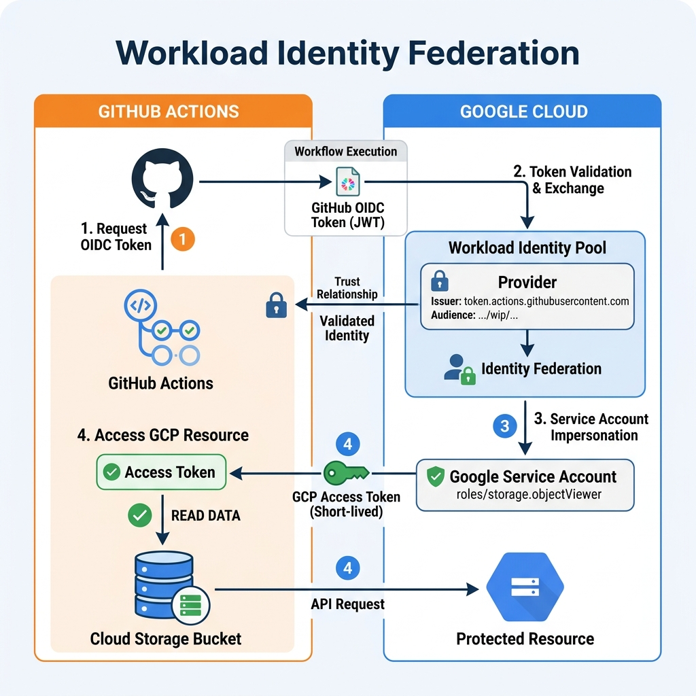

<!-- course-title: ACE: Associate Cloud Engineer Prep -->
<!-- layout: title -->


ACE: Associate Cloud Engineer Prep

# Chapter 8: Advanced Access & Security Management

---

# Chapter Objectives

- Author fine-grained Custom IAM Roles and enforce IAM Deny Policies
- Audit service accounts, eliminate long-lived JSON key risks, and enforce governance
- Implement Service Account Impersonation with short-lived access tokens
- Configure Workload Identity Federation for keyless authentication from external systems

---
<!-- layout: navigation -->
# Chapter 8

- **Advanced IAM & Custom Roles**
- Service Accounts & Key Governance
- Service Account Impersonation
- Workload Identity Federation

---

# When to Use Custom IAM Roles

- Predefined roles sometimes grant **more permissions than needed**
- Custom roles let you pick **exactly** the permissions required for a job function
- Available at the Project or Organization level

```yaml
# custom-role.yaml
title: "Instance Start Stop Operator"
description: "Allows restarting compute instances only"
stage: "GA"
includedPermissions:
- compute.instances.start
- compute.instances.stop
- compute.instances.get
- compute.instances.list
```

---

# Creating & Managing Custom Roles

```bash
# Create a custom role at project level
gcloud iam roles create instanceOperator \
  --project=prod-app-01 \
  --file=custom-role.yaml

# Update an existing custom role to add permissions
gcloud iam roles update instanceOperator \
  --project=prod-app-01 \
  --add-permissions=compute.instances.reset

# List all custom roles in a project
gcloud iam roles list --project=prod-app-01
```

> [!NOTE]
> Custom roles must be maintained manually. When Google adds new permissions to a service, your custom role does not automatically pick them up.

---
<!-- layout: 2-column -->

# Custom Role Lifecycle

### Stages
- **Alpha / Beta:** Testing; not visible to all project members
- **GA:** Ready for production use
- **Disabled:** Role exists but cannot be assigned
- **Deleted:** Soft-deleted for 7 days, then permanently removed

### Limitations
- Maximum 300 custom roles per organization
- Some permissions are **not available** in custom roles (check `gcloud iam permissions queryable-by`)
- Cannot combine permissions from incompatible services

---

# IAM Deny Policies

- Standard IAM grants are **additive only** — there is no built-in "remove" or "revoke"
- **Deny Policies** explicitly block specific permissions, overriding any "Allow" bindings

```json
{
  "name": "policies/org-123/denypolicies/block-sa-key-creation",
  "rules": [
    {
      "denyRule": {
        "deniedPrincipals": ["principalSet://goog/group/contractors@roi.com"],
        "deniedPermissions": ["iam.serviceAccountKeys.create"],
        "exceptionPrincipals": ["principal://goog/subject/sec-admin@roi.com"]
      }
    }
  ]
}
```

> [!CAUTION]
> Deny policies apply immediately across all child resources. Test in a sandbox project before applying at the organization level.

---

# IAM Conditions (Context-Aware Access)

- Add **conditions** to IAM bindings to restrict access by time, resource name, IP, or request attributes
- Conditions use Common Expression Language (CEL) syntax

```bash
# Grant Storage Admin only for objects with prefix "reports/"
gcloud projects add-iam-policy-binding prod-app-01 \
  --member="group:analysts@roi.com" \
  --role="roles/storage.objectAdmin" \
  --condition='expression=resource.name.startsWith("projects/_/buckets/data/objects/reports/"),title=reports-only'
```

> [!TIP]
> Use conditions to implement resource-level least privilege without creating dozens of custom roles.

---
<!-- layout: navigation -->
# Chapter 8

- Advanced IAM & Custom Roles
- **Service Accounts & Key Governance**
- Service Account Impersonation
- Workload Identity Federation

---
<!-- layout: 2-column -->

# Service Account Types

### Google-Managed Service Accounts
- Created automatically by Google Cloud services
- Named `service-PROJECT_NUMBER@*.iam.gserviceaccount.com`
- You cannot delete or directly manage these

### User-Managed Service Accounts
- Created by you for application workloads
- Named `SA_NAME@PROJECT_ID.iam.gserviceaccount.com`
- Maximum 100 per project

### Default Compute Engine SA
- `PROJECT_NUMBER-compute@developer.gserviceaccount.com`
- Granted **Editor** role by default — **disable this immediately in production**

---

# Service Account Key Risks

- JSON keys **never expire** until explicitly deleted
- A leaked key grants full access to everything the SA is authorized for
- Common leak vectors: committed to GitHub, stored on compromised laptops, shared via email

```bash
# List all keys for a service account (audit regularly)
gcloud iam service-accounts keys list \
  --iam-account=web-sa@prod-app.iam.gserviceaccount.com

# Delete an old key
gcloud iam service-accounts keys delete KEY_ID \
  --iam-account=web-sa@prod-app.iam.gserviceaccount.com
```

> [!WARNING]
> Google's Security Command Center flags service account keys older than 90 days. Treat any key download as a **security incident** in production.

---

# Key Governance: Eliminating Keys

- Enforce Organization Policy: `constraints/iam.disableServiceAccountKeyCreation`
- This blocks **all** key downloads organization-wide

```bash
# Apply org policy to disable SA key creation
gcloud resource-manager org-policies enable-enforce \
  constraints/iam.disableServiceAccountKeyCreation \
  --organization=ORGANIZATION_ID
```

- Replace keys with:
  1. **Service Account Impersonation** (next section)
  2. **Workload Identity Federation** (section after)
  3. **Attached Service Accounts** (VMs, Cloud Run, GKE automatically get tokens)

---

# Attached Service Accounts

- Compute Engine, Cloud Run, and GKE workloads can be assigned a Service Account at creation
- The platform automatically provides short-lived OAuth tokens — no JSON key needed

```bash
# Create a VM with a specific service account
gcloud compute instances create prod-worker \
  --service-account=worker-sa@prod-app.iam.gserviceaccount.com \
  --scopes=cloud-platform

# Deploy Cloud Run with a specific service account
gcloud run deploy processor \
  --service-account=processor-sa@prod-app.iam.gserviceaccount.com
```

> [!IMPORTANT]
> Always use `--scopes=cloud-platform` (broad scope) and control access with **IAM roles on the service account** — not OAuth scopes.

---
<!-- layout: navigation -->
# Chapter 8

- Advanced IAM & Custom Roles
- Service Accounts & Key Governance
- **Service Account Impersonation**
- Workload Identity Federation

---

# How Impersonation Works

- A user or service temporarily **assumes the identity** of a target Service Account
- Returns a **short-lived access token** (default 1 hour, max 12 hours)
- Requires the `roles/iam.serviceAccountTokenCreator` role on the target SA

```text
[Developer: alice@roi.com]
       |
       v  (holds roles/iam.serviceAccountTokenCreator)
[Target: deploy-sa@prod-app.iam.gserviceaccount.com]
       |
       v  (deploy-sa has roles/run.admin)
[Cloud Run Service] --> Deployment succeeds
```

---

# Impersonation with gcloud & Terraform

```bash
# Grant Token Creator role
gcloud iam service-accounts add-iam-policy-binding \
  deploy-sa@prod-app.iam.gserviceaccount.com \
  --member="user:alice@roi.com" \
  --role="roles/iam.serviceAccountTokenCreator"

# Run gcloud as the service account
gcloud run services list \
  --impersonate-service-account=deploy-sa@prod-app.iam.gserviceaccount.com
```

```hcl
# Terraform provider with impersonation
provider "google" {
  impersonate_service_account = "deploy-sa@prod-app.iam.gserviceaccount.com"
  project                     = "prod-app"
  region                      = "us-central1"
}
```

---

# Audit Trail for Impersonation

- Cloud Audit Logs record **both** identities:
  - `principalEmail`: the original human user
  - `serviceAccountDelegationInfo`: the impersonated service account
- Full traceability — you always know *who* did *what* as *whom*

> [!TIP]
> Impersonation provides the same level of access as downloading a key, but with time-limited tokens and full audit trails. It is the recommended replacement for all developer key usage.

---

# Short-Lived Token Types

| Token Type | Max Lifetime | Use Case |
| :--- | :--- | :--- |
| **Access Token** | 12 hours | API calls, gcloud, Terraform |
| **ID Token** | 1 hour | Service-to-service authentication |
| **Self-Signed JWT** | 1 hour | Custom audience claims |
| **Signed Blob** | N/A | Signing data (e.g., GCS signed URLs) |

---
<!-- layout: navigation -->
# Chapter 8

- Advanced IAM & Custom Roles
- Service Accounts & Key Governance
- Service Account Impersonation
- **Workload Identity Federation**

---

# The Problem: External System Authentication

- CI/CD pipelines (GitHub Actions, GitLab), AWS workloads, and on-prem apps need GCP access
- Traditional approach: download a JSON key and store it as a CI/CD secret
- **Risk:** Key never expires, stored in third-party systems, potential for leaks

---

# Workload Identity Federation

- Exchange an **external identity token** (OIDC or SAML) for a short-lived GCP access token
- No JSON keys stored anywhere — the external token itself is the credential
- Supported providers: GitHub Actions, AWS, Azure AD, GitLab, HashiCorp Vault, any OIDC/SAML provider

```text
[GitHub Actions OIDC Token]
       |
       v
[Workload Identity Pool: github-pool]
       |
       v (Token exchange via STS API)
[GCP Short-Lived Access Token]
       |
       v (Impersonates)
[Service Account: cicd-deployer@prod-app.iam.gserviceaccount.com]
```

---

# Configuring Workload Identity for GitHub Actions

```yaml
# .github/workflows/deploy.yml
jobs:
  deploy:
    permissions:
      id-token: write
      contents: read
    steps:
    - uses: google-github-actions/auth@v2
      with:
        workload_identity_provider: >-
          projects/123/locations/global/workloadIdentityPools/github-pool/providers/github-provider
        service_account: cicd-deployer@prod-app.iam.gserviceaccount.com

    - name: Deploy to Cloud Run
      run: gcloud run deploy api --image=...
```

> [!IMPORTANT]
> Configure the Workload Identity Pool to validate the `sub`, `aud`, and `iss` claims. Without claim validation, any GitHub repository could authenticate to your GCP project.

---
<!-- layout: title-image -->

# Workload Identity Federation Flow


---

# GKE Workload Identity

- Maps Kubernetes Service Accounts to Google Cloud Service Accounts
- Pods authenticate to GCP APIs using **projected service account tokens** — no key files in containers

```bash
# Enable Workload Identity on a GKE cluster
gcloud container clusters update prod-gke \
  --region=us-central1 \
  --workload-pool=prod-app.svc.id.goog

# Bind a K8s SA to a GCP SA
gcloud iam service-accounts add-iam-policy-binding \
  app-sa@prod-app.iam.gserviceaccount.com \
  --member="serviceAccount:prod-app.svc.id.goog[default/app-ksa]" \
  --role="roles/iam.workloadIdentityUser"
```

---

# Lab 8: Enterprise IAM & Workload Identity

**Time:** 45 minutes

**Lab guide:** [Lab 8 Instructions](https://example.com/labs/lab-08)

---

# What You Learned

- Authored fine-grained Custom IAM Roles and enforced IAM Deny Policies
- Audited service accounts, eliminated long-lived JSON key risks, and enforced governance
- Implemented Service Account Impersonation with short-lived access tokens
- Configured Workload Identity Federation for keyless authentication from external systems

---

# Q&A

Questions?
