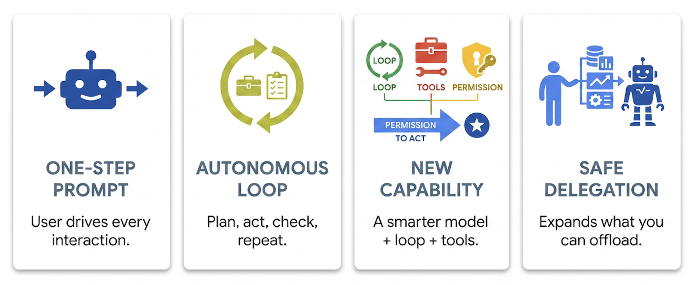
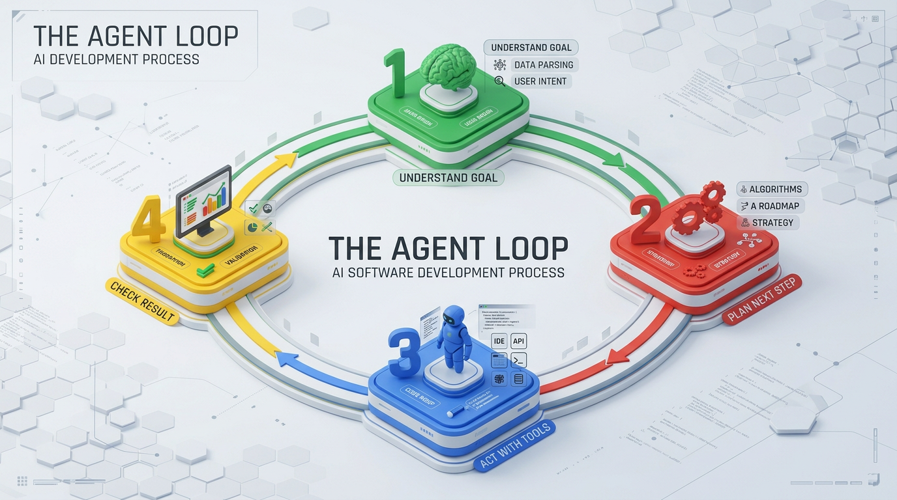
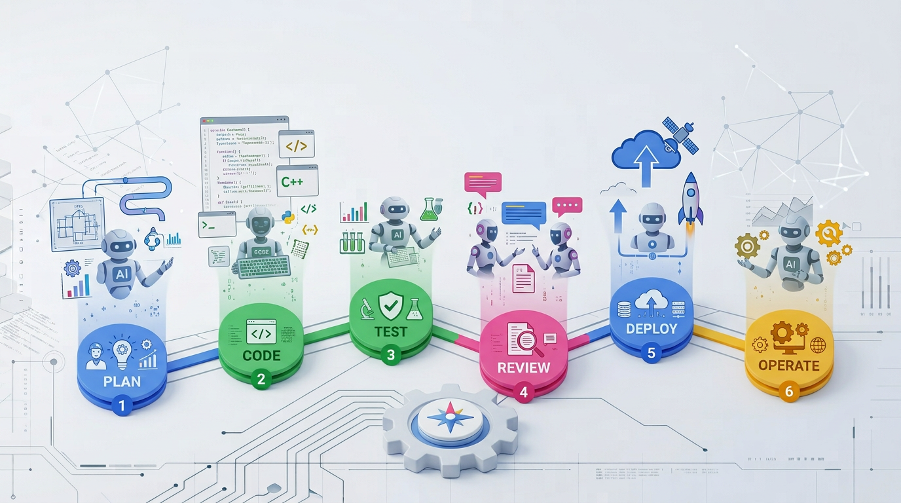
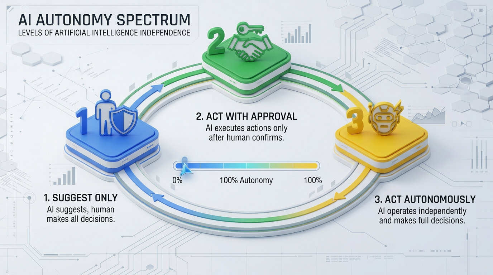

<!-- course-title: HCA: Agentic AI Use in the SDLC -->
<!-- layout: title -->

# Agentic AI Use in the
# Software Development Lifecycle (SDLC)

## Where autonomous AI agents fit across planning, coding, testing, review, and operations

---

# Welcome!

- ROI leads the industry in designing and delivering customized technology and management training solutions
- Meet your instructor
  - Name
  - Background
  - Contact info
- Let's get started!

---

# Course Objectives

- **Apply agentic AI effectively across the software development lifecycle**—from planning through operations
- Describe what distinguishes an agentic AI system from a simple prompt-and-response assistant
- Identify where agentic AI adds value across each phase of the SDLC
- Recognize common agentic AI tools and patterns used in modern software teams
- Apply practical guardrails for using agentic AI safely and effectively on a real team

---

# Agenda

- Segment 1: What Makes AI "Agentic"? (~20 min)
- Segment 2: Agentic AI Across the SDLC (~35 min)
- Segment 3: Adopting Agentic AI Responsibly (~25 min)
- Q&A (~10 min)

---

# Who Should Attend

- Software engineers and technical leads
- Engineering managers evaluating agentic AI adoption
- QA and DevOps engineers

---

# Prerequisites

- General software development experience
- No prior experience with AI agents required

---
<!-- layout: navigation -->
# Course Roadmap

- **What Makes AI "Agentic"?**
- Agentic AI Across the SDLC
- Adopting Agentic AI Responsibly

---
<!-- layout: stacked -->
# From Chatbots to Agents

- A chatbot answers one prompt at a time—you drive every step
- An agent pursues a goal: it plans, acts, checks its own results, and keeps going
- The shift isn't a smarter model—it's giving the model a loop, tools, and permission to act
- This distinction matters because it changes what you can safely delegate

---
<!-- layout: title-image -->
<!-- # The Agent Loop -->

---

# Core Building Blocks

- **Goal**: a task stated in outcome terms, not step-by-step instructions
- **Tools**: the actions the agent can actually take (run code, call an API, edit a file)
- **Memory**: context carried across steps—what's already been tried or learned
- **Iteration**: the ability to evaluate its own output and try again

---
<!-- layout: 2-column -->
# Assistant vs. Agent

### Prompt-and-Response Assistant
- You supply each step
- No memory between separate requests
- Output is advisory—you decide what to do with it

### Agentic System
- Pursues a stated goal across multiple steps
- Carries context forward within a task
- Takes real actions—edits files, runs commands, calls APIs

---

# Autonomy Is a Spectrum, Not a Switch

- Suggests only (you approve every action) → fully autonomous (acts, then reports)
- Most production tools sit in the middle: autonomous within a scoped, permissioned sandbox
- More autonomy means more leverage—and more blast radius if something goes wrong
- Segment 3 covers how to choose the right level deliberately

> [!NOTE]
> "Agentic" describes a pattern of operation, not a single product—coding assistants, test tools, and CI bots can all be built this way.

---
<!-- layout: navigation -->
# Course Roadmap

- What Makes AI "Agentic"?
- **Agentic AI Across the SDLC**
- Adopting Agentic AI Responsibly

---

# Walking the Lifecycle

- Agentic AI isn't one tool bolted onto one phase—it shows up at every stage of building software
- Each phase has a different job for an agent: research, generate, verify, gate, or operate
- We'll walk the lifecycle in order, calling out what "agentic" looks like at each stage
- The goal isn't tool names—it's recognizing the pattern so you can evaluate any tool

---
<!-- layout: title-image -->
# Agentic AI Across the SDLC

---

# Planning and Requirements

- Agents can turn a rough problem statement into a structured spec, user stories, or acceptance criteria draft
- Useful for surfacing edge cases and ambiguities a human might not think to ask about
- Still needs a human to confirm scope, priority, and business context an agent can't know
- Treat agent output here as a first draft to critique, not a final spec

---

# Coding

- The most mature use case: an agent reads a codebase, plans a change, edits multiple files, and runs tests
- Works best on well-scoped tasks with a clear definition of done
- Struggles with tasks requiring deep, undocumented tribal knowledge
- The bigger the change, the more a human should review the plan before code gets written

---
<!-- layout: 2-column -->
# Coding: What Works vs. What Doesn't (Yet)

### Works Well
- Bug fixes with a clear repro
- Refactors with existing test coverage
- Boilerplate and repetitive changes

### Still Needs a Human
- Novel architecture decisions
- Ambiguous or conflicting requirements
- Changes touching security-sensitive code

---

# Testing and QA

- Agents can generate test cases from code, specs, or even a bug report
- Can run a test suite, read the failure, and iterate on a fix autonomously
- Good at expanding coverage for edge cases humans forget to write
- Doesn't replace judgment about which tests actually matter to the business

> [!TIP]
> Let agents run the test suite and iterate—that fast feedback loop is exactly where autonomy pays off most.

---
<!-- layout: 2-column -->
# Code Review

### What Agents Catch
- Style and convention violations
- Common bug patterns
- Missed edge cases in the diff

### Still the Human's Call
- Whether the change is the right one
- Business and priority trade-offs
- Final approval

---

# Deployment and Operations

| Phase | What an agent can do |
| :--- | :--- |
| CI/CD | Diagnose a failed pipeline step and propose a fix |
| Deployment | Draft a rollout plan or rollback steps |
| Monitoring | Triage an alert and summarize likely root cause |
| Incident response | Assemble a timeline from logs before a human takes over |

---

# The Common Thread

- At every phase, the agent's job is to produce a draft, a diagnosis, or a first pass—not the final decision
- The phases where agents add the most value are the ones with fast, objective feedback (tests pass/fail, pipeline succeeds/fails)
- The phases needing more human judgment (architecture, priority, security) still need a human in the loop
- Segment 3 turns this into concrete guardrails for your own team

---
<!-- layout: navigation -->
# Course Roadmap

- What Makes AI "Agentic"?
- Agentic AI Across the SDLC
- **Adopting Agentic AI Responsibly**

---

# From Capability to Practice

- Everything in Segment 2 described what's possible—this segment covers what's responsible
- More autonomy isn't automatically better; it should match the risk and reversibility of the task
- Good adoption is a team practice, not just a tool choice
- We'll close with a practical path to get started

---

# Guardrail #1: Human in the Loop

- Decide, per task type, where a human must approve before an action takes effect
- Low-risk, easily reversible actions (draft a PR) can run with less oversight
- High-risk or hard-to-reverse actions (deploy, delete, modify production data) need explicit approval
- Make the approval point visible—buried auto-approval is how incidents happen

---

# Guardrail #2: Scope and Permissions

- Give an agent the narrowest set of tools and access it needs for the task at hand—not blanket credentials
- Sandbox risky actions (running arbitrary code, hitting production systems) away from anything critical
- Log every action an agent takes the same way you'd log a human's—you'll need it for the postmortem
- Treat an agent's credentials with the same care as a service account's, because that's what it is

> [!WARNING]
> An agent with unscoped access is a bigger risk than a careless engineer—it can act faster and at greater scale before anyone notices.

---
<!-- layout: title-image -->
# Choosing the Right Autonomy Level

---
<!-- layout: 2-column -->
# Team Workflow Changes

### What Shifts
- Review shifts from writing code to evaluating agent output
- "Prompting well" becomes a real engineering skill
- Task breakdown matters more—agents do better with well-scoped work

### What Stays the Same
- Someone is still accountable for what ships
- Code review and testing standards don't relax
- Security and compliance requirements still apply

---

# Common Pitfalls

- Treating agent output as correct because it's confident and well-formatted
- Giving an agent a vague goal and being surprised by an unexpected path to it
- Skipping tests "because the agent already checked it"
- Letting agent-written code accumulate without anyone truly understanding it

---

# Getting Started on Your Team

- Start with a low-risk, high-feedback task: test generation, small bug fixes, or draft PRs
- Set explicit approval points before you expand scope
- Measure outcomes (cycle time, defect rate), not just adoption
- Expand autonomy only after the guardrails have proven themselves on real work

---

# What You Learned

- Described what distinguishes an agentic AI system from a simple prompt-and-response assistant
- Identified where agentic AI adds value across each phase of the SDLC
- Recognized common agentic AI tools and patterns used in modern software teams
- Applied practical guardrails for using agentic AI safely and effectively on a real team

---
<!-- layout: title-image -->
# Q&A

