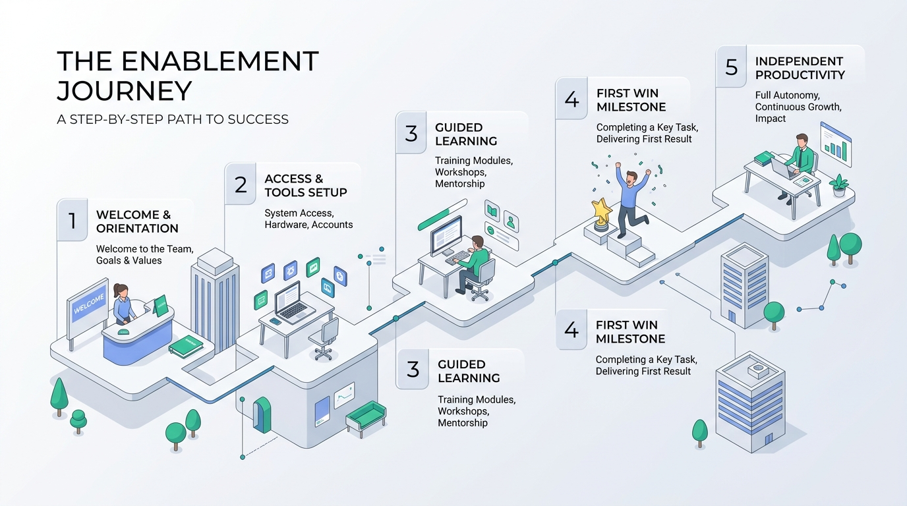
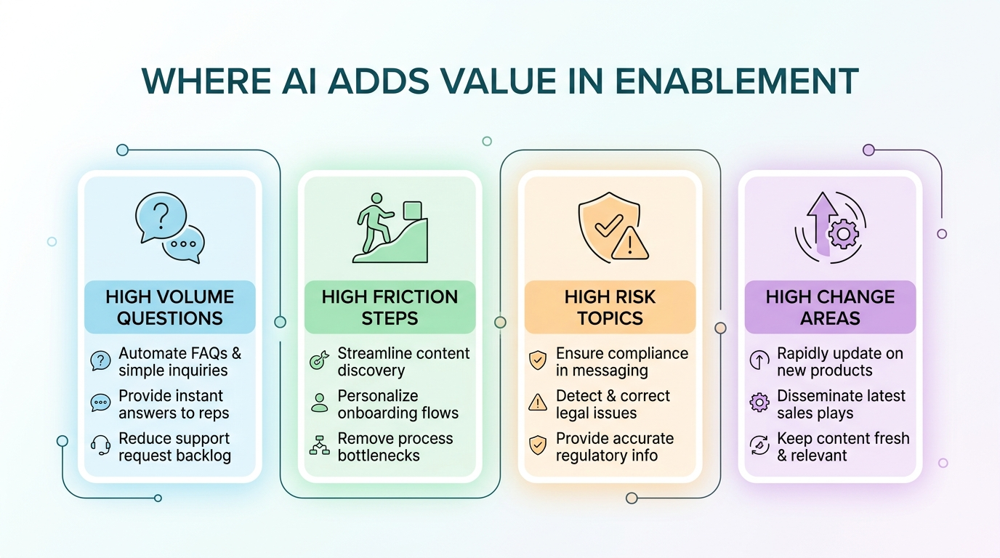
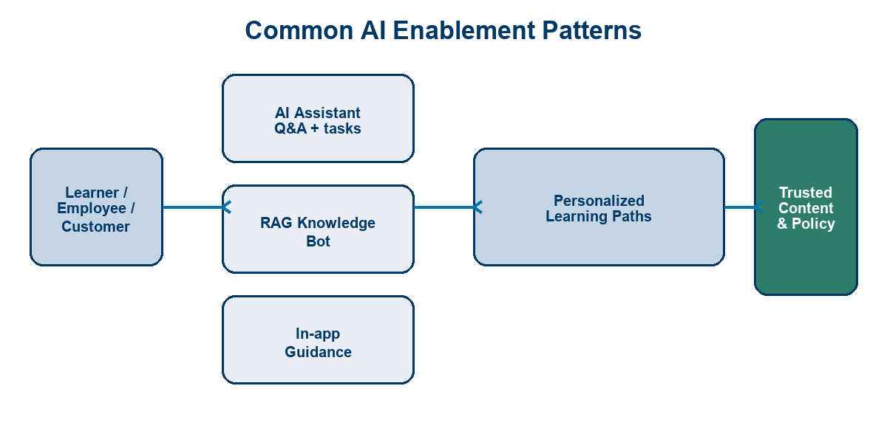
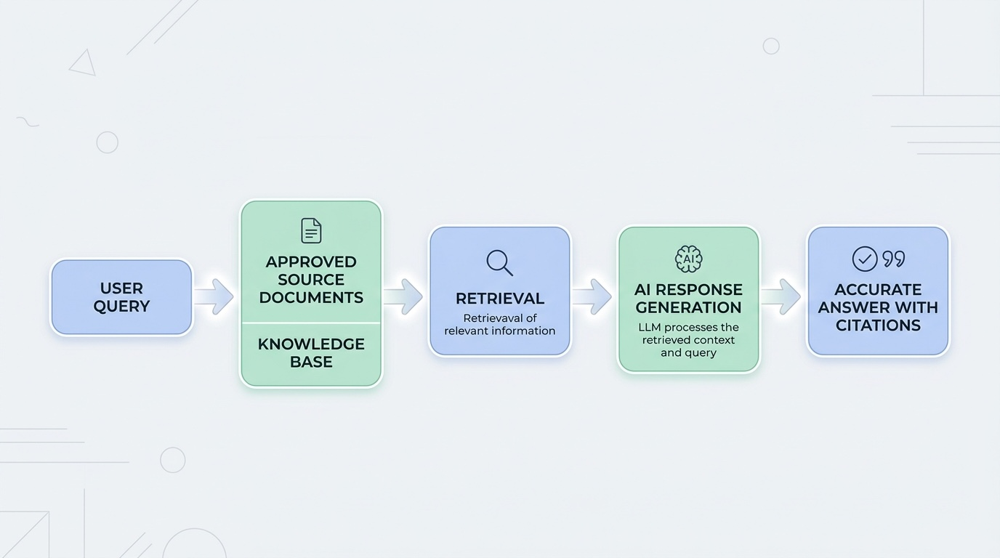
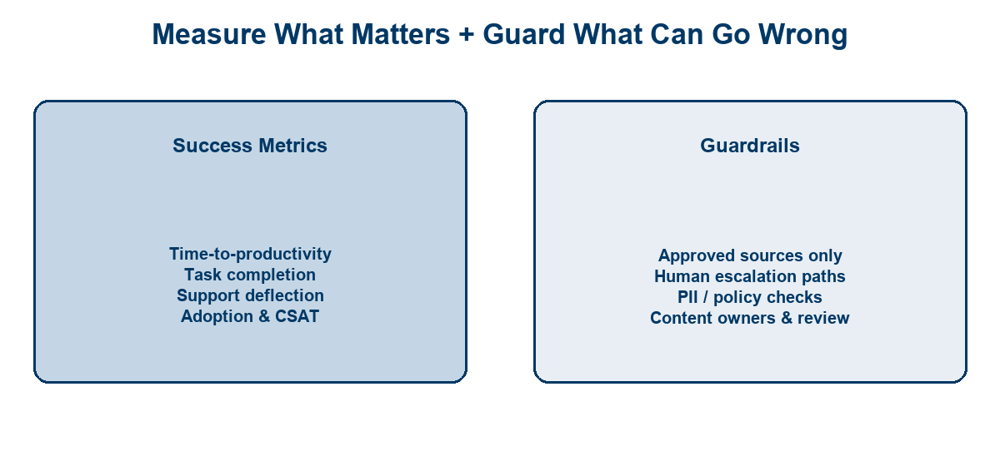

<!-- course-title: HCA: AI-Powered Onboarding & Enablement -->
<!-- layout: title -->

# AI-Powered Onboarding and
# User Enablement Solutions

## Shorten time-to-productivity with assistants, guidance, and personalized learning

---

# Welcome!

- ROI leads the industry in designing and delivering customized technology and management training solutions
- Meet your instructor
  - Name
  - Background
  - Contact info
- Let’s get started!

---

# Course Objectives

- **Design AI-enabled onboarding and enablement experiences** that shorten time-to-productivity for employees and customers
- Identify onboarding and enablement moments where AI adds value
- Describe common patterns (AI assistants, RAG knowledge bots, guided flows)
- Recognize how to personalize enablement with AI
- Outline success measures and guardrails for AI enablement tools

---

# Agenda

- Segment 1: The Enablement Opportunity (~20 min)
- Segment 2: Patterns and Tools (~25 min)
- Segment 3: Measuring and Governing (~15 min)
- Questions and Answers (~15 min)

---

# Who Should Attend

- Learning & Development (L&D) practitioners
- Employee / customer enablement and success teams
- HR technology and people systems owners
- Product managers shaping in-app help and adoption
- Leaders sponsoring AI assistants for onboarding

---

# Prerequisites

- No prior AI or engineering experience required
- Helpful: familiarity with your org’s onboarding or training journey
- Helpful: awareness of where people get stuck today (tickets, Slack, managers)

---
<!-- layout: navigation -->
# Course Roadmap

- **The Enablement Opportunity**
- Patterns and Tools
- Measuring and Governing

---

# The Problem We Are Solving

- New hires and new users face **too much content, too little timing**
- Help is scattered: LMS, wiki, Slack, tickets, and tribal knowledge
- Managers and trainers become **bottlenecks** for the same questions
- Change (new tools, policy, process) resets the learning curve again

> [!NOTE]
> AI does not replace your curriculum—it delivers the right piece of it at the right moment.

---
<!-- layout: 2-column -->
# Onboarding vs. Ongoing Enablement

### Onboarding
- First days / weeks in role or product
- Access, orientation, first wins
- High emotion; high drop-off risk

### Ongoing Enablement
- New features, policy, skills
- Just-in-time refreshers
- Sustains productivity after ramp

---
<!-- layout: title-image -->
# The Enablement Journey

---

# Time-to-Productivity as the North Star

- **Time-to-productivity (TTP):** how long until someone performs independently
- Shorter TTP compounds: less shadowing, fewer tickets, faster value
- Measure milestones, not “completed training modules” alone

| Weak signal | Stronger signal |
| :--- | :--- |
| Course completion % | First independent task done |
| Hours of video watched | Days to role-ready checklist |
| Content published | Repeat questions deflected |

---
<!-- layout: title-image -->
# Where AI Adds Value

---

# Moments Worth Automating First

- **High volume** questions (“How do I…?”) that experts answer daily
- **High friction** steps that stall Day 1–30 (access, systems, forms)
- **High risk** topics where wrong answers hurt (policy, compliance, safety)
- **High change** areas where docs lag and people guess

> [!TIP]
> Start with one role or one product workflow—prove TTP impact before boiling the ocean.

---
<!-- layout: 3-column -->
# Employee vs. Customer Enablement

### Employees
- Role-based journeys
- Systems + culture + policy
- Manager and buddy support

### Customers
- Activation and first value
- In-product education
- Support deflection goals

### Shared AI Plays
- Answers in context
- Guided next steps
- Personalized paths

---
<!-- layout: navigation -->
# Course Roadmap

- The Enablement Opportunity
- **Patterns and Tools**
- Measuring and Governing

---
<!-- layout: title-image -->
<!-- # Common AI Enablement Patterns -->

---
<!-- layout: 2-column -->
# Pattern 1: AI Assistants

### What Learners Experience
- Ask in natural language
- Get steps, links, and summaries
- Escalate to a human when stuck

### What You Provide
- Clear scope (“HR onboarding only”)
- Tone and brand guidelines
- Handoff to Service Desk / L&D

---
<!-- layout: title-image -->
# Pattern 2: Knowledge Retrieval (RAG)

---

# Why RAG Matters for Enablement

- **RAG** = retrieve approved content, then generate an answer grounded in it
- Reduces “confident but wrong” answers on policy and process
- Lets you update a source doc once—answers improve without retraining people

> [!IMPORTANT]
> If the knowledge base is stale or unowned, the assistant will scale bad information faster.

---
<!-- layout: 2-column -->
# Pattern 3: In-App Guidance

### What It Looks Like
- Checklists, tooltips, walkthroughs
- Triggered by role, page, or task
- Optional AI for “explain this screen”

### Design Rules
- Guide the next action, not a lecture
- Keep steps short and dismissible
- Measure completion of the flow

---

# Pattern 4: Personalized Learning Paths

- Adapt by **role, skill gap, product plan, or tenure**
- Sequence micro-lessons, practice, and checkpoints
- AI can recommend “what’s next” from behavior and goals
- Humans still own the curriculum map and quality bar

| Input signal | Personalization example |
| :--- | :--- |
| Role = nurse manager | Prioritize scheduling + compliance modules |
| Failed quiz item | Assign a 5-minute refresher |
| Feature unused | Trigger in-app tour + tip |

---
<!-- layout: 3-column -->
# How These Patterns Work Together

### Discover
- Assistant / search
- “What should I do?”

### Do
- In-app guidance
- Task checklists

### Grow
- Personalized path
- Practice & coach

---
<!-- layout: navigation -->
# Course Roadmap

- The Enablement Opportunity
- Patterns and Tools
- **Measuring and Governing**

---
<!-- layout: title-image -->
# Metrics and Guardrails at a Glance

---

# Metrics That Prove It Works

- **Time-to-productivity:** days to milestone / role-ready
- **Task success:** % completing critical first-week actions
- **Deflection:** fewer repeat tickets / Slack pings on known topics
- **Adoption:** weekly active users of assistant / guidance
- **Experience:** CSAT / thumbs on answers; qualitative comments

> [!NOTE]
> Pair leading indicators (adoption, thumbs) with lagging outcomes (TTP, ticket volume).

---
<!-- layout: 2-column -->
# Feedback Loops That Improve Content

### Collect
- Thumbs up/down on answers
- “Was this helpful?” on tours
- Escalation transcripts themes

### Act
- Fix or retire bad sources
- Add missing playbooks
- Retrain owners on gaps

---

# Content Accuracy Guardrails

- **Approved sources only** (policy, SOP, product docs you own)
- **Named content owners** and review cadences
- **Citations** so learners can verify the source
- **Versioning** when process or policy changes
- **Blocklists** for topics the bot must not answer

> [!WARNING]
> Never let the assistant invent HR, clinical, legal, or compliance guidance without a grounded source.

---
<!-- layout: 3-column -->
# Operating Guardrails

### People
- Human escalation path
- Manager override options
- Clear ownership (L&D / IT / Risk)

### Process
- Change intake for new content
- Red-team sensitive prompts
- Incident playbook for bad answers

### Technology
- Access control by audience
- PII minimization
- Logging & audit trail

---

# Making It Stick: 90-Day Starter Plan

| Window | Focus |
| :--- | :--- |
| Days 1–30 | Pick one journey; inventory sources; define TTP milestones |
| Days 31–60 | Pilot assistant + RAG on top 20 questions; add one guided flow |
| Days 61–90 | Measure TTP/deflection; fix content gaps; decide scale / stop |

> [!TIP]
> Governance is lighter when scope is narrow. Expand audience only after accuracy holds.

---

# What You Learned

- Identified onboarding and enablement moments where AI adds value
- Described common patterns: assistants, RAG knowledge bots, and guided flows
- Recognized how to personalize enablement with roles, signals, and paths
- Outlined success measures and guardrails for AI enablement tools

---

# Quiz 1 of 3

**What does RAG do for an enablement assistant?**

- A. Retrains the model overnight on every LMS course video
- B. Replaces your curriculum with open-web search results
- C. Retrieves approved content, then generates an answer grounded in it
- D. Removes the need for content owners and review cadences

---

# Quiz 1 — Answer

**What does RAG do for an enablement assistant?**

**Correct: C.** Retrieves approved content, then generates an answer grounded in it

- RAG = retrieve approved sources, then generate a grounded answer
- It reduces “confident but wrong” answers on policy and process
- Updating a source doc improves answers without retraining people
- Stale or unowned knowledge still scales bad information faster

---

# Quiz 2 of 3

**Which metric is the strongest signal of shorter time-to-productivity?**

- A. First independent task completed / days to role-ready checklist
- B. Course completion percentage alone
- C. Hours of onboarding video watched
- D. Number of enablement pages published

---

# Quiz 2 — Answer

**Which metric is the strongest signal of shorter time-to-productivity?**

**Correct: A.** First independent task completed / days to role-ready checklist

- TTP is how long until someone performs independently
- Milestones beat “completed modules” as the north star
- Deflection and task success complement TTP; vanity content metrics do not
- Pair leading indicators (adoption, thumbs) with lagging outcomes (TTP, tickets)

---
<!-- layout: 2-column -->
# Quiz 3 of 3 — Discussion

### Prompt
Pick one high-volume onboarding question in your org (for example: access, policy, or a Day-1 system step).

### Discuss
- Which pattern fits first—assistant, RAG, in-app guidance, or personalized path?
- What approved sources and content owners would you require before go-live?
- How would you measure TTP or deflection in the first 90 days?

---
<!-- layout: 2-column -->
# Quiz 3 — Discussion Points

**Pick one high-volume onboarding question in your org (for example: access, policy, or a Day-1 system step).**

### Strong Answers Mention
- Narrow scope (one role/workflow) before scale
- Approved sources, citations, and named owners
- Human escalation for high-risk topics
- TTP milestones + deflection—not completion % alone

### Watch For
- Boiling the ocean across every audience
- Letting the bot invent HR/clinical/legal guidance
- Measuring only adoption with no accuracy loop

---
<!-- layout: title-image -->
# Questions and Answers

