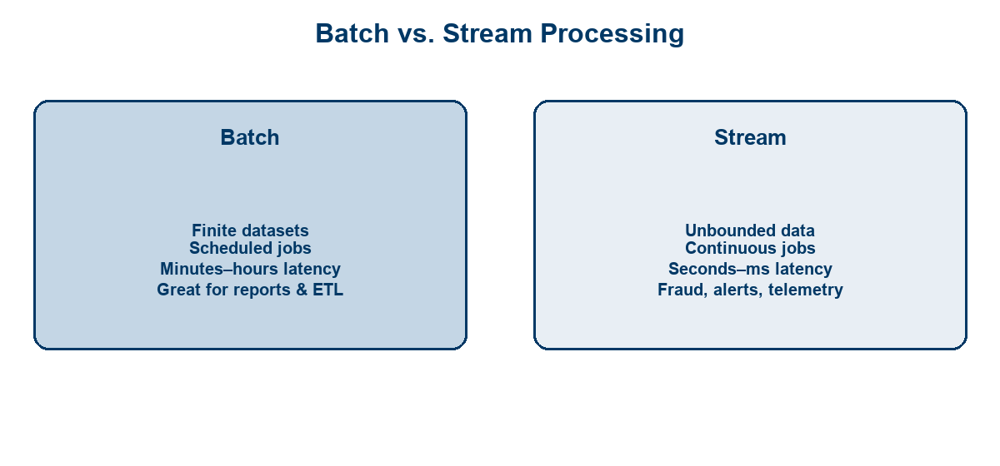
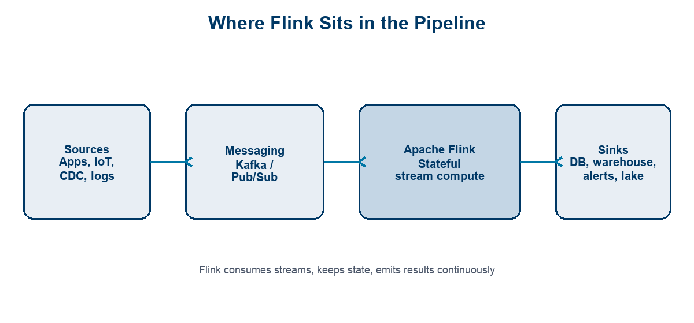
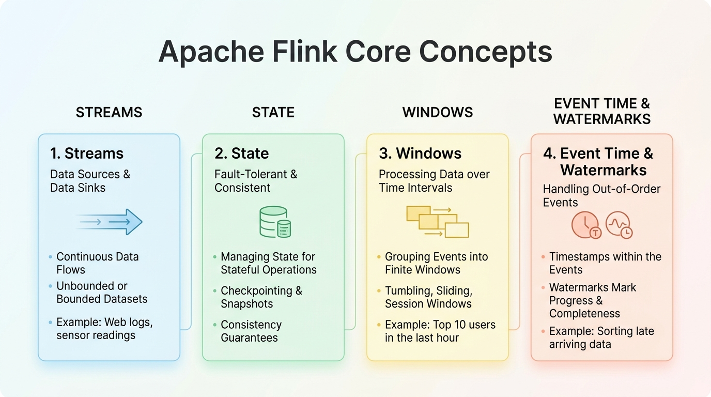
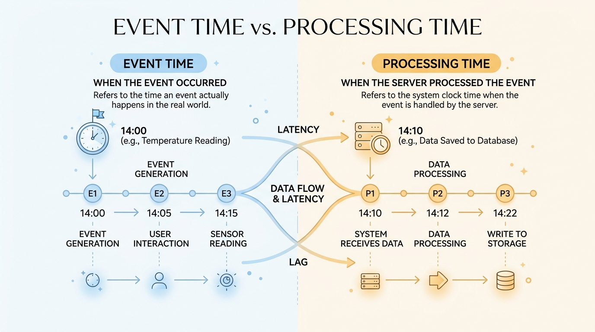
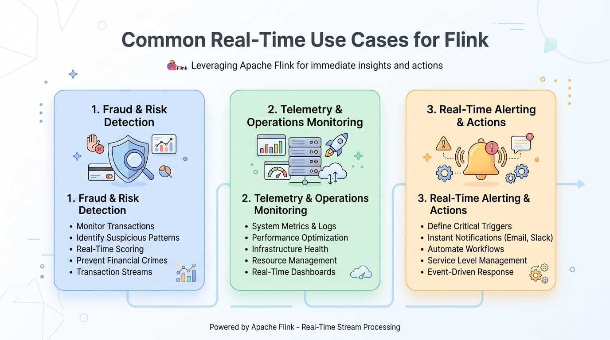

<!-- course-title: HCA: Apache Flink for Real-Time Data -->
<!-- layout: title -->


# Apache Flink for
# Real-Time Data Processing

## Streams, state, windows, and where Flink fits in modern pipelines

---

# Welcome!

- ROI leads the industry in designing and delivering customized technology and management training solutions
- Meet your instructor
  - Name
  - Background
  - Contact info
- Let’s get started!


---

# Course Objectives

- **Explain how Apache Flink enables low-latency stream processing** in a modern data architecture
- Explain real-time stream processing and how it differs from batch
- Describe Flink’s core concepts: streams, state, windows, and event time
- Contrast DataStream and SQL/Table APIs on the same engine
- Identify common real-time use cases and judge when Flink is a fit
- Recognize how Flink fits alongside messaging and storage in a pipeline

---

# Agenda

- Segment 1: Streaming Fundamentals (~20 min)
- Segment 2: Flink Core Concepts (~25 min)
- Segment 3: Putting It to Work (~15 min)
- Q&A (~15 min)


---

# Who Should Attend

- Data engineers building continuous pipelines
- Architects designing real-time platforms
- Platform engineers operating streaming infrastructure
- Analytics engineers moving from batch-only workloads


---

# Prerequisites

- Familiarity with software development fundamentals
- Comfort reading APIs, logs, and simple code samples
- Generative AI basics (as required by your program track)
- Helpful: prior exposure to Kafka, Pub/Sub, or data warehouses


---
<!-- layout: navigation -->
# Course Roadmap

- **Streaming Fundamentals**
- Flink Core Concepts
- Putting It to Work

---

# Why Real-Time Matters

- Businesses increasingly need **seconds**, not overnight batches
- Detect fraud, outages, and user issues while they are happening
- Power live dashboards, personalization, and operational alerts
- Continuous data is already flowing—batch is a delayed snapshot

> [!NOTE]
> “Real-time” is a product requirement (latency budget), not a buzzword. Define the SLA first.

---
<!-- layout: title-image -->
# Batch vs. Stream



---
<!-- layout: 2-column -->
# Latency and Throughput

### Latency
- Time from event → useful result
- Fraud: milliseconds–seconds
- Daily report: hours is fine

### Throughput
- Events processed per second
- Streaming systems scale both
- Optimize for your bottleneck

---

# What Is Apache Flink?

- Open-source **stateful stream processing** engine
- Runs continuous jobs over unbounded data
- Strong model for **event time**, **windows**, and **fault-tolerant state**
- APIs for Java/Scala (DataStream) and SQL/Table for many teams

> [!TIP]
> Think of Flink as the compute layer for streams—similar to how Spark often serves batch/lakehouse compute.

---
<!-- layout: title-image -->
# Where Flink Sits in the Ecosystem



---
<!-- layout: 3-column -->
# Flink vs. Adjacent Tools

### Messaging
- Kafka / Pub/Sub / Pulsar
- Transport & buffer
- Not heavy compute

### Flink
- Stateful transforms
- Windows & joins
- Exactly-once sinks*

### Storage
- Warehouse / lake / OLTP
- Durable history
- Serving & analytics

---
<!-- layout: navigation -->
# Course Roadmap

- Streaming Fundamentals
- **Flink Core Concepts**
- Putting It to Work

---
<!-- layout: title-image -->
# How Flink Works: Building Blocks



---

# Streams

- A **stream** is an unbounded sequence of events
- Events often carry a key (user_id, device_id, account_id)
- Operators transform streams: map, filter, keyBy, join, window
- Jobs run until cancelled—there is no natural “end of file”

```text
clicks  →  filter(bot?)  →  keyBy(user)  →  window(5m)  →  counts
```

---
<!-- layout: 2-column -->
# State: Memory Across Events

### Why State Exists
- Count per user so far
- Last seen transaction
- Session in progress
- Model features online

### Flink Responsibilities
- Local keyed state
- Checkpoint to durable store
- Restore after failure
- Scale with keyed parallelism

---

# Windowing

- Windows **slice** an unbounded stream into finite buckets
- Common types: tumbling, sliding, session
- Aggregations (sum, count, avg) usually happen **inside** a window
- Choose windows from the business question, not from habit

| Window | Idea | Example |
| :--- | :--- | :--- |
| Tumbling | Fixed, non-overlapping | Count orders every 1 minute |
| Sliding | Fixed, overlapping | 5-minute fraud score every 1 minute |
| Session | Gap-based | User browse session until idle |

---
<!-- layout: title-image -->
# Event Time vs. Processing Time



---

# Watermarks and Late Data

- **Watermarks** estimate how far event time has progressed
- They let windows close even when data arrives out of order
- Late events can still be allowed within a configured lateness
- Wrong time semantics → wrong dashboards and wrong alerts

> [!IMPORTANT]
> For correctness under delay and reordering, prefer **event time** + watermarks over processing time.

---
<!-- layout: 2-column -->
# Story: The Late Click

### What Happened
- User clicks at **10:00:50** (event time)
- Mobile network delays delivery
- Event arrives at the job at **10:01:05**
- You need “clicks per minute” for **10:00**

### Processing Time vs Event Time
- **Processing time:** lands in the 10:01 bucket → undercount 10:00, inflate 10:01
- **Event time + watermark:** still attributed to 10:00; window closes when watermark passes 10:01
- Same bug shows up in fraud scores, billing, and SLO burn rates

> [!TIP]
> If your chart “looks wrong under load or mobile traffic,” check time semantics before tuning parallelism.

---
<!-- layout: 2-column -->
# Mental Model: A Flink Job

### Sources
- Kafka topic / Pub/Sub
- Files, sockets (dev)
- CDC streams

### Operators → Sink
- Stateful keyed logic
- Windows & timers
- Write to DB, lake, alert bus

---
<!-- layout: 2-column -->
# Two APIs, Same Engine

### DataStream (Java / Scala)
- Imperative operators in code
- Full control: timers, custom state, CEP
- What the next example uses
- Best when logic is complex or bespoke

### SQL / Table API
- Declarative queries over streams & tables
- Windows, joins, aggregations in SQL
- Often faster for analytics-style jobs
- Same runtime: state, checkpoints, event time

> [!NOTE]
> Many production teams use **Flink SQL** day to day and drop to DataStream only when SQL is not enough. The engine—and the concepts—are the same.

---

# Example: A Simple Flink Stream Job

- Read a stream of purchase events (amount + event-time timestamp)
- `keyBy` customer so each user’s state is processed independently
- Tumbling **event-time** windows (1 minute) sum spend per customer
- Print results—same shape as writing to Kafka, a DB, or a lake sink

```java
public class SimplePurchaseSumJob {
    public static void main(String[] args) throws Exception {
        // Local env for demos; on a cluster you'd use getExecutionEnvironment()
        StreamExecutionEnvironment env =
            StreamExecutionEnvironment.createLocalEnvironment();

        DataStream<Purchase> purchases = env
            .addSource(new PurchaseSource()) // Kafka/Pub/Sub in production
            // Event time + watermarks: Flink advances "time" from the data,
            // not the wall clock—so late events are handled correctly
            .assignTimestampsAndWatermarks(
                WatermarkStrategy
                    .<Purchase>forBoundedOutOfOrderness(Duration.ofSeconds(5))
                    .withTimestampAssigner((event, ts) -> event.getEventTimeMillis())
            );

        purchases
            .keyBy(Purchase::getCustomerId)           // partition state by customer
            .window(TumblingEventTimeWindows.of(Time.minutes(1)))
            .aggregate(new SumAmounts())              // stateful window aggregation
            .map(result -> String.format(
                "customer=%s windowEnd=%s total=%.2f",
                result.getCustomerId(),
                result.getWindowEnd(),
                result.getTotal()
            ))
            .print();                                 // replace with a real sink later

        env.execute("simple-purchase-sum");
    }
}
```

---

# From `print()` to a Kafka Sink

- Swap the sink—**not** the window or `keyBy` logic
- Serialize the aggregate (JSON, Avro, Protobuf) for consumers
- Use a transactional / idempotent sink when you need stronger delivery guarantees
- Downstream reads a topic instead of job logs—same pipeline shape as production

```java
// Instead of:  resultStream.print();
resultStream.sinkTo(
    KafkaSink.<String>builder()
        .setBootstrapServers("kafka:9092")
        .setRecordSerializer(
            KafkaRecordSerializationSchema.builder()
                .setTopic("customer-minute-spend")
                .setValueSerializationSchema(new SimpleStringSchema())
                .build()
        )
        .setDeliveryGuarantee(DeliveryGuarantee.AT_LEAST_ONCE)
        .build()
);
```

> [!TIP]
> Source → stateful operators → sink is the whole job. Changing Kafka topic names or sink guarantees should not require rewriting your window math.

---
<!-- layout: navigation -->
# Course Roadmap

- Streaming Fundamentals
- Flink Core Concepts
- **Putting It to Work**

---
<!-- layout: title-image -->
# Common Real-Time Use Cases



---
<!-- layout: 3-column -->
# Pattern Snapshots

### Fraud / Risk
- Score each event live
- Enrich with recent history
- Route high-risk to review

### Telemetry
- Roll up metrics
- Detect anomalies
- Feed SLO / ops views

### Alerting
- Threshold & composite rules
- Deduplicate noise
- Trigger tickets / pages

---

# Integration: Messaging In, Sinks Out

- **Ingress:** Kafka, Google Pub/Sub, Kinesis, Pulsar
- **Egress:** warehouses, lakes, OLTP, search, notification topics
- Design for **replay**: keep source offsets and idempotent sinks
- Separate “speed layer” results from long-term analytical storage when needed

> [!WARNING]
> A Flink job is only as reliable as its checkpoint storage, restart strategy, and sink semantics.

---
<!-- layout: 2-column -->
# Architecture Checklist

### Fit for Flink
- Continuous events
- Stateful decisions
- Sub-minute latency
- Complex event logic

### Consider Alternatives
- Pure batch / micro-batch OK
- Simple filter at the broker
- Request/response APIs only
- Tiny volume, rare jobs

---

# Putting It Together

```text
Producers → Kafka/Pub/Sub → Flink (stateful jobs)
                              ├─→ Alerting / Actions
                              ├─→ Serving DB / Cache
                              └─→ Lakehouse / Warehouse
```

- Flink owns **compute + state** for the stream path
- Messaging owns **durable transport and fan-out**
- Storage owns **history, BI, and downstream ML features**

---
<!-- layout: 3-column -->
# Would You Use Flink?

### Yes
**Card authorizations**
- Every swipe scored with recent spend history
- Sub-second enrich + route to review
- Stateful per-card logic is the product

### No
**Nightly sales workbook**
- Finance needs yesterday’s totals by 7 a.m.
- Batch / warehouse job is enough
- No continuous consumer waiting on the stream

### Maybe
**Clickstream → lake + alerts**
- Flink (or SQL) for live anomaly windows
- Micro-batch OK for lake-only analytics
- Split: speed path vs history path

> [!IMPORTANT]
> Ask: Do we need **continuous stateful compute** on the event path—or just fresher batch?

---

# What You Learned

- Explained real-time stream processing and how it differs from batch
- Described Flink’s core concepts: streams, state, windows, and event time
- Contrasted DataStream and SQL/Table APIs on the same engine
- Identified common real-time use cases suited to Flink
- Recognized how Flink fits alongside messaging and storage in a pipeline
- Judged fit for Flink with yes / no / maybe scenarios

---

# Quiz 1 of 3

**A click happens at 10:00:50 but arrives at the Flink job at 10:01:05. For correct “clicks per minute,” which approach attributes it to the 10:00 bucket?**

- A. Processing time only (wall-clock arrival)
- B. Dropping any event that arrives after the minute ends
- C. Ignoring timestamps and counting in arrival order
- D. Event time with watermarks (and configured lateness)

---

# Quiz 1 — Answer

**A click happens at 10:00:50 but arrives at the Flink job at 10:01:05. For correct “clicks per minute,” which approach attributes it to the 10:00 bucket?**

**Correct: D.** Event time with watermarks (and configured lateness)

- Event time uses the time in the event, not when the job saw it
- Watermarks let windows close despite out-of-order arrival
- Processing time would put the click in the 10:01 bucket
- Wrong time semantics break dashboards, fraud scores, and billing

---

# Quiz 2 of 3

**Which workload is the clearest fit for Apache Flink?**

- A. A nightly sales workbook Finance needs by 7 a.m.
- B. Scoring each card authorization with recent spend history in sub-seconds
- C. A one-off SQL pull for a quarterly board slide
- D. A simple broker-side filter with no state or windows

---

# Quiz 2 — Answer

**Which workload is the clearest fit for Apache Flink?**

**Correct: B.** Scoring each card authorization with recent spend history in sub-seconds

- Flink shines on continuous, stateful, low-latency event paths
- Nightly batch and one-off analytics usually belong in the warehouse
- Messaging transports events; Flink owns compute, state, and windows
- Ask: do we need continuous stateful compute—or just fresher batch?

---
<!-- layout: 2-column -->
# Quiz 3 of 3 — Discussion

### Prompt
Describe a real-time use case on your team (fraud, telemetry, alerting, or clickstream).

### Discuss
- Where do messaging, Flink, and storage each sit in the pipeline?
- Would you use tumbling, sliding, or session windows—and why?
- When would DataStream be worth it instead of Flink SQL?

---
<!-- layout: 2-column -->
# Quiz 3 — Discussion Points

**Describe a real-time use case on your team (fraud, telemetry, alerting, or clickstream).**

### Strong Answers Mention
- Messaging = transport; Flink = stateful compute; storage = history/BI
- Window choice follows the business question
- Event time + watermarks when delay/reorder matters
- SQL for analytics-style jobs; DataStream for custom state/timers/CEP

### Watch For
- Treating Kafka as the compute engine
- Processing-time windows for correctness-critical metrics
- Using Flink for pure overnight batch with no continuous consumer

---
<!-- layout: title-image -->
# Questions and Answers


