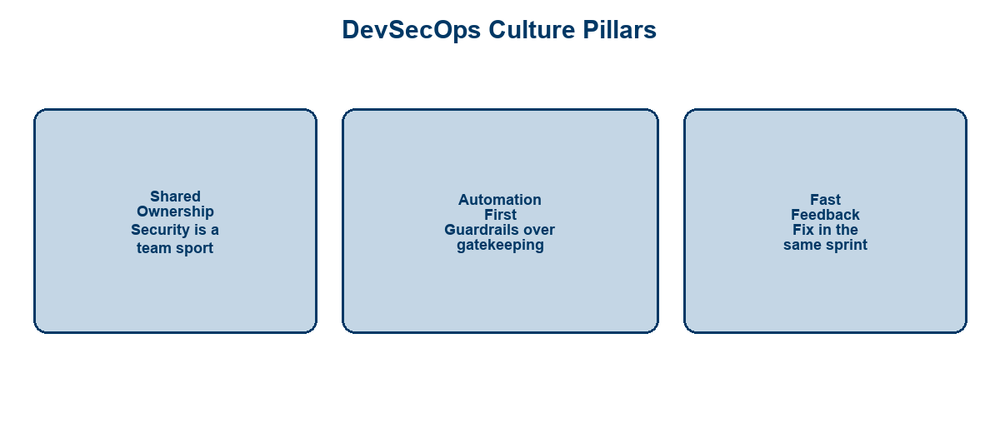
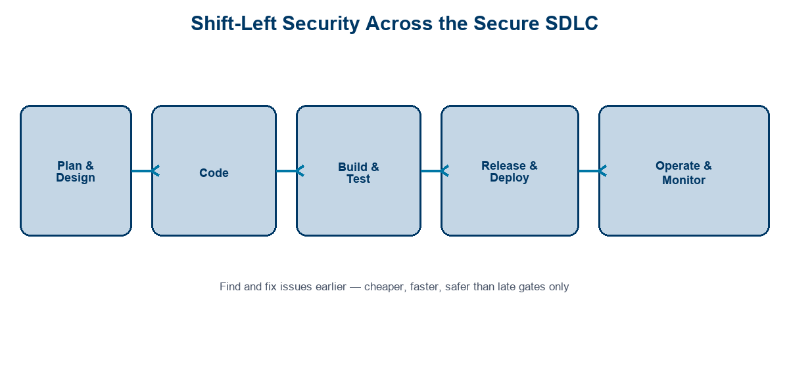
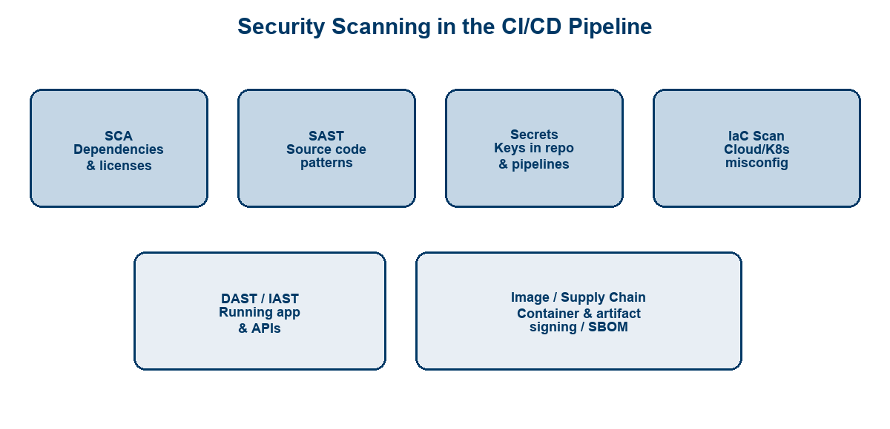
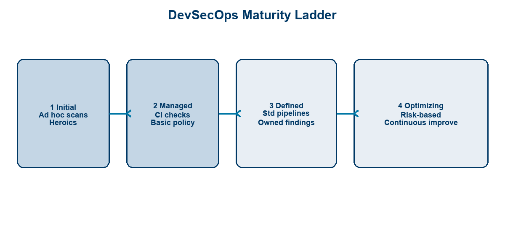
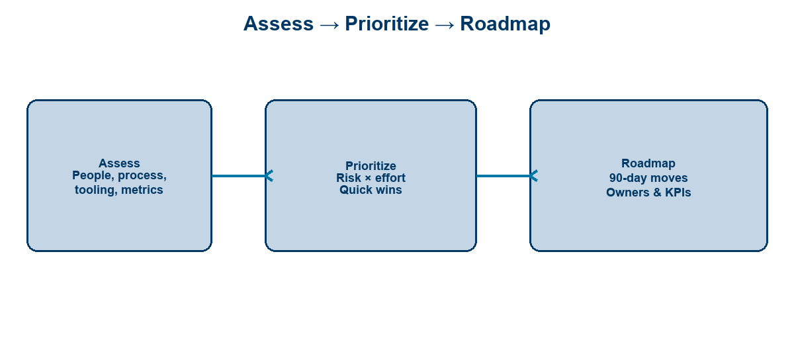

<!-- course-title: HCA: DevSecOps Program Update -->
<!-- layout: title -->

# DevSecOps Program Update

## Practices, automation, and shift-left security against a maturity model

---

# Welcome!

- ROI leads the industry in designing and delivering customized technology and management training solutions
- Meet your instructor
  - Name
  - Background
  - Contact info
- Let’s get started!

---

# Course Objectives

- **Frame the current DevSecOps program** against a maturity model and agree near-term priorities
- Restate the core DevSecOps principles and culture
- Describe how security integrates into the CI/CD pipeline (“shift left”)
- Recognize tooling categories across the secure SDLC (SCA, SAST, DAST, IaC scanning)
- Assess program maturity and identify next-step priorities

---

# Agenda

- Segment 1: DevSecOps in Context (~20 min)
- Segment 2: Security in the Pipeline (~25 min)
- Segment 3: Maturity and Roadmap (~15 min)
- Q&A (~15 min)

---

# Who Should Attend

- Engineering leads and developers on delivery teams
- Platform / DevOps engineers owning CI/CD
- Application and cloud security stakeholders
- Leaders tracking a DevSecOps initiative

---

# Prerequisites

- Familiarity with software development concepts
- Familiarity with IT operations / delivery basics
- Helpful: exposure to CI/CD pipelines and pull-request workflows
- Helpful: awareness of your org’s current security scanning tools

---
<!-- layout: navigation -->
# Course Roadmap

- **DevSecOps in Context**
- Security in the Pipeline
- Maturity and Roadmap

---

# What DevSecOps Is (and Is Not)

- **DevSecOps** = security as a continuous, shared responsibility across build and run
- Embeds controls into the same pipelines that ship software
- Favors **automation and feedback** over late, manual approval theater
- Not a rebrand of a separate security team doing the same handoffs

> [!NOTE]
> This session is a program briefing: shared language, pipeline map, maturity snapshot, and next moves.

---
<!-- layout: title-image -->
# Culture Pillars

---
<!-- layout: 2-column -->
# Why It Matters Now

### Risk Reality
- Faster releases expand attack surface
- Dependencies and IaC ship risk at scale
- Late findings block release or get waived

### Business Outcome
- Fewer sev-1 surprises in prod
- Faster, safer change
- Audit-ready evidence from pipelines

---
<!-- layout: title-image -->
# Shift-Left and the Secure SDLC

---

# Shift-Left in Practice

- Move checks to **design, code, and CI**—not only pre-prod gates
- Give developers **actionable findings** in the PR, not a PDF next quarter
- Keep a final gate for residual risk—but make it thin because earlier controls worked
- Secure SDLC spans plan → code → build → deploy → operate

> [!TIP]
> Shift-left fails without fix ownership, severity policy, and timeboxed remediation SLAs.

---
<!-- layout: 3-column -->
# Shared Responsibilities

### Build Teams
- Fix findings in sprint
- Keep deps current
- Don’t bypass gates

### Platform
- Standard pipelines
- Tooling & policy-as-code
- Fast, stable feedback

### Security
- Risk appetite & standards
- Threat guidance
- Exception governance

---
<!-- layout: navigation -->
# Course Roadmap

- DevSecOps in Context
- **Security in the Pipeline**
- Maturity and Roadmap

---
<!-- layout: title-image -->
# Automated Guardrails in CI/CD

---
<!-- layout: 2-column -->
# SCA — Software Composition Analysis

### What It Catches
- Vulnerable open-source libs
- License risk
- Transitive dependency issues

### Pipeline Fit
- On PR and main builds
- Block critical CVEs by policy
- Feed SBOM for inventory

---
<!-- layout: 2-column -->
# SAST — Static Application Security Testing

### What It Catches
- Insecure coding patterns
- Injection / XSS candidates
- Hard-coded risky APIs

### Pipeline Fit
- Incremental on PRs
- Full scans on main/release
- Tune rules to cut noise

---

# DAST (and Friends) — Test the Running App

- **DAST** probes a running app/API for exploitable issues
- Complements SAST: finds config and runtime problems code scan misses
- Often later in pipeline (staging) or on a schedule
- Pair with API security tests and authenticated scan profiles

> [!WARNING]
> DAST without a stable test environment produces flaky gates teams learn to ignore.

---
<!-- layout: 3-column -->
# Tooling Categories at a Glance

### SCA
- Dependencies
- Licenses
- SBOM

### SAST / Secrets
- Source patterns
- Secret scanning
- IDE + CI feedback

### DAST / IaC
- Running apps
- Terraform/K8s/cloud
- Misconfig detection

---

# Infrastructure-as-Code Security

- Scan Terraform, CloudFormation, Bicep, Helm, K8s manifests **before apply**
- Catch public buckets, open security groups, privileged pods, missing encryption
- Policy-as-code (e.g. OPA / Conftest / vendor IaC scanners) in the same PR flow
- Drift detection in cloud accounts closes the loop after deploy

| Signal | Example control |
| :--- | :--- |
| Misconfiguration | Deny `0.0.0.0/0` on admin ports |
| Identity risk | Flag roles with admin on `*` |
| Data risk | Require encryption at rest |

---
<!-- layout: 2-column -->
# Guardrails vs. Gates

### Guardrails (prefer)
- Fast PR feedback
- Auto-fix suggestions
- Severity-based policy
- Break-glass exceptions

### Heavy Gates (sparingly)
- Manual security review always
- Opaque severity
- Days-long ticket queues
- Waive-everything culture

---

# Demo / Walkthrough: Pipeline Security Map

**Time:** ~10–12 minutes (instructor-led)

**Demo guide:** [Placeholder — org CI security stage map](https://example.com/hca/demos/devsecops-pipeline)

- Show where SCA / SAST / secrets / IaC run today
- Show a sample PR finding and remediation path
- Call out what is warn-only vs blocking
- Note gaps (e.g. no DAST, weak IaC coverage)

---
<!-- layout: navigation -->
# Course Roadmap

- DevSecOps in Context
- Security in the Pipeline
- **Maturity and Roadmap**

---
<!-- layout: title-image -->
# DevSecOps Maturity Model

---

# Reading the Maturity Levels

| Level | Typical signals |
| :--- | :--- |
| **1 Initial** | Ad hoc scans; heroics; tribal knowledge |
| **2 Managed** | CI checks on key repos; basic severity policy |
| **3 Defined** | Standard pipelines; owned findings; SLAs |
| **4 Optimizing** | Risk-based controls; metrics-driven improvement |

> [!IMPORTANT]
> Maturity is per capability (SCA, SAST, IaC, culture)—teams are rarely “all Level 3.”

---
<!-- layout: title-image -->
# Assess → Prioritize → Roadmap

---
<!-- layout: 2-column -->
# Assessing Current State

### Look For
- Coverage % of critical apps
- Mean time to remediate (MTTR)
- False-positive / ignore rates
- Exception volume & age

### Ask Honestly
- Who owns critical findings?
- Can devs fix in the PR?
- Are IaC changes scanned?
- Is prod runtime in scope?

---

# Prioritizing Improvements

- Score candidates by **risk reduced × feasibility**
- Prefer fixes that unlock many teams (platform pipeline templates)
- Sequence: inventory & SCA → secrets → SAST tune-in → IaC → DAST depth
- Kill zombie tools that add noise without owners

> [!TIP]
> A smaller set of blocking, high-signal checks beats a wall of warn-only scanners.

---

# Example 90-Day Priority Themes

| Theme | Example outcome |
| :--- | :--- |
| Coverage | Critical services on standard secure pipeline |
| Signal quality | Severity policy + suppressions with expiry |
| IaC | PR scanning required for infra repos |
| Accountability | Finding SLAs by severity; dashboards live |
| Culture | Security champions + office hours |

---

# What “Good” Looks Like Next Quarter

- Shared definition of DevSecOps success metrics
- Documented pipeline security stage map (owners included)
- Maturity self-score by capability—not a vanity overall number
- Named 3–5 roadmap items with dates and accountable owners

---

# What You Learned

- Restated core DevSecOps principles and culture
- Described how security integrates into CI/CD through shift-left practices
- Recognized tooling categories across the secure SDLC (SCA, SAST, DAST, IaC)
- Assessed program maturity and identified next-step priority patterns

---

# Q&A

Questions?
