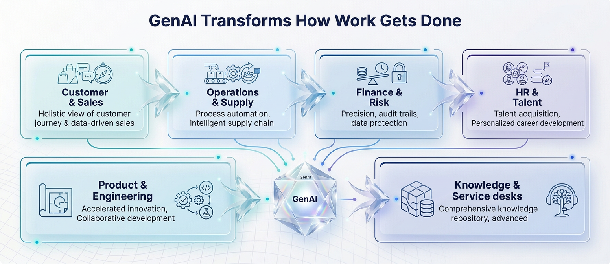
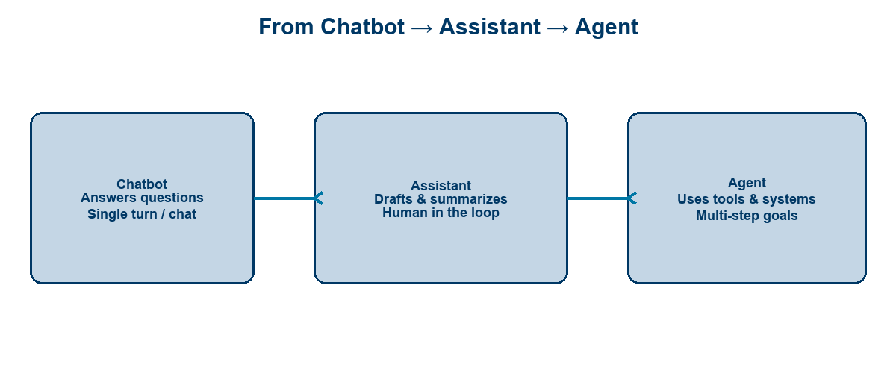
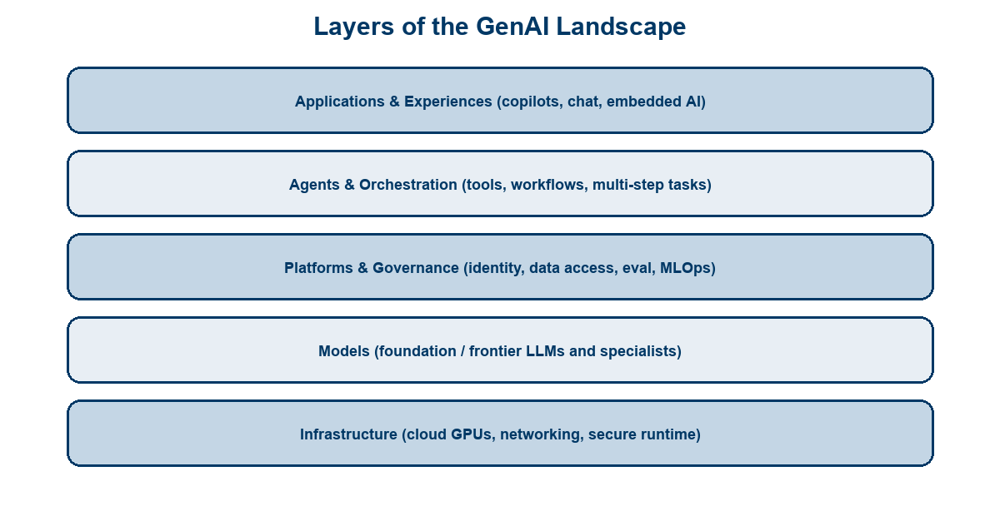
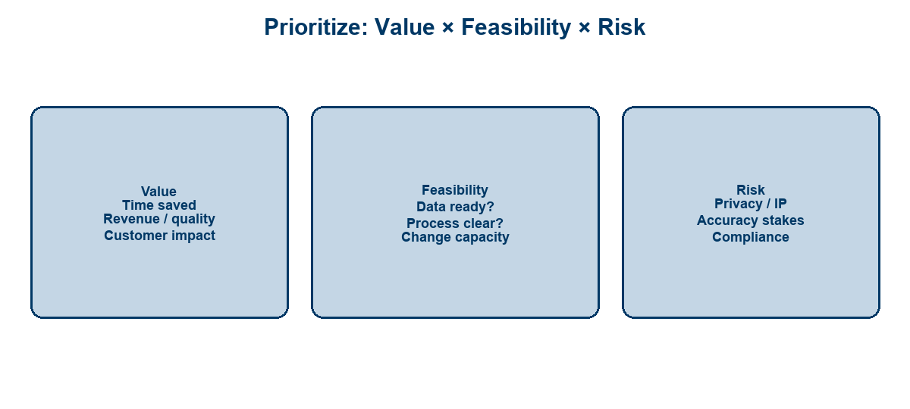
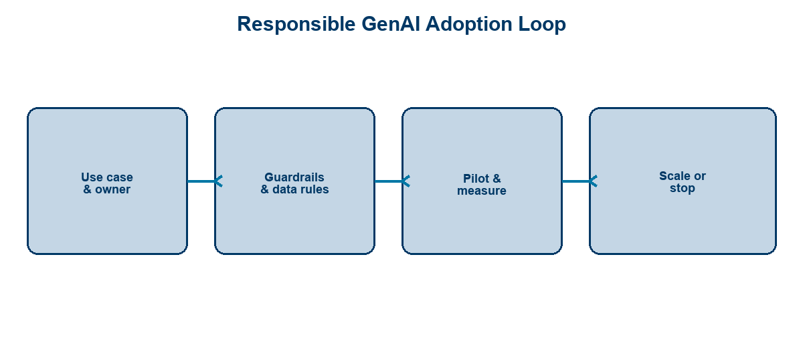

<!-- course-title: HCA: Generative AI for Leaders -->
<!-- layout: title -->

# Generative AI for Leaders

## From concepts to prioritized, responsible business impact

---

# Welcome!

- ROI leads the industry in designing and delivering customized technology and management training solutions
- Meet your instructor
  - Name
  - Background
  - Contact info
- Let’s get started!

---

# Course Objectives

- **Lead GenAI initiatives with clarity**—what it is, where value sits, and how to adopt responsibly
- Describe how generative AI transforms business functions and industries
- Define core GenAI concepts in plain language
- Identify the layers of the GenAI landscape (apps, agents, platforms, models, infrastructure)
- Recognize how to lead and prioritize a GenAI initiative responsibly

---

# Agenda

- Segment 1: GenAI Beyond the Chatbot (~20 min)
- Segment 2: Concepts and Landscape (~25 min)
- Segment 3: Leading the Change (~15 min)
- Q&A (~15 min)

---

# Who Should Attend

- Business professionals and leaders at all levels
- Function owners sponsoring GenAI pilots
- Transformation, strategy, and innovation stakeholders
- Anyone expected to prioritize or govern GenAI work

---

# Prerequisites

- No prior technical or AI experience required
- Helpful: familiarity with your function’s workflows and pain points
- Helpful: awareness of where your organization already uses copilots or chat tools

---
<!-- layout: navigation -->
# Course Roadmap

- **GenAI Beyond the Chatbot**
- Concepts and Landscape
- Leading the Change

---

# Why Leaders Need a Point of View Now

- GenAI is already in products employees and customers use daily
- Competitive advantage shifts from “having a chatbot” to **redesigning work**
- Leaders set ambition, funding, risk appetite—and what *not* to chase
- Waiting for perfect clarity is also a decision (usually a costly one)

> [!NOTE]
> This briefing is non-technical and outcome-focused: language you can reuse with teams and sponsors.

---
<!-- layout: title-image -->
# GenAI Transforms Functions

---
<!-- layout: 3-column -->
# Examples of Business Impact

### Faster Cycles
- Draft contracts, briefs, code
- Summarize meetings & research
- Accelerate content ops

### Better Decisions
- Synthesize options
- Surface exceptions
- Scenario narratives

### New Experiences
- Always-on assistance
- Personalized journeys
- Self-service with judgment*

---

# Industries Feel It Differently

| Sector pattern | Typical GenAI plays |
| :--- | :--- |
| Healthcare / life sciences | Documentation, knowledge retrieval, admin burden |
| Financial services | Research assist, ops productivity, controlled copilots |
| Retail / CX | Offers, support deflection, content at scale |
| Manufacturing | Knowledge capture, maintenance assist, planning support |
| Software / tech | Developer productivity, support, product AI features |

> [!TIP]
> Start from **jobs-to-be-done** in your industry—not from a model vendor slide.

---
<!-- layout: title-image -->
# Beyond the Chatbot

---
<!-- layout: 2-column -->
# Foundation Models (Conceptually)

### What They Are
- Large models trained on broad data
- Generate text, code, images, and more
- General capability you adapt to tasks

### What Leaders Should Ask
- Fit for our data & risk?
- Cost at expected volume?
- Vendor lock-in & exit options?

---

# Prompt Engineering — The Leadership View

- A **prompt** is the instruction and context you give the model
- Better prompts → better drafts; still not a substitute for process design
- Organizations win by standardizing good prompts into **products and workflows**
- Treat prompt libraries like playbooks: owned, versioned, measured

> [!IMPORTANT]
> Prompt tips help individuals. Operating models, data access, and governance scale the enterprise.

---
<!-- layout: navigation -->
# Course Roadmap

- GenAI Beyond the Chatbot
- **Concepts and Landscape**
- Leading the Change

---

# Core Concepts in Plain Language

| Term | Plain meaning |
| :--- | :--- |
| **Generative AI** | Systems that create new content (text, code, images…) |
| **LLM** | A large language model—predicts likely next words/tokens |
| **Tokens** | Chunks of text the model reads/writes (drives cost/limits) |
| **Context window** | How much information it can consider at once |
| **Grounding / RAG** | Answering with your approved documents, not memory alone |
| **Hallucination** | Confident output that is wrong or made up |

---
<!-- layout: 2-column -->
# What LLMs Are Good At

### Strengths
- Drafting and rewriting
- Summarizing long material
- Translating formats/styles
- Brainstorming options
- Coding assistance (with review)

### Weak Spots
- Exact facts without sources
- Fresh private knowledge
- Precise math / counting
- Consistent multi-step process alone
- Knowing when they are wrong

---

# Limitations Leaders Must Budget For

- **Accuracy risk** rises when stakes are clinical, legal, financial, or safety-related
- **Data leakage** risk if staff paste sensitive content into unapproved tools
- **Bias and uneven quality** across languages, topics, and user groups
- **Change fatigue** if every team launches a disconnected pilot

> [!WARNING]
> “The model said so” is not a control. People, process, and systems remain accountable.

---
<!-- layout: title-image -->
# The GenAI Landscape Stack

---
<!-- layout: 3-column -->
# Strategic Entry Points

### Buy / Adopt
- Copilots in M365, Google, CRM
- Fast time-to-value
- Govern usage & data

### Build on Platforms
- Internal assistants
- RAG over your knowledge
- Shared identity & eval

### Differentiate
- Productized AI features
- Domain agents
- Harder, higher reward

---

# Choosing Where to Play

- **Infrastructure / models:** usually partner unless AI is your product core
- **Platforms & governance:** often the enterprise bottleneck—and advantage
- **Apps & agents:** where employees and customers feel value
- Map spend to the layer that unlocks *many* use cases, not one demo

---
<!-- layout: navigation -->
# Course Roadmap

- GenAI Beyond the Chatbot
- Concepts and Landscape
- **Leading the Change**

---
<!-- layout: 2-column -->
# Apps vs. Agents in the Organization

### GenAI Apps
- Copilots in existing tools
- Knowledge Q&A
- Content generation desks
- Clear human owner of output

### Agents
- Multi-step goals
- Call tools / systems
- Need stronger controls
- Higher automation upside

---
<!-- layout: title-image -->
# Prioritize Initiatives

---

# A Simple Portfolio Filter

| Keep / fund | Revisit | Park |
| :--- | :--- | :--- |
| High value, feasible, manageable risk | High value but messy data/process | Low value or unacceptable risk |
| Clear owner & KPI | Needs platform investment first | “Cool demo” only |
| Human review where stakes are high | Unclear accountability | Shadow IT tools |

> [!TIP]
> Limit active pilots. A short list with owners beats a zoo of PoCs.

---
<!-- layout: title-image -->
# Lead Responsible Adoption

---
<!-- layout: 3-column -->
# What “Responsible” Means Day to Day

### Secure
- Approved tools
- Data classification
- Access least privilege

### Reliable
- Grounded answers
- Human review points
- Measure quality

### Accountable
- Named owners
- Audit trails
- Escalation paths

---

# The Leader’s Operating Cadence

- Set **outcomes** (time saved, quality, revenue, risk reduced)—not model names
- Fund **platform + 2–3 flagship use cases**, not 30 orphans
- Require **metrics and kill criteria** before scale
- Model the behavior: use approved tools; never bypass policy for speed

---

# Discussion Prompt (Optional)

**Time:** ~8–10 minutes

- Which function in *your* org has the clearest GenAI value story?
- What data or process gap would block it?
- What risk would a board member ask about first?

---

# What You Learned

- Described how generative AI transforms business functions and industries
- Defined core GenAI concepts in plain language
- Identified landscape layers: apps, agents, platforms, models, infrastructure
- Recognized how to lead and prioritize GenAI adoption responsibly

---

# Quiz 1 of 3

**In plain language, what is a hallucination?**

- **A.** Any answer that uses a larger context window
- **B.** Confident output that is wrong or made up
- **C.** Grounding answers in approved documents (RAG)
- **D.** Charging by tokens for model usage

---

# Quiz 1 — Answer

**Correct: B**

- Hallucinations are confident but incorrect or invented outputs
- Grounding / RAG reduces reliance on model “memory” alone
- Tokens and context window are cost/limit concepts—not accuracy labels
- High-stakes domains still need human review and accountable process

---

# Quiz 2 of 3

**Where should most enterprises focus spend to unlock many use cases—not one demo?**

- **A.** Training a foundation model from scratch as the default first move
- **B.** Thirty disconnected pilots with no kill criteria
- **C.** Shadow IT chat tools with no data policy
- **D.** Platforms & governance plus a short list of flagship apps/agents

---

# Quiz 2 — Answer

**Correct: D**

- Platforms and governance are often the bottleneck—and the advantage
- Fund platform + 2–3 flagship use cases, not a zoo of PoCs
- Infrastructure/models are usually partnered unless AI is the product core
- Apps and agents are where employees and customers feel value

---
<!-- layout: 2-column -->
# Quiz 3 of 3 — Discussion

### Prompt
Pick one GenAI idea in your function and run it through the portfolio filter.

### Discuss
- Keep / fund, revisit, or park—and why (value, feasibility, risk)?
- What data or process gap would block it?
- What does “responsible” require: secure, reliable, accountable?

---
<!-- layout: 2-column -->
# Quiz 3 — Discussion Points

### Strong Answers Mention
- Clear owner, KPI, and human review where stakes are high
- Approved tools, least privilege, and grounded answers
- Metrics and kill criteria before scale
- Jobs-to-be-done first—not a vendor model slide

### Watch For
- “The model said so” as a control
- Cool demos with unacceptable risk or no owner
- Change fatigue from every team launching alone

---
<!-- layout: title-image -->
# Q&A

