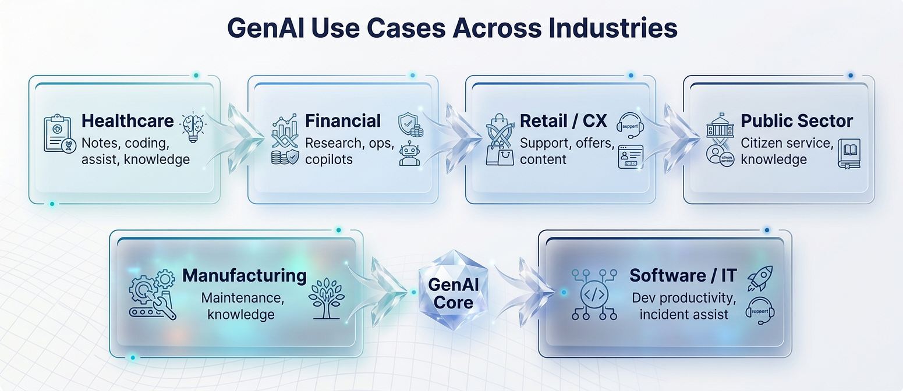
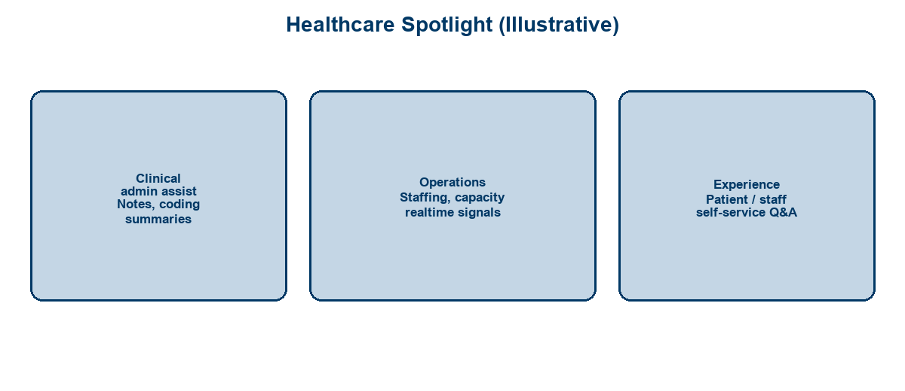
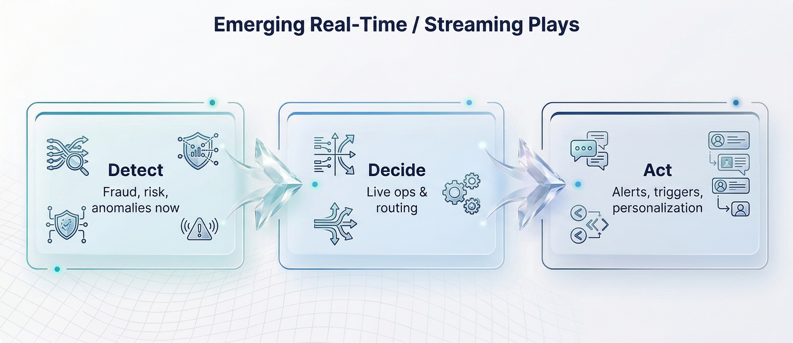
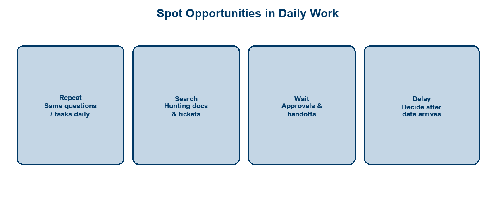
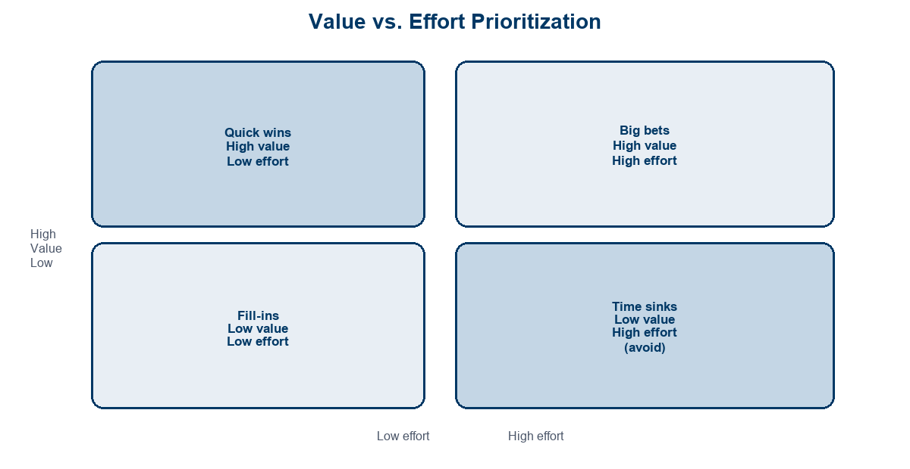
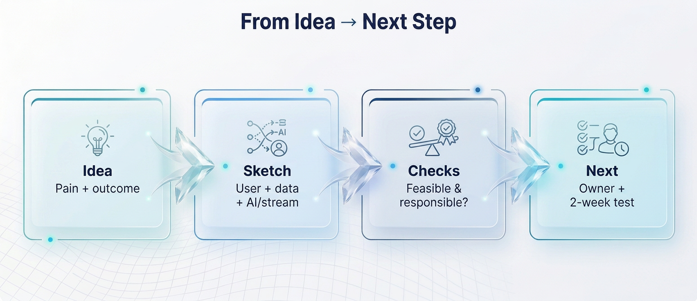

<!-- course-title: HCA: Innovation Workshop AI & Streaming -->
<!-- layout: title -->

# Innovation Workshop
# New AI and Streaming Use Cases

## Tour what’s possible—then prioritize ideas from your own work

---

# Welcome!

- ROI leads the industry in designing and delivering customized technology and management training solutions
- Meet your instructor
  - Name
  - Background
  - Contact info
- Let’s get started!

---

# Course Objectives

- **Generate and prioritize GenAI and streaming ideas** that map to real work in your organization
- Survey real-world GenAI use cases across industries, including healthcare
- Explore emerging streaming / real-time data use cases
- Identify candidate opportunities in attendees’ own workflows
- Apply a simple value-vs-effort lens to prioritize ideas

---

# Agenda

- Segment 1: What’s Possible Now (~20 min)
- Segment 2: Find Your Use Cases — workshop (~30 min)
- Segment 3: Make It Real (~10 min)
- Q&A (~15 min)

---

# Who Should Attend

- Business staff exploring AI / streaming opportunities
- Technical staff partnering on idea generation
- Product, ops, clinical, and platform stakeholders
- Anyone who will pitch or sponsor a small pilot

---

# Prerequisites

- No prior AI or streaming experience required
- Bring a laptop or notepad for ideation
- Come ready to talk about friction in your day-to-day work

---
<!-- layout: navigation -->
# Course Roadmap

- **What’s Possible Now**
- Find Your Use Cases
- Make It Real

---

# Workshop Norms

- **Quantity first** — capture many ideas before judging
- **Build on others** — “yes, and…” beats shutdowns
- **Be concrete** — name the user, the pain, the outcome
- **Stay responsible** — flag privacy, safety, and compliance early
- **Timebox** — move ideas to the matrix; don’t over-polish

> [!NOTE]
> This is a workshop, not a build session. Leave with prioritized candidates and a next step—not production code.

---
<!-- layout: title-image -->
<!-- # GenAI Across Industries -->

---
<!-- layout: 3-column -->
# GenAI Patterns You’ll Recognize

### Create
- Drafts, summaries
- Content variants
- Meeting notes

### Find
- Knowledge Q&A
- Policy lookup
- Ticket assist

### Guide
- Next-best action
- Coaching prompts
- Checklists

---
<!-- layout: title-image -->
<!-- # Healthcare Spotlight -->

---

# Healthcare Ideas

- **Clinician admin assist:** draft notes, after-visit summaries, coding suggestions (with review)
- **Knowledge bots:** approved protocols and playbooks at the point of need
- **Ops signals:** capacity, staffing, and throughput dashboards that update continuously
- **Experience:** staff / patient self-service answers with escalation to a human

> [!WARNING]
> Clinical, privacy, and safety-critical uses need grounding, human review, and formal governance—not a freeform chatbot.

---
<!-- layout: title-image -->
<!-- # Streaming / Real-Time Plays -->

---
<!-- layout: 2-column -->
# When Streaming Beats Batch

### Real-Time Fit
- Fraud / abuse as it happens
- Live ops and alerting
- Personalization in-session
- Telemetry & anomaly detection

### Batch Is Fine
- Monthly reporting
- Overnight reconciliations
- One-off analytics pulls
- Low-urgency backfills

---

# Pairing GenAI + Streaming

| Combine when… | Example |
| :--- | :--- |
| Events need explanation | Summarize why an alert fired |
| Operators need next steps | Suggest runbook actions live |
| Customers need instant help | In-session assistant + live context |
| Risk needs continuous score | Stream features → model / rules → action |

> [!TIP]
> Don’t force a mashup. Many wins are *either* GenAI *or* streaming. Combine only when latency and language both matter.

---
<!-- layout: navigation -->
# Course Roadmap

- What’s Possible Now
- **Find Your Use Cases**
- Make It Real

---
<!-- layout: title-image -->
<!-- # Spot Opportunities in Daily Work -->

---

# Workshop: Capture Friction

**Time:** ~5 minutes

Write 3–5 items from *your* week:

1. Something you **repeat** often
2. Something you **search** for repeatedly
3. Something you **wait** on
4. Something you’d act on **faster** if data were live

Keep each to one sentence: *Who* + *pain* + *desired outcome*.

---
<!-- layout: title-image -->
<!-- # Value vs. Effort Lens -->

---

# Scoring Rubric (Keep It Simple)

| Dimension | High | Low |
| :--- | :--- | :--- |
| **Value** | Clear time/quality/risk win; many users | Nice-to-have; unclear owner |
| **Effort** | Data/process ready; existing tools | Needs new platforms, clean-up, politics |
| **Risk** | Reversible; human review easy | Clinical/legal/automated high stakes |

> [!IMPORTANT]
> Plot **relative** scores in the room. Perfect ROI math can wait for the pilot brief.

---

# Workshop: Plot Your Ideas

**Time:** ~8–10 minutes

- Place your top idea on the value–effort matrix (sticky note or shared board)
- Prefer **quick wins** for first experiments
- Park **time sinks**; schedule **big bets** only with a sponsor
- Note one dependency: data, system access, policy, or partner team

---
<!-- layout: navigation -->
# Course Roadmap

- What’s Possible Now
- Find Your Use Cases
- **Make It Real**

---
<!-- layout: title-image -->
<!-- # From Idea to Next Step -->

---

# Sketch a Candidate Solution

Fill this on one page (or slide):

| Field | Prompt |
| :--- | :--- |
| **User** | Who benefits in week one? |
| **Job** | What do they need to finish? |
| **Today** | How do they do it now? |
| **AI / stream** | What does the new capability do? |
| **Success** | What metric moves in 2–4 weeks? |
| **Human** | Where does a person still decide? |

---
<!-- layout: 2-column -->
# Feasibility Checks

### Practical
- Is the data accessible?
- Is the process stable enough?
- Who owns the outcome?
- What’s the smallest test?

### Technical (light)
- GenAI, streaming, or both?
- Existing platform to reuse?
- Integration nightmare?

---
<!-- layout: 3-column -->
# Responsible-AI Checks

### Data
- PHI / PII involved?
- Approved sources only?
- Retention rules clear?

### Decisions
- Human review required?
- Can it be overridden?
- Failure mode safe?

### Trust
- Who is accountable?
- How do we audit?
- How do users escalate?

---

# Commit to a 2-Week Next Step

- Name an **owner** (one person)
- Define a **learning goal** (not a full product)
- Book a **decision date** (continue / pivot / stop)
- List the **single blocker** to remove first

> [!TIP]
> “Interview 5 users and draft the one-pager” is a better next step than “build the platform.”

---

# Gallery / Report-Out (Optional)

**Time:** ~5–8 minutes

- 60-second shares: idea → quadrant → next step
- Instructors capture themes for follow-up
- Collect sticky notes / board photos for the enablement backlog

---

# What You Learned

- Surveyed GenAI use cases across industries, including healthcare examples
- Explored emerging real-time / streaming use-case patterns
- Identified candidate opportunities in your own workflows
- Applied a value-vs-effort lens to prioritize and pressure-test ideas

---

# Quiz 1 of 3

**When is streaming / real-time processing a better fit than batch?**

- A. Monthly reporting and overnight reconciliations
- B. One-off analytics pulls for a deck
- C. Fraud, live ops alerting, in-session personalization, or anomaly detection
- D. Low-urgency historical backfills

---

# Quiz 1 — Answer

**When is streaming / real-time processing a better fit than batch?**

**Correct: C.** Fraud, live ops alerting, in-session personalization, or anomaly detection

- Streaming fits when latency and continuous events drive the outcome
- Batch is fine for monthly reports, overnight jobs, and low-urgency pulls
- Pair GenAI + streaming only when language *and* latency both matter
- Don’t force a mashup when either alone is enough

---

# Quiz 2 of 3

**On the value–effort matrix, which ideas should you prefer for first experiments?**

- A. Quick wins (high value, lower effort)
- B. Time sinks (low value, high effort)
- C. Any big bet with no sponsor
- D. Ideas with unclear owners and no success metric

---

# Quiz 2 — Answer

**On the value–effort matrix, which ideas should you prefer for first experiments?**

**Correct: A.** Quick wins (high value, lower effort)

- Prefer quick wins for first experiments
- Park time sinks; schedule big bets only with a sponsor
- Score value, effort, and risk relatively in the room
- Note one dependency: data, access, policy, or partner team

---
<!-- layout: 2-column -->
# Quiz 3 of 3 — Discussion

### Prompt
Take the top idea you plotted today and turn it into a 2-week next step.

### Discuss
- Who is the single owner, and what learning goal replaces “build the platform”?
- What responsible-AI checks apply (PHI/PII, human review, escalation)?
- What is the one blocker to remove first, and the continue/pivot/stop date?

---
<!-- layout: 2-column -->
# Quiz 3 — Discussion Points

**Take the top idea you plotted today and turn it into a 2-week next step.**

### Strong Answers Mention
- Concrete user + pain + outcome (not a vague tech wish)
- Human review for clinical/safety/privacy-critical paths
- Smallest test with a decision date and kill criteria
- Interview users / one-pager beats boiling the ocean

### Watch For
- Skipping risk flags on healthcare, safety, or PHI ideas
- “Build the platform” with no owner or metric
- Polishing forever instead of timeboxing to the matrix

---
<!-- layout: title-image -->
# Questions and Answers

