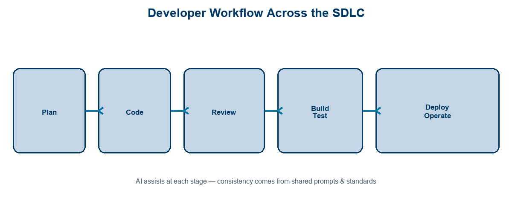
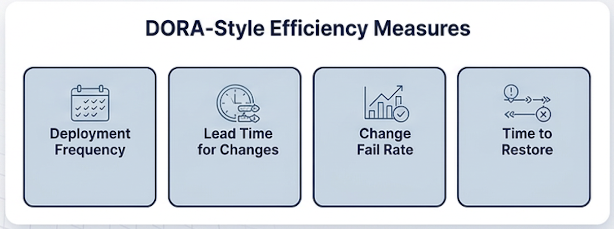
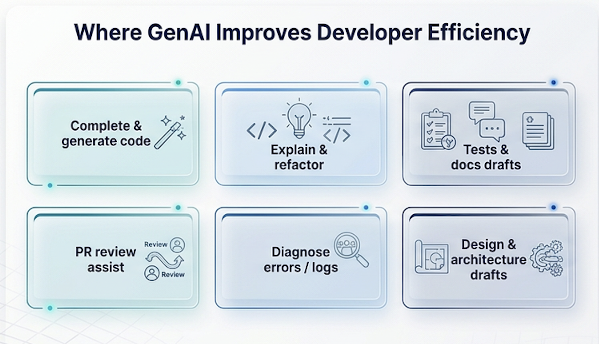
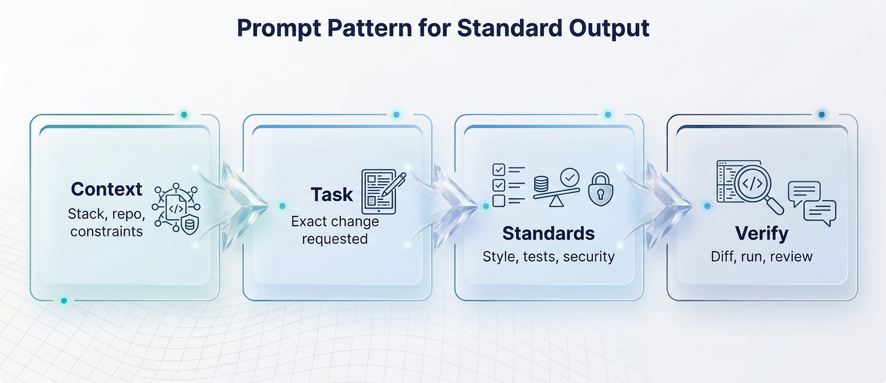
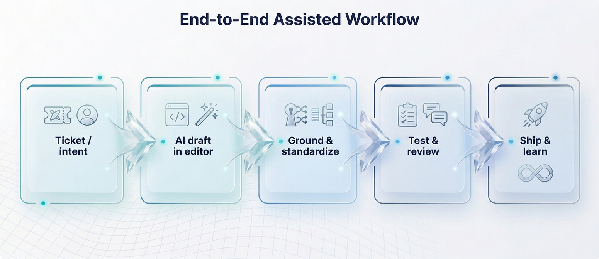

<!-- course-title: HCA: Developer Productivity & Standardization -->
<!-- layout: title -->


# Introduction to Developer Productivity
# and Standardization

## AI-assisted coding, shared prompting standards, and faster diagnosis

---

# Welcome!

- ROI leads the industry in designing and delivering customized technology and management training solutions
- Meet your instructor
  - Name
  - Background
  - Contact info
- Let’s get started!


---

# Course Objectives

- **Use AI coding assistants to ship faster and more consistently** across the team workflow
- Identify efficiency challenges across the developer workflow and SDLC
- Use an AI code assistant to write and complete code more consistently
- Apply prompting best practices that standardize output quality
- Describe how AI cloud-assist tools speed up diagnosis and design

---

# Agenda

- Segment 1: Developer Efficiency Foundations (~20 min)
- Segment 2: AI-Assisted Coding (~25 min)
- Segment 3: Beyond the Editor (~15 min)
- Q&A (~15 min)


---

# Who Should Attend

- Application developers adopting AI coding assistants
- Engineering leads driving consistency across teams
- Tech leads defining shared prompts and review norms
- Platform engineers supporting IDE / cloud AI tooling


---

# Prerequisites

- Basic software development experience
- Comfortable reading and editing code in an IDE
- Helpful: Git / PR workflow familiarity
- Helpful: access to an org-approved AI code assistant for the demo


---
<!-- layout: navigation -->
# Course Roadmap

- **Developer Efficiency Foundations**
- AI-Assisted Coding
- Beyond the Editor

---

# The Productivity Problem

- Developers lose time to **boilerplate, context switching, and hunt-the-docs**
- Teams diverge on style, patterns, and “how we do things here”
- Senior engineers become bottlenecks for the same explanations
- Speed without standards creates review debt and inconsistent quality

> [!NOTE]
> AI amplifies whatever process you have—good standards scale; weak ones scale noise.

---
<!-- layout: title-image -->
<!-- # Workflow Lens: SDLC -->



---
<!-- layout: title-image -->
<!-- # DORA-Style Efficiency Measures -->



---

# Connecting AI Assist to DORA Outcomes

| DORA-style measure | How AI assist can help |
| :--- | :--- |
| **Deployment frequency** | Faster small changes; less boilerplate |
| **Lead time for changes** | Quicker drafts, tests, and explanations |
| **Change fail rate** | Better tests/review prompts—if humans verify |
| **Time to restore** | Faster log/error diagnosis and fix drafts |

> [!IMPORTANT]
> AI is a lever on flow metrics—not a substitute for CI quality, ownership, and review.

---
<!-- layout: title-image -->
<!-- # Where GenAI Improves Efficiency -->



---
<!-- layout: 2-column -->
# Efficiency Challenges to Name Explicitly

### Individual Friction
- Blank-page starts
- Unfamiliar APIs
- Flaky local debug
- Writing tests last

### Team Friction
- Inconsistent patterns
- Uneven review quality
- Tribal knowledge
- Tool sprawl

---
<!-- layout: navigation -->
# Course Roadmap

- Developer Efficiency Foundations
- **AI-Assisted Coding**
- Beyond the Editor

---

# What an AI Code Assistant Does

- **Completes** code as you type (inline suggestions)
- **Generates** functions, tests, and refactors from prompts/chat
- **Explains** unfamiliar code and error messages
- Works best when grounded in **your open files / repo context**

> [!TIP]
> Treat suggestions like a junior pair: fast drafts, mandatory review.

---
<!-- layout: 2-column -->
# Generating and Completing Code

### Completion
- Keep typing with clear names
- Accept / reject / edit often
- Prefer small, local suggestions

### Generation
- Ask for a function or test
- Specify inputs/outputs
- Require matching existing style

---
<!-- layout: title-image -->
<!-- # Prompting for Standard Output -->



---

# Prompting Best Practices (Team Standards)

- State **language, framework, and file path**
- Paste or reference **existing patterns** (“match `UserService` style”)
- Require **tests**, error handling, and logging norms
- Ban secrets: never paste credentials or PHI into prompts
- Ask for a **diff-sized** change—not a rewrite of the module

```text
Context: Python 3.12 service using our repository pattern in services/
Task: Add get_patient_summary(patient_id) returning a dict
Standards: type hints, raise NotFoundError, no PHI in logs, add pytest
Verify: show function + test only
```

---
<!-- layout: 3-column -->
# Consistency Levers

### Shared Prompts
- Team prompt library
- PR description template
- “Generate tests” macro

### Guardrails
- Linters / formatters
- CI checks
- Secure coding rules

### Review Norms
- AI-origin label OK
- Human owns merge
- Reject unverified code

---

# Grounding on Your Own Codebase

- Open relevant files so the assistant sees **local patterns**
- Point to interfaces, fixtures, and examples to clone
- Prefer repo-aware / codebase chat features when licensed
- Keep enterprise **data protection** settings on for work code

> [!WARNING]
> Ungrounded generation invents APIs that “look right.” Always compile, test, and read the diff.

---

<!-- layout: 2-column -->
# Anti-Patterns to Avoid

### Don’t
- Blind-accept multi-file rewrites
- Skip tests because “AI wrote it”
- Paste secrets or production data
- Let every engineer invent prompts

### Do
- Small diffs, frequent verify
- Keep CI as source of truth
- Use approved enterprise tools
- Share winning prompts weekly

---

<!-- layout: navigation -->
# Course Roadmap

- Developer Efficiency Foundations
- AI-Assisted Coding
- **Beyond the Editor**

---
<!-- layout: 2-column -->
# Cloud-Assist: Design

### Design Help
- Draft sequence / API sketches
- Compare options with tradeoffs
- Turn requirements into tasks

### Keep Control
- Architecture owners decide
- Capture ADRs for big calls
- Don’t skip threat modeling

---

# Cloud-Assist: Diagnosis

- Paste **sanitized** stack traces and error snippets
- Ask for likely causes *and* what to check next
- Use assist to draft log queries or reproduction steps
- Validate against real telemetry—don’t ship speculative fixes

| Input | Ask the assistant for |
| :--- | :--- |
| Stack trace | Ranked hypotheses + checks |
| Failing test | Minimal fix + why |
| Slow endpoint | Instrumentation ideas |
| Incident notes | Timeline & next actions draft |

---
<!-- layout: title-image -->
<!-- # End-to-End Assisted Workflow -->



---
<!-- layout: 3-column -->
# Putting It Together

### Plan
- Clarify acceptance
- Prompt for task split

### Build
- Complete / generate
- Ground on repo
- Add tests

### Ship
- Review like a peer
- CI must pass
- Note what to reuse

---

# Team Standardization Starter Kit

- Approved assistant + security settings documented
- 5–10 shared prompts (feature, test, refactor, PR, incident)
- Definition of done includes “AI-assisted code reviewed by a human”
- Spot-check metrics: lead time on small stories, review rework rate

> [!TIP]
> Standardization is social: office hours and examples beat a wiki nobody opens.

---
<!-- layout: 2-column -->
# Measuring Without Vanity Metrics

### Prefer
- Lead time on small changes
- PR rework / review cycles
- Incident time-to-mitigate
- Developer satisfaction pulses

### Avoid Over-reading
- Lines of AI-generated code
- Acceptance-rate alone
- Raw suggestion counts
- “Hours saved” guesses

---

# What You Learned

- Identified efficiency challenges across the developer workflow and SDLC
- Used (or walked through) an AI code assistant for consistent write/complete loops
- Applied prompting practices that standardize output quality
- Described how cloud-assist tools speed diagnosis and design in an end-to-end flow

---

# Quiz 1 of 3

**How should teams treat AI coding assistant suggestions?**

- A. Blind-accept multi-file rewrites to maximize speed
- B. Treat them like a junior pair: fast drafts with mandatory human review
- C. Skip tests because “the AI already wrote them”
- D. Prefer ungrounded generation over open-file / repo context

---

# Quiz 1 — Answer

**How should teams treat AI coding assistant suggestions?**

**Correct: B.** Treat them like a junior pair: fast drafts with mandatory human review

- Suggestions are drafts—compile, test, and read the diff
- Blind multi-file accepts create review debt and subtle bugs
- CI and human ownership remain the source of truth
- Grounding on local patterns beats invented APIs that “look right”

---

# Quiz 2 of 3

**Which signal best measures AI-assisted developer productivity without vanity metrics?**

- A. Lines of AI-generated code
- B. Raw suggestion acceptance rate alone
- C. Lead time on small changes and PR rework / review cycles
- D. Total suggestion count shown in the IDE

---

# Quiz 2 — Answer

**Which signal best measures AI-assisted developer productivity without vanity metrics?**

**Correct: C.** Lead time on small changes and PR rework / review cycles

- Flow and quality outcomes matter more than generation volume
- Acceptance rate alone ignores whether code survived review and CI
- Lead time and rework reflect real team efficiency
- Pair with incident time-to-mitigate and developer satisfaction pulses

---
<!-- layout: 2-column -->
# Quiz 3 of 3 — Discussion

### Prompt
Your team is rolling out an org-approved AI coding assistant next quarter.

### Discuss
- Which 5–10 shared prompts would you standardize first—and why?
- Where must a human still own the merge decision?
- How would you spot-check that standards are helping (not just adopted)?

---
<!-- layout: 2-column -->
# Quiz 3 — Discussion Points

**Your team is rolling out an org-approved AI coding assistant next quarter.**

### Strong Answers Mention
- Shared prompts for feature, test, refactor, PR, and incident
- Human review + CI as definition of done
- Metrics like lead time and review rework—not lines of AI code
- Security settings and “no secrets in prompts” as non-negotiables

### Watch For
- “Everyone invents their own prompts”
- Measuring success only by suggestion acceptance
- Skipping grounding and review to go faster

---
<!-- layout: title-image -->
# Questions and Answers


