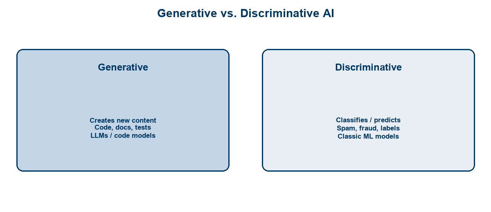
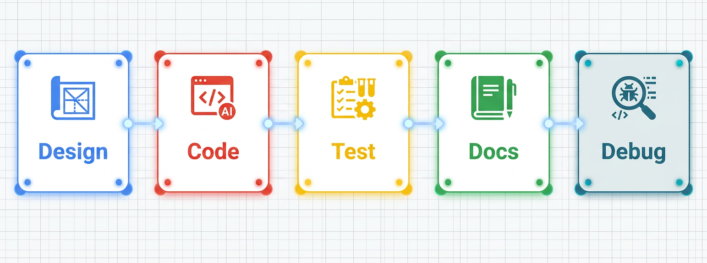
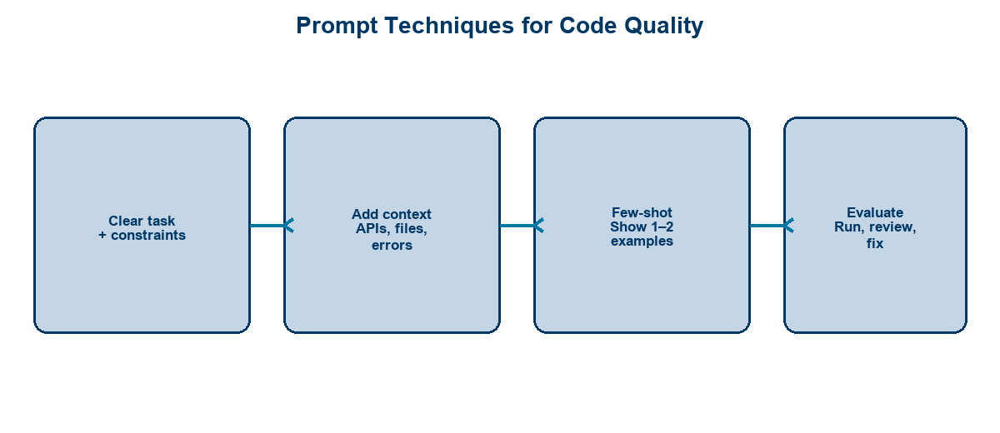
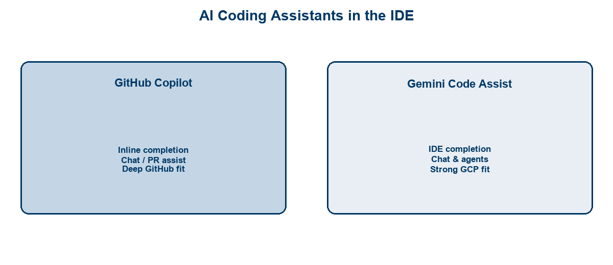
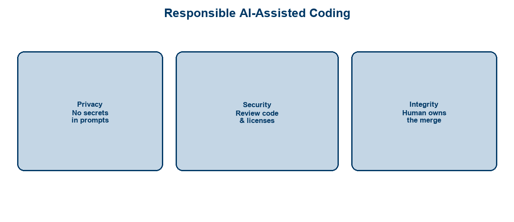

<!-- course-title: HCA: GenAI for Software Engineering -->
<!-- layout: title -->


# Introduction to Generative AI
# for Software Engineering

## Generate, test, document, and debug code with AI assistants—responsibly

---

# Welcome!

- ROI leads the industry in designing and delivering customized technology and management training solutions
- Meet your instructor
  - Name
  - Background
  - Contact info
- Let’s get started!


---

# Course Objectives

- **Apply generative AI across the software engineering workflow** while keeping quality and security intact
- Describe how generative AI applies to the software development workflow
- Use prompt techniques to generate, document, and test code
- Compare leading AI coding assistants (Copilot, Gemini Code Assist) and IDE integration
- Recognize responsible-use and security considerations for AI-assisted coding

---

# Agenda

- Segment 1: GenAI for Developers (~20 min)
- Segment 2: Prompt Engineering for Code (~25 min)
- Segment 3: Tools and Responsible Use (~15 min)
- Q&A (~15 min)


---

# Who Should Attend

- Software developers writing application code
- Architects advising teams on AI-assisted practices
- Engineers adopting IDE coding assistants
- Tech leads setting responsible-use norms


---

# Prerequisites

- Familiarity with a modern language (Python, Java, or C#)
- Comfortable with an IDE and basic Git workflows
- Helpful: prior exposure to unit testing
- Helpful: access to an org-approved coding assistant for the demo


---
<!-- layout: navigation -->
# Course Roadmap

- **GenAI for Developers**
- Prompt Engineering for Code
- Tools and Responsible Use

---
<!-- layout: title-image -->
# Generative vs. Discriminative AI



---

# Model Types Developers Encounter

| Type | Role in engineering work |
| :--- | :--- |
| **LLMs / code models** | Generate and explain code, docs, tests |
| **Embedding models** | Search code/docs by meaning |
| **Classic ML** | Classify, score, detect (often not “generative”) |
| **Multimodal** | Read screenshots, diagrams, error images |

> [!NOTE]
> This course focuses on **generative** coding assistants—models that draft software artifacts you still must verify.

---
<!-- layout: title-image -->
# Where GenAI Fits in the Workflow



---
<!-- layout: 3-column -->
# Practical Applications

### Build Faster
- Boilerplate & APIs
- Refactors
- Migrations stubs

### Raise Quality
- Tests & edge cases
- Docstrings / README
- Review checklists

### Unblock
- Explain unfamiliar code
- Debug errors
- Explore options

---
<!-- layout: 2-column -->
# What Changes (and What Doesn’t)

### Changes
- Time to first draft
- Breadth of exploration
- Onboarding to new code

### Doesn’t Change
- Accountability for merges
- Need for tests & review
- Security & license duties

---
<!-- layout: navigation -->
# Course Roadmap

- GenAI for Developers
- **Prompt Engineering for Code**
- Tools and Responsible Use

---
<!-- layout: title-image -->
# Prompt Techniques That Improve Output



---

# Generating Code

- State language, runtime, and framework versions
- Specify inputs, outputs, and error behavior
- Constrain scope: “one function,” “no new dependencies”
- Ask for idiomatic style matching your stack

```text
Write a Python 3.12 function parse_iso_dates(values: list[str]) -> list[date].
Skip invalid entries; log a warning; no external libraries.
Include type hints and a short docstring.
```

---
<!-- layout: 2-column -->
# Documentation and Tests

### Documentation
- Docstrings from signatures
- README usage examples
- ADR / design drafts

### Tests
- Unit tests for happy path
- Edge cases & errors
- Fixtures matching project style

---

# Adding Context and Few-Shot Prompting

- **Context:** paste interfaces, error logs, or “match this file’s style”
- **Few-shot:** show 1–2 examples of the pattern you want repeated
- Prefer open files / codebase grounding in the IDE over giant pastes
- Refresh context when the assistant drifts from your APIs

```text
Example style (few-shot):
def get_user(id: str) -> User:
    ...
Now write get_order(id: str) -> Order the same way.
```

---
<!-- layout: 2-column -->
# Pitfalls: Hallucinations

### Common Failure Modes
- Invented methods / packages
- Subtle logic bugs
- Outdated API usage
- Overconfident explanations

### Evaluation Checklist
- Does it compile / typecheck?
- Do tests pass?
- Licenses OK?
- Security smell review?

---

# Evaluating Generated Code

- Run the **smallest verification** immediately (test, REPL, build)
- Diff like a PR from a junior engineer
- Ask the assistant to critique its own output against your checklist
- Prefer iterative fixes over accepting a large rewrite

> [!WARNING]
> If you can’t explain the change, don’t merge it—regardless of who (or what) wrote it.

---
<!-- layout: navigation -->
# Course Roadmap

- GenAI for Developers
- Prompt Engineering for Code
- **Tools and Responsible Use**

---
<!-- layout: title-image -->
# Copilot and Gemini Code Assist



---
<!-- layout: 3-column -->
# IDE Integration Capabilities

### Inline
- Completions
- Next-edit hints
- Accept / edit / reject

### Chat
- Generate & explain
- Multi-file Q&A
- Test / doc drafts

### Workflow
- PR summaries
- Agent-style tasks*
- Cloud/repo grounding*

---

# Choosing and Configuring Assistants

| Consideration | Why it matters |
| :--- | :--- |
| **IDE support** | VS Code, JetBrains, others your team uses |
| **Repo grounding** | Quality rises with real project context |
| **Enterprise controls** | Retention, training opt-out, allowlists |
| **Ecosystem fit** | GitHub-centric vs Google Cloud-centric shops |

> [!TIP]
> Standardize on **org-approved** tools and settings—personal consumer accounts create policy and IP risk.

---

# Demo: Assistants in the IDE

**Time:** ~10–12 minutes (instructor-led)

**Demo guide:** [Placeholder — Copilot / Gemini Code Assist demo](https://example.com/hca/demos/genai-se-assistants)

- Inline-complete a function in Python, Java, or C#
- Chat-generate a unit test and docstring
- Compare a grounded vs ungrounded suggestion
- Show enterprise privacy / exclusion settings if available

---
<!-- layout: title-image -->
# Responsible AI-Assisted Coding



---
<!-- layout: 2-column -->
# Privacy and Prompt Safety

### Never Paste
- Secrets / API keys
- PHI / PII / production dumps
- Customer confidential data
- Private keys / tokens

### Prefer
- Approved enterprise SKUs
- Redacted logs & samples
- Synthetic test data
- Local secrets managers

---

# Prompt Hacking and Abuse Awareness

- Assistants can be steered into **unsafe or policy-violating** output
- Treat untrusted content (web pages, tickets) as potentially adversarial
- Don’t let AI execute destructive commands without human confirmation
- Report suspicious IDE / extension behavior through security channels

> [!IMPORTANT]
> Responsible use is a team sport: policy, tooling defaults, and peer review.

---
<!-- layout: 2-column -->
# Assess Current State → Prioritize

### Assess
- Who has access today?
- Are settings enterprise-safe?
- Shared prompts exist?
- Review norms clear?

### Prioritize
- Enable approved tooling
- Train prompting + review
- Add secret scanning
- Measure lead time / rework

---

# What You Learned

- Described how generative AI applies across the software development workflow
- Used prompt techniques to generate, document, and test code
- Compared Copilot and Gemini Code Assist style IDE integrations
- Recognized responsible-use and security considerations for AI-assisted coding

---

# Quiz 1 of 3

**Which practice most improves the quality of generated code?**

- **A.** State language/runtime, constrain scope, then verify with the smallest build/test immediately
- **B.** Accept a large rewrite without reading the diff if the model sounds confident
- **C.** Prefer giant pasted context over open-file / codebase grounding
- **D.** Skip license and security review because the assistant “knows best”

---

# Quiz 1 — Answer

**Correct: A**

- Clear constraints reduce hallucinations and scope creep
- Immediate verification catches invented APIs and logic bugs early
- Diff-sized iteration beats merging unexplained large changes
- Accountability for merges and security duties never goes away

---

# Quiz 2 of 3

**Why should teams standardize on org-approved coding assistants?**

- **A.** Consumer personal accounts never create IP or policy risk
- **B.** IDE support and enterprise controls do not matter
- **C.** Any free tool is fine as long as suggestions look good
- **D.** Enterprise controls (retention, training opt-out, allowlists) reduce policy and IP risk

---

# Quiz 2 — Answer

**Correct: D**

- Personal consumer accounts create retention and IP exposure
- Enterprise SKUs align with org data-protection settings
- Standard tooling also enables shared prompts and review norms
- Security and license duties remain human responsibilities

---
<!-- layout: 2-column -->
# Quiz 3 of 3 — Discussion

### Prompt
Pick one workflow on your team: generate a function, draft tests, or explain a failing stack trace.

### Discuss
- What context and few-shot examples would you include in the prompt?
- What must never be pasted (secrets, PHI, production dumps)?
- How would you evaluate the output before merge?

---
<!-- layout: 2-column -->
# Quiz 3 — Discussion Points

### Strong Answers Mention
- Language, I/O contracts, and “match this file’s style”
- Redacted logs / synthetic data; approved enterprise tools
- Compile, tests, license/security smell check, explainable diff
- Iterative fixes over one-shot mega-rewrites

### Watch For
- Pasting credentials or customer data “for better context”
- Merging code nobody on the team can explain
- Treating hallucinations as ground truth

---
<!-- layout: title-image -->
# Q&A


