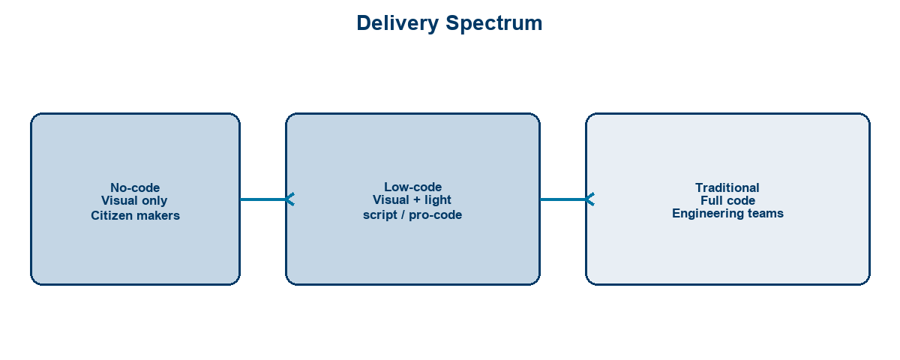
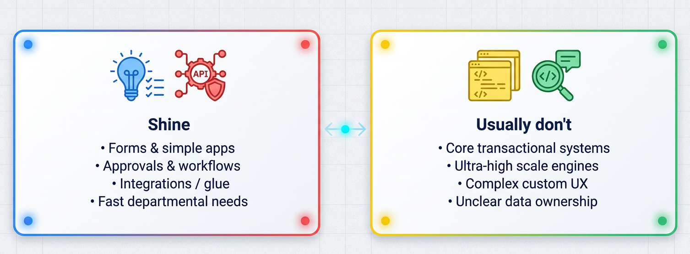
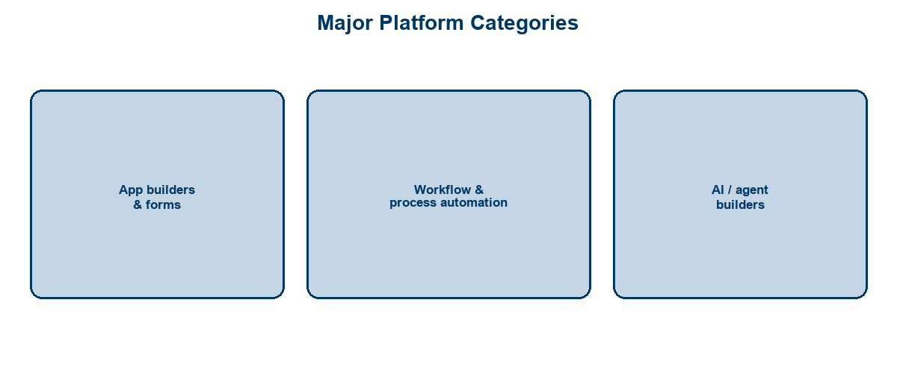
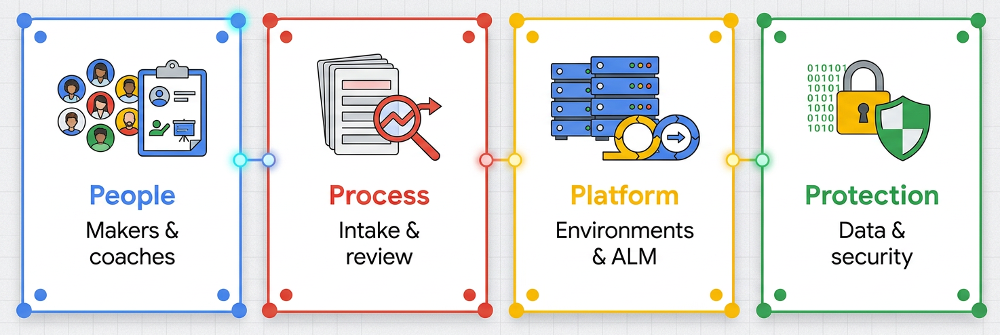
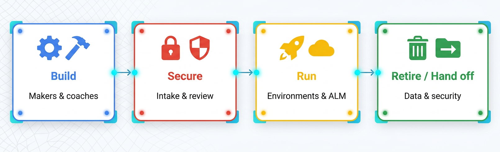

<!-- course-title: HCA: Introduction to Low-Code & No-Code -->
<!-- layout: title -->

# Introduction to Low-Code
# and No-Code Platforms

## Build apps and automations faster—with guardrails for safe citizen development

---

# Welcome!

- ROI leads the industry in designing and delivering customized technology and management training solutions
- Meet your instructor
  - Name
  - Background
  - Contact info
- Let’s get started!

---

# Course Objectives

- **Orient business and IT partners to low-code/no-code**—what to build, where, and how to govern it
- Define low-code and no-code and distinguish the two
- Identify use cases well-suited to low-code/no-code delivery
- Recognize major platform categories (app builders, workflow automation, AI agent builders)
- Describe governance and security guardrails for citizen development

---

# Agenda

- Segment 1: The Low-Code/No-Code Landscape (~20 min)
- Segment 2: What You Can Build (~25 min)
- Segment 3: Doing It Safely (~15 min)
- Questions and Answers (~15 min)

---

# Who Should Attend

- Business analysts and operations staff
- Citizen developers and process owners
- IT partners enabling or coaching makers
- Leaders exploring faster departmental delivery

---

# Prerequisites

- No prior development experience required
- Helpful: familiarity with a business process you want to improve
- Helpful: awareness of your org’s approved productivity / automation tools

---
<!-- layout: navigation -->
# Course Roadmap

- **The Low-Code/No-Code Landscape**
- What You Can Build
- Doing It Safely

---

# Why This Matters

- Demand for digital workflows outpaces traditional project queues
- Business teams know the process; IT knows the risk surface
- Low-code/no-code shortens time-to-solution **when scoped well**
- Without guardrails, you get shadow IT, fragile apps, and data sprawl

> [!NOTE]
> Goal of this session: shared language + fit criteria + safe operating model—not a vendor bake-off.

---
<!-- layout: title-image -->
# Low-Code vs. No-Code vs. Traditional

---
<!-- layout: 2-column -->
# Definitions

### No-Code
- Build with visual designers only
- Forms, simple apps, basic flows
- Aimed at business makers

### Low-Code
- Visual builders **plus** light code/scripts
- Deeper integrations & logic
- Often IT + maker partnership

---
<!-- layout: title-image -->
# Where They Shine (and Don’t)

---
<!-- layout: 3-column -->
# Good Fit Signals

### Process
- Clear steps
- Frequent change
- Department-owned

### Data
- Known sources
- Modest volume
- Classified access

### Outcome
- Weeks matter
- MVP acceptable
- Measurable win

---

# Poor Fit / Hand Off to Engineering

- Systems of record that require complex transactional integrity
- Hard real-time / ultra-high-scale processing
- Highly custom UX or specialized algorithms
- Unclear ownership, retention, or compliance posture

> [!TIP]
> “Can we?” is easy. Ask “Should we—and who runs it in 18 months?”

---
<!-- layout: navigation -->
# Course Roadmap

- The Low-Code/No-Code Landscape
- **What You Can Build**
- Doing It Safely

---
<!-- layout: title-image -->
# Platform Categories

---
<!-- layout: 2-column -->
# App Builders and Forms

### Typical Builds
- Request / intake forms
- Internal utilities & dashboards
- Lightweight departmental apps
- Mobile-friendly data capture

### Watch-outs
- Becoming a second CRM
- Unmanaged data stores
- Orphan apps after the maker leaves

---
<!-- layout: 2-column -->
# Workflow and Process Automation

### Typical Builds
- Approvals & notifications
- Ticket / task routing
- System-to-system glue
- Scheduled housekeeping jobs

### Watch-outs
- Hidden brittle integrations
- No error handling / alerts
- Spaghetti of overlapping flows

---

# AI-Assisted and Agent Builders

- Platforms increasingly add **AI helpers** (generate apps, summarize, classify)
- **Agent builders** let makers compose assistants that call tools/workflows
- Powerful for knowledge Q&A and guided processes—with stronger governance needs
- Treat AI features like any other automation: owners, data rules, human escalation

> [!WARNING]
> AI agent builders can reach systems and data quickly. Scope permissions narrowly from day one.

---
<!-- layout: 3-column -->
# Example Use Cases

### Operations
- Intake → assign → notify
- Checklist apps
- Status trackers

### HR / Admin
- Onboarding tasks
- Policy acknowledgments
- Simple self-service

### IT Partnership
- Managed connectors
- Shared environments
- Co-built solutions

---
<!-- layout: navigation -->
# Course Roadmap

- The Low-Code/No-Code Landscape
- What You Can Build
- **Doing It Safely**

---
<!-- layout: title-image -->
# Citizen Development Guardrails

---
<!-- layout: 2-column -->
# Governance Essentials

### Enable
- Approved platforms only
- Maker training & coaching
- Templates & patterns
- Fast intake for ideas

### Control
- Data loss prevention
- Connector allowlists
- Environment strategy
- Review for sensitive apps

---

# Security and Data Access

- Classify data before connecting it (public → internal → confidential / PHI)
- Prefer **least-privilege** service accounts and shared connections owned by IT
- Block personal productivity accounts for business-critical automations
- Log who built what; require MFA and org identity

| Risk | Guardrail example |
| :--- | :--- |
| Oversharing | DLP + sharing policies |
| Shadow connectors | Allowlisted connectors only |
| Secrets in flows | Secure variable stores |
| Orphaned apps | Owner + review cadence |

---
<!-- layout: title-image -->
# Lifecycle Ownership

---

# Operating Model in Practice

- Every solution has a **business owner** and a **technical contact**
- Promote through Dev → Test → Prod (don’t edit production live)
- Document support path: who gets the 2 a.m. failure alert?
- Plan retirement or handoff when the maker changes roles

> [!IMPORTANT]
> Citizen development succeeds when IT enables with guardrails—not when IT bans everything or ignores everything.

---
<!-- layout: 2-column -->
# Starter Checklist for Your Org

### Next 30 Days
- Name approved platforms
- Publish fit / no-fit criteria
- Stand up maker office hours

### Next 90 Days
- Environment + ALM basics
- Connector & data policy
- Inventory of critical apps

---

# What You Learned

- Defined low-code and no-code and distinguished them from traditional development
- Identified use cases well-suited to low-code/no-code delivery
- Recognized platform categories: app builders, workflow automation, AI/agent builders
- Described governance and security guardrails for citizen development

---

# Quiz 1 of 3

**What best distinguishes no-code from low-code?**

- A. No-code always requires professional developers; low-code never does
- B. Low-code forbids any scripts or integrations
- C. No-code uses visual designers only; low-code adds light code/scripts for deeper logic and integrations
- D. Both are identical to traditional custom development

---

# Quiz 1 — Answer

**What best distinguishes no-code from low-code?**

**Correct: C.** No-code uses visual designers only; low-code adds light code/scripts for deeper logic and integrations

- No-code targets business makers with visual builders only
- Low-code keeps visual builders but allows light code for harder logic
- Both sit on a spectrum with traditional engineering—not a replacement for every system
- Fit depends on process, data, and ownership—not “can we click it together?”

---

# Quiz 2 of 3

**Which use case is the poorest fit for low-code/no-code and should usually hand off to engineering?**

- A. A system of record needing complex transactional integrity or hard real-time / ultra-high scale
- B. A departmental intake form with clear steps and modest data volume
- C. An approval-and-notification workflow between known systems
- D. A checklist / status tracker owned by one operations team

---

# Quiz 2 — Answer

**Which use case is the poorest fit for low-code/no-code and should usually hand off to engineering?**

**Correct: A.** A system of record needing complex transactional integrity or hard real-time / ultra-high scale

- Complex transactional integrity and ultra-high scale are classic hand-offs
- Clear, department-owned processes with modest data are good LCNC fits
- Ask who runs it in 18 months—not only whether a maker can build an MVP
- Poor ownership or compliance posture is another red flag

---
<!-- layout: 2-column -->
# Quiz 3 of 3 — Discussion

### Prompt
A business team wants to automate an internal request → approve → notify flow on an approved platform.

### Discuss
- What governance controls would you require before go-live?
- Who is the business owner vs technical contact—and who gets the 2 a.m. alert?
- When would you insist on Dev → Test → Prod instead of editing production live?

---
<!-- layout: 2-column -->
# Quiz 3 — Discussion Points

**A business team wants to automate an internal request → approve → notify flow on an approved platform.**

### Strong Answers Mention
- Approved platform, connector allowlists, DLP / data classification
- Named owner + technical contact; retirement/handoff plan
- Environment promotion; least-privilege shared connections
- AI/agent features scoped narrowly with human escalation

### Watch For
- Personal productivity accounts for business-critical flows
- Orphan apps with no owner after the maker leaves
- Connecting confidential / PHI data without classification

---
<!-- layout: title-image -->
# Questions and Answers

