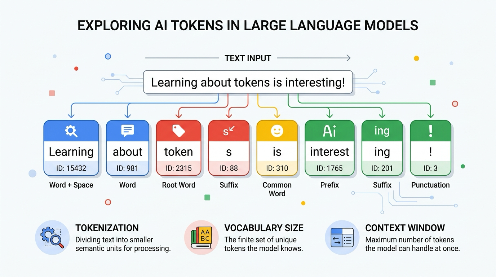
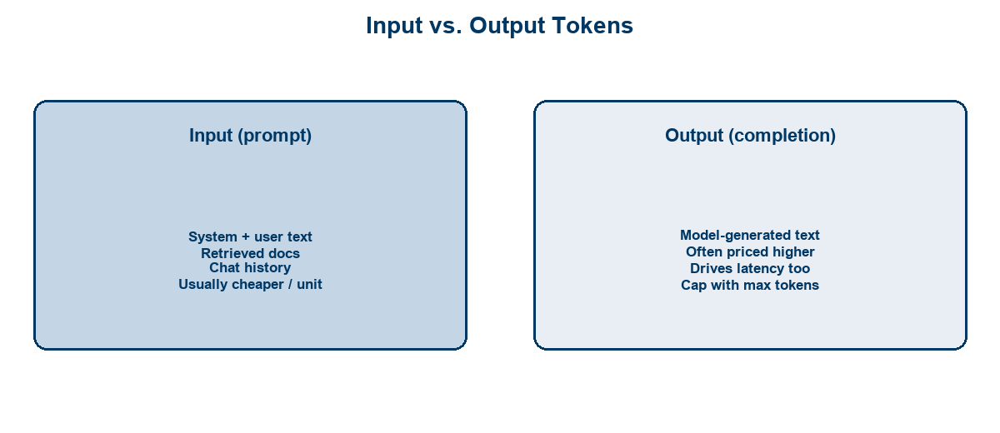
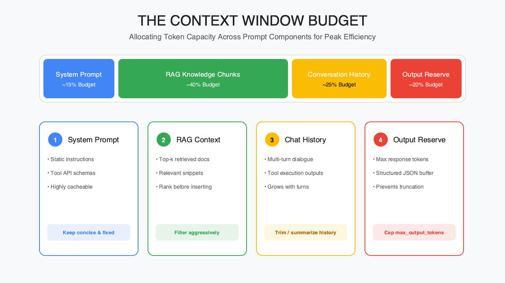
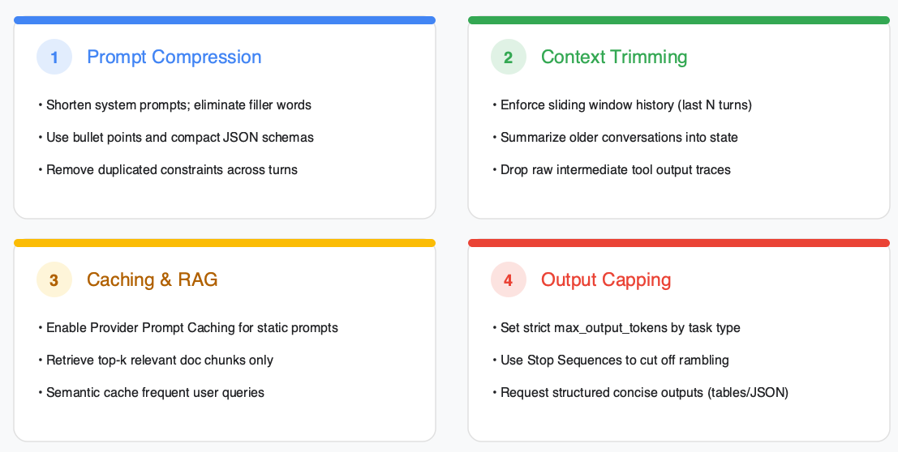
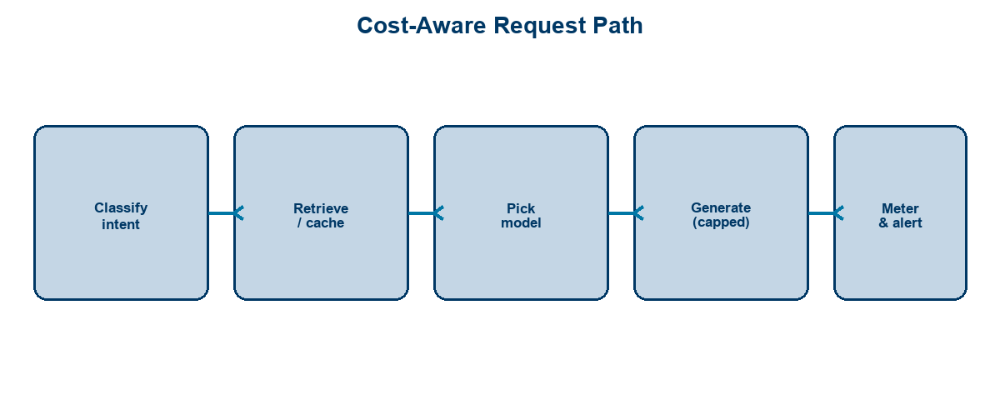

<!-- course-title: HCA: Tokenomics & Token Optimization -->
<!-- layout: title -->


# Introduction to Tokenomics
# and Token Optimization

## Estimate, reduce, and architect LLM usage for cost and latency at scale

---

# Welcome!

- ROI leads the industry in designing and delivering customized technology and management training solutions
- Meet your instructor
  - Name
  - Background
  - Contact info
- Let’s get started!


---

# Course Objectives

- **Run LLM workloads efficiently** by understanding tokens, estimating usage, and designing for cost control
- Explain what tokens are and how models are priced by them
- Estimate token consumption for prompts, context, and outputs
- Apply techniques to reduce token usage without losing quality
- Recognize architectural choices (caching, retrieval, model selection) that control cost

---

# Agenda

- Segment 1: Token Fundamentals (~20 min)
- Segment 2: Optimizing Usage (~25 min)
- Segment 3: Cost-Aware Architecture (~15 min)
- Q&A (~15 min)


---

# Who Should Attend

- Developers building LLM-powered features
- Solution architects designing GenAI systems
- Technical product owners accountable for AI spend
- Platform engineers operating shared model gateways


---

# Prerequisites

- Familiarity with generative AI / LLM basics
- Comfort reading simple API request/response shapes
- Helpful: exposure to prompt design or RAG concepts
- Helpful: access to a tokenizer or provider usage dashboard for the demo


---
<!-- layout: navigation -->
# Course Roadmap

- **Token Fundamentals**
- Optimizing Usage
- Cost-Aware Architecture

---

# Why Tokenomics Matters

- Tokens drive **cost**, **latency**, and **context limits**
- Unbounded prompts and histories create surprise bills
- Quality does not require maximum context every time
- Efficient design is a product capability—not only a FinOps afterthought

> [!NOTE]
> “Tokenomics” here means the economics and mechanics of token consumption—not crypto tokens.

---
<!-- layout: title-image -->
# What Is a Token?



---

# Tokenization Basics

- Models don’t read raw characters; a **tokenizer** splits text into tokens
- Common English heuristic: **~4 characters ≈ 1 token** (rough; varies by language/code)
- Code, URLs, and rare words often use **more** tokens than you expect
- Always measure with the **same tokenizer family** as your target model when precision matters

```text
"tokenization"  →  may be 1–3 tokens depending on the tokenizer
"SELECT * FROM patients;"  →  often token-heavier than plain prose
```

---
<!-- layout: title-image -->
# Input vs. Output Tokens



---
<!-- layout: 2-column -->
# How Pricing Usually Works

### Billable Units
- Price per **1K / 1M input tokens**
- Price per **1K / 1M output tokens**
- Output often costs more than input

### Other Cost Drivers
- Model tier (flash vs pro)
- Cached / batch discounts*
- Tool/agent multi-call amplification

---
<!-- layout: title-image -->
# Context Windows



---

# Estimating Consumption

| Piece | What to count |
| :--- | :--- |
| System prompt | Static instructions every call |
| User turn | Current question / task |
| History | Prior turns you resend |
| Retrieved docs | RAG chunks injected |
| Tools / schemas | Specs sent to the model |
| Output | `max_tokens` ceiling × expected length |

> [!TIP]
> Rough monthly cost ≈ calls × (avg input + avg output tokens) × price per token—then add retries and tool loops.

---
<!-- layout: 3-column -->
# Quick Estimation Example

### Prompt
- 800 input tokens
- Includes short history

### Completion
- ~300 output tokens
- Cap at 512

### At scale
- 100k calls/mo
- Watch history growth

---
<!-- layout: navigation -->
# Course Roadmap

- Token Fundamentals
- **Optimizing Usage**
- Cost-Aware Architecture

---
<!-- layout: title-image -->
# Levers to Reduce Spend



---
<!-- layout: 2-column -->
# Prompt Compression

### Do
- Short system prompts
- Bullet constraints
- Reuse shared templates
- Remove repeated boilerplate

### Avoid
- Novel-length instructions
- Pasting entire style guides
- Duplicating rules every turn
- “Explain everything” defaults

---

# Context Trimming

- Keep only the **last N turns** or summarize older history
- Drop irrelevant tool traces from the next prompt
- Prefer structured state over raw transcript dumps
- Enforce a hard input budget per request type

> [!IMPORTANT]
> Long chat history is a silent cost multiplier—trim by design, not by accident.

---
<!-- layout: 2-column -->
# Caching and Retrieval (RAG)

### Caching
- Cache stable system prompts
- Cache repeated tool schemas
- Reuse embeddings / results
- Provider prompt caching where available

### RAG
- Retrieve top-k chunks—not whole corpora
- Chunk & rank for relevance
- Cite sources; skip filler
- Fail closed when nothing relevant

---

# Truncation Strategies

- Set **`max_output_tokens`** appropriate to the task (titles ≠ reports)
- Ask for concise formats: tables, bullets, JSON schemas
- Stop sequences / structured outputs reduce rambling
- For docs: summarize first, expand on demand (two-step)

| Task | Output posture |
| :--- | :--- |
| Classification | Tiny (labels / JSON) |
| Code fix | Diff-sized |
| Executive summary | Hard word/token cap |
| Deep analysis | Separate “expand” call |

---

# Demo: Measure and Trim

**Time:** ~10–12 minutes (instructor-led)

**Demo guide:** [Placeholder — token counting & optimization demo](https://example.com/hca/demos/token-optimization)

- Count tokens for a verbose vs compressed prompt
- Show history growth across turns
- Apply RAG top-k instead of pasting a long doc
- Cap output tokens and compare quality vs cost

---
<!-- layout: navigation -->
# Course Roadmap

- Token Fundamentals
- Optimizing Usage
- **Cost-Aware Architecture**

---
<!-- layout: title-image -->
# Design for Efficiency



---
<!-- layout: 2-column -->
# Model Right-Sizing and Routing

### Right-Size
- Small/fast models for easy tasks
- Larger models for hard reasoning
- Don’t default everything to “pro”

### Route
- Classify intent first
- Escalate only when needed
- A/B quality vs cost
- Cache frequent answers

---

# Monitoring Token Usage and Budgets

- Meter **input, output, cached, and embedding** tokens per feature
- Attribute spend to app, team, and environment
- Alert on spikes (runaway agents, loops, huge RAG)
- Set budgets and rate limits before launch—not after the invoice

> [!WARNING]
> Multi-step agents can multiply token use per user action. Budget at the *workflow* level, not only per single LLM call.

---
<!-- layout: 3-column -->
# Control Plane Checklist

### Product
- Task SLAs
- Quality bar
- Kill switches

### Platform
- Gateway metering
- Model catalog
- Cache & RAG defaults

### FinOps
- Budgets / quotas
- Chargeback
- Monthly reviews

---

# Efficiency Without Losing Quality

- Optimize the **80% routine traffic** first
- Keep an evaluation set so cost cuts don’t silently tank quality
- Prefer architectural fixes (routing, RAG, cache) over endless prompt micro-edits alone
- Document defaults: model, max tokens, history policy, top-k

---

# What You Learned

- Explained what tokens are and how model pricing relates to them
- Estimated token consumption across prompts, context, and outputs
- Applied techniques to reduce usage without blindly sacrificing quality
- Recognized caching, retrieval, and model-selection choices that control cost

---
<!-- layout: title-image -->
# Q&A


