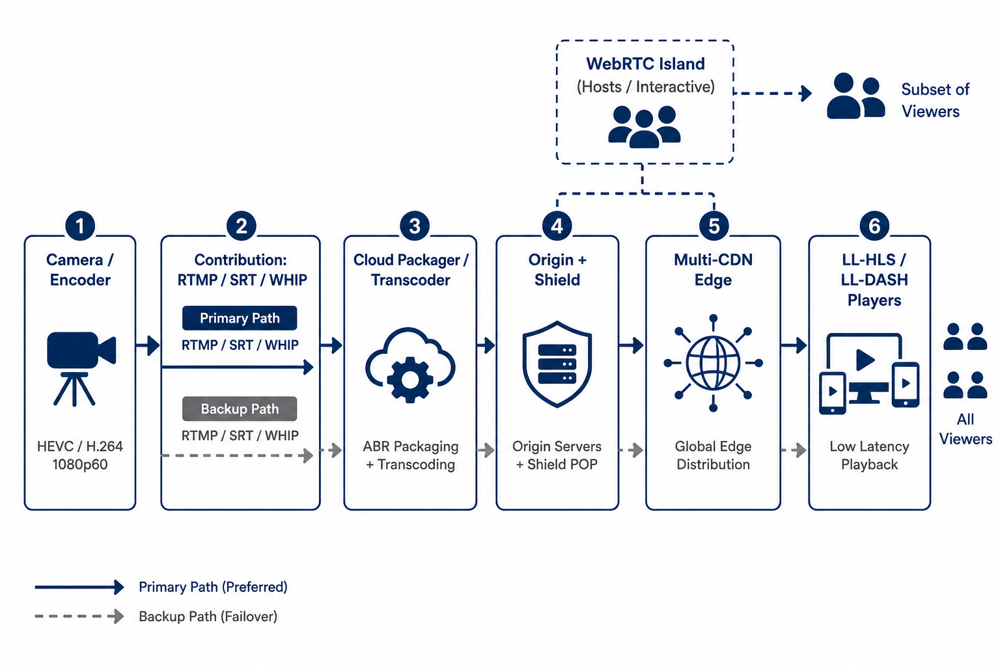

<!-- course-title: HCA: Live Streaming & Low-Latency Architecture -->
<!-- layout: title -->


# Live Streaming Platforms and
# Low-Latency Architecture

## From capture to playback—protocols, edge design, and reliability at scale

---

# Welcome!

- ROI leads the industry in designing and delivering customized technology and management training solutions
- Meet your instructor
  - Name
  - Background
  - Contact info
- Let’s get started!


---

# Course Objectives

- **Architect live audio/video delivery** with clear latency, scale, and reliability trade-offs
- Describe the end-to-end live streaming pipeline and contribution options
- Explain the protocols and trade-offs behind low-latency delivery
- Identify architectural levers (edge, CDN, encoding, player) that reduce latency
- Apply scaling, reliability, auth, and game-day practices for live events

---

# Agenda

- Segment 1: The Live Streaming Pipeline (~20 min)
- Segment 2: Low-Latency Techniques (~25 min)
- Segment 3: Scale and Reliability (~20 min)
- Questions and Answers (~10 min)


---

# Who Should Attend

- Solution architects designing media platforms
- Platform engineers operating streaming infrastructure
- Technical media / product teams shipping live experiences
- Cloud engineers supporting large live events


---

# Prerequisites

- General familiarity with networking concepts (DNS, HTTP, CDN)
- General familiarity with cloud architecture patterns
- Helpful: exposure to video formats or event broadcasting
- Helpful: awareness of HLS / DASH terminology


---
<!-- layout: navigation -->
# Course Roadmap

- **The Live Streaming Pipeline**
- Low-Latency Techniques
- Scale and Reliability

---

# Why Latency Matters

- Live sports, auctions, betting, and interactive classes punish delay
- Chat and second-screen experiences drift when video lags
- “Live” is a product SLA—define **glass-to-glass** targets up front
- Lower latency usually costs complexity, capacity, or resilience margin

> [!NOTE]
> Pick a latency budget first (e.g. &lt;2s interactive vs 5–15s broadcast-scale), then choose protocols.

---
<!-- layout: title-image -->
# Capture to Playback


---
<!-- layout: 3-column -->
# Pipeline Stages

### Ingest
- Camera / encoder
- RTMP, SRT, WHIP
- Contribution link

### Process
- Transcode ladders
- Package manifests
- Origin / packager

### Deliver
- CDN / edge
- ABR playback
- Player buffering

---
<!-- layout: title-image -->
# Where Latency Accumulates


---

# Typical Delay Contributors

| Stage | What adds delay |
| :--- | :--- |
| Capture / ingest | Device buffers, uplink jitter handling |
| Encode | GOP length, look-ahead, multi-rendition |
| Package | Segment duration, playlist depth |
| CDN | Cache miss, origin fetch, regional hop |
| Player | Startup buffer, rebuffer safety margin |

> [!TIP]
> Optimizing only the CDN won’t fix a 6-second segment + large player buffer.

---

# Sample Glass-to-Glass Budgets

Illustrative only—measure your stack; numbers vary by encoder, network, and player.

| Stage (approx.) | Interactive (~&lt;2s) | Broadcast low-latency (~5–10s) |
| :--- | :--- | :--- |
| Capture / ingest | 50–150 ms | 100–300 ms |
| Encode | 100–300 ms | 300–800 ms |
| Package / parts | 100–400 ms | 1–3 s (segment/part size) |
| CDN / edge | 50–200 ms | 200–800 ms |
| Player buffer | 200–800 ms | 2–5 s |
| **Rough total** | **~0.5–2 s** | **~5–10 s** |

> [!IMPORTANT]
> Budget the product SLA first. If interactive needs &lt;2s, classic long-GOP HLS will never get you there—no matter how good the CDN is.

---
<!-- layout: 3-column -->
# Contribution: RTMP vs SRT vs WHIP

### RTMP
- Still common from encoders
- TCP; simple firewall story
- Weaker on lossy links
- Aging protocol—plan exits

### SRT
- UDP + recovery / encryption
- Strong for unreliable WAN
- Popular for backup paths
- Great contribution workhorse

### WHIP
- WebRTC ingest over HTTP
- Browser / modern encoders
- Low-latency contribution
- Pair with WHEP-style playback when needed

> [!NOTE]
> Dual ingest (primary + backup) matters more than which single protocol you prefer—paths fail on game day.

---
<!-- layout: 2-column -->
# Encode, Package, Deliver

### Encode & Package
- Bitrate ladder for devices/networks
- Segment or chunk the stream
- Publish to an origin

### Deliver & Play
- CDN fans out to viewers
- Player picks rendition (ABR)
- Buffer trades smoothness vs delay

---
<!-- layout: navigation -->
# Course Roadmap

- The Live Streaming Pipeline
- **Low-Latency Techniques**
- Scale and Reliability

---
<!-- layout: title-image -->
# Protocols and Trade-offs


---
<!-- layout: 2-column -->
# Protocol Landscape

### WebRTC (and peers)
- Sub-second / interactive
- Great for calls, auctions, classrooms
- Harder fan-out at huge scale

### LL-HLS / LL-DASH
- Seconds-scale “broadcast low latency”
- CDN-friendly HTTP delivery
- Partial segments / chunked transfer

---

# Classic HLS vs Low-Latency HLS

- Classic HLS: longer segments → simpler scale, higher delay
- LL-HLS: shorter parts, blocking playlist reads, tuned players
- Same family of HTTP delivery—different latency posture
- Always validate with **your** player stack, not just origin config

> [!IMPORTANT]
> Protocol choice is a product decision: interactivity needs ≠ stadium-scale one-to-many.

---
<!-- layout: title-image -->
# Reference Architecture



---

# Reference Architecture Notes

- **Contribution:** primary + backup (SRT/RTMP/WHIP) into cloud packager/transcode
- **Origin shield:** protect packagers from CDN stampedes on misses
- **Multi-CDN / multi-region edge:** capacity and regional failover
- **Players:** LL-HLS/LL-DASH for scale; optional **WebRTC island** for hosts or ultra-interactive rooms
- Auth tokens / DRM sit at the edge and player—not only at the origin

---
<!-- layout: title-image -->
# Architectural Levers


---
<!-- layout: 3-column -->
# Encoding Trade-offs

### Faster
- Shorter GOP
- Lower latency presets
- Fewer fancy tools

### Cost / Quality
- More CPU/GPU
- Bitrate efficiency ↓
- Visual quality risk

### Design Rule
- Match encode to SLA
- Don’t over-optimize
  unused interactivity

---
<!-- layout: 2-column -->
# Edge, CDN, and Player

### Edge / CDN
- PoPs near audiences
- Shield origins
- Prefetch / mid-gress tuning
- Anycast & regional failover

### Player
- Minimal safe buffer
- Fast startup vs rebuffer risk
- LL-capable player required
- ABR logic that doesn’t chase

---
<!-- layout: 2-column -->
# Player / ABR Pitfalls

### “We enabled LL-HLS… still laggy”
- Player still using a large startup buffer
- ABR thrashing on busy Wi-Fi (up/down swings)
- Manifest/part fetch blocked behind a slow CDN PoP
- Mixed classic + LL assumptions in one player build

### Design Fixes
- Require an LL-capable player build
- Cap aggressive ABR downswitches
- Measure **glass-to-glass**, not only CDN TTFB
- Test on real device/network profiles before go-live

---

# Putting Low-Latency Techniques Together

```text
Tight encode  →  short segments/parts  →  edge near viewers
                                         →  LL-capable player
                                         →  monitor glass-to-glass
```

- Optimize the **largest buffer first**
- Measure end-to-end—not only CDN TTFB
- Accept that ultra-low latency narrows your operational margin

---
<!-- layout: navigation -->
# Course Roadmap

- The Live Streaming Pipeline
- Low-Latency Techniques
- **Scale and Reliability**

---
<!-- layout: title-image -->
# Running Live at Scale


---
<!-- layout: 2-column -->
# Handling Spikes

### Demand Spikes
- Pre-warm CDN / capacity
- Regional load shedding
- Cap concurrent starts
- Queue join / waiting room

### Publish Spikes
- Redundant ingest paths
- Auto-scale transcoders
- Protect origin with shield
- Degrade renditions gracefully

---

# Failover Patterns

- Dual ingest (primary / backup contribution)
- Hot-standby packagers and origins
- Multi-CDN or multi-region edge strategies
- Automated cutover with health checks—not only human panic

> [!WARNING]
> Failover that isn’t rehearsed will fail on the main event. Game-day runbooks need dry runs.

---
<!-- layout: 2-column -->
# Who Can Watch? Auth & Entitlement

### Common Controls
- Signed / expiring URLs or tokens at the CDN edge
- Geo / IP allow–deny when required
- DRM when content licenses demand it
- Separate entitlements for hosts vs audience

### Design Rules
- Enforce at the **edge + player**, not only origin
- Short TTL tokens; rotate keys on a schedule
- Don’t put long-lived secrets in client apps
- Log denials—abuse and misconfig look the same live

---
<!-- layout: 3-column -->
# Monitor Quality of Experience

### Integrity
- Ingest health
- Encode errors
- Manifest freshness

### Delivery
- CDN cache hit
- Error rates 4xx/5xx
- Startup failures

### Experience
- Join time
- Rebuffer ratio
- Glass-to-glass lag
- Audience complaints

---

# Reliability Checklist for Live Events

| Area | Ready when… |
| :--- | :--- |
| Capacity | Peak + headroom modeled and tested |
| Redundancy | Dual path ingest & origin failover proven |
| Observability | QoE dashboards + on-call alerts live |
| Degrade mode | Lower ladder / higher latency fallback defined |
| Comms | Status page / stakeholder updates prepared |

---
<!-- layout: 3-column -->
# Game-Day Timeline

### T–24h
- Capacity & CDN pre-warm plan
- Dual-ingest dry run
- Dashboard & alert check
- Comms / status page ready

### T–2h
- Confirm backup path live
- Spot-check ladder & LL player
- Token/DRM smoke test
- On-call bridge open

### T–0 / Live
- Watch join, rebuffer, lag
- Degrade ladder if needed
- Execute runbook—not heroics
- Stakeholder updates on cadence

---

# What You Learned

- Described the end-to-end live streaming pipeline and contribution options (RTMP, SRT, WHIP)
- Explained protocol trade-offs for low-latency delivery (WebRTC, LL-HLS, peers)
- Identified encoding, edge/CDN, player, and architecture levers that reduce latency
- Applied scaling, failover, auth/entitlement, QoE monitoring, and game-day practices

---

# Quiz 1 of 3

**What is the best first step when designing for live latency?**

- A. Define a glass-to-glass latency budget (product SLA), then choose protocols and buffers to match
- B. Always pick classic HLS with long segments for interactive auctions
- C. Optimize only the CDN and ignore segment duration and player buffer
- D. Assume player startup buffer never affects end-to-end delay

---

# Quiz 1 — Answer

**What is the best first step when designing for live latency?**

**Correct: A.** Define a glass-to-glass latency budget (product SLA), then choose protocols and buffers to match

- “Live” is a product SLA—interactive vs broadcast-scale targets differ
- Latency accumulates across ingest, encode, package, CDN, and player
- CDN tuning alone won’t fix long segments plus large buffers
- Lower latency usually trades complexity, capacity, or resilience margin

---

# Quiz 2 of 3

**Which statement best captures WebRTC vs LL-HLS trade-offs?**

- A. WebRTC is always the right choice for stadium-scale one-to-many fan-out
- B. Classic HLS always has lower latency than LL-HLS
- C. WebRTC targets sub-second interactive use; LL-HLS offers CDN-friendly seconds-scale broadcast low latency
- D. Protocol choice has no product implications if the origin is configured

---

# Quiz 2 — Answer

**Which statement best captures WebRTC vs LL-HLS trade-offs?**

**Correct: C.** WebRTC targets sub-second interactive use; LL-HLS offers CDN-friendly seconds-scale broadcast low latency

- WebRTC (and peers) excel at interactive, sub-second experiences but fan-out is harder at huge scale
- LL-HLS/LL-DASH use HTTP/CDN delivery with shorter parts for broadcast-scale low latency
- Classic HLS is simpler to scale but typically higher delay
- Validate with your player stack—not origin config alone

---
<!-- layout: 2-column -->
# Quiz 3 of 3 — Discussion

### Prompt
You are preparing a large live event with a &lt;5s glass-to-glass target and expected audience spikes.

### Discuss
- Which encode, segment/part, edge, and player levers would you tune first?
- What failover (dual ingest, origin, multi-CDN) and auth checks must be rehearsed before game day?
- Which QoE signals would you watch live (join time, rebuffer, glass-to-glass)?

---
<!-- layout: 2-column -->
# Quiz 3 — Discussion Points

**You are preparing a large live event with a &lt;5s glass-to-glass target and expected audience spikes.**

### Strong Answers Mention
- Optimize the largest buffer first; measure end-to-end, not only TTFB
- Pre-warm capacity; dual ingest / hot-standby origin; degrade modes
- Edge tokens/DRM smoke-tested; dashboards for ingest, CDN, rebuffer, lag
- Runbooks with dry runs—not only human panic cutover

### Watch For
- Protocol choice mismatched to interactivity vs scale needs
- Failover or entitlement checks never rehearsed on the main event
- Watching only origin metrics while viewers rebuffer

---
<!-- layout: title-image -->
# Questions and Answers


