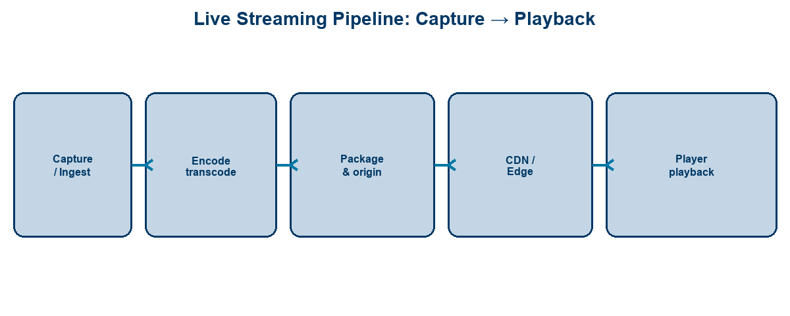
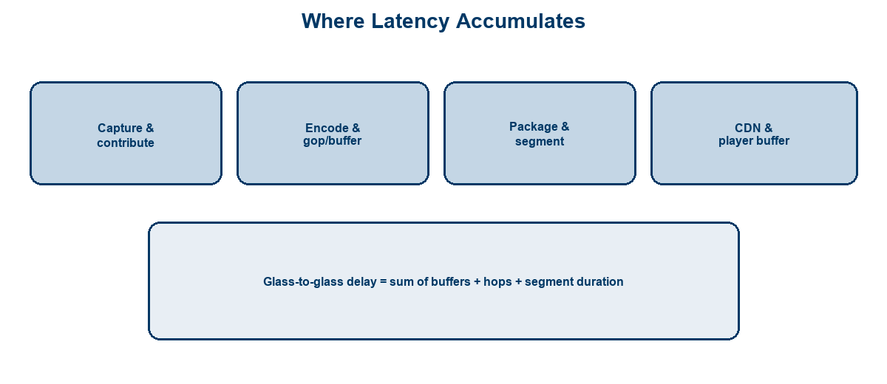
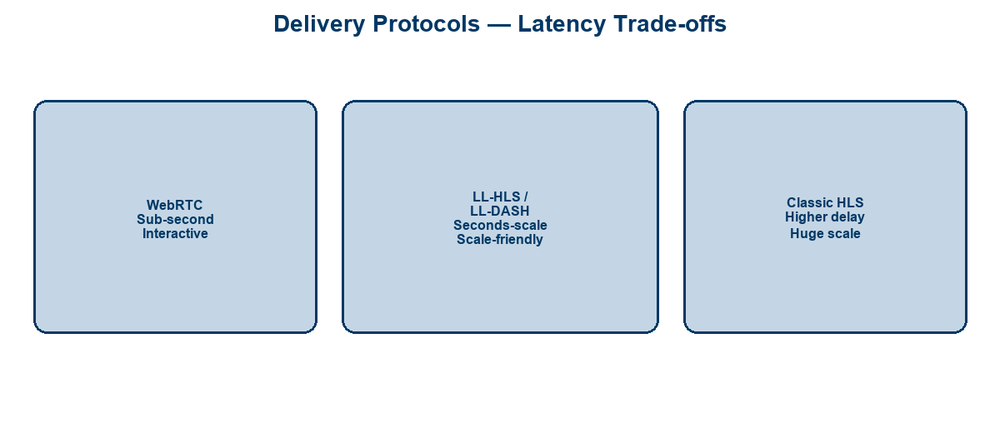
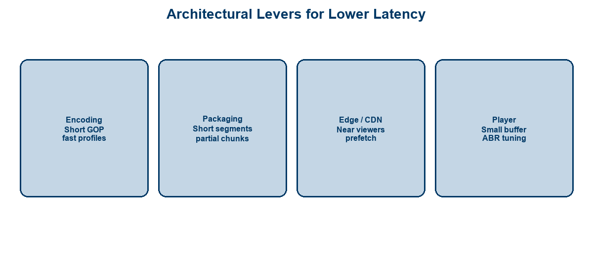
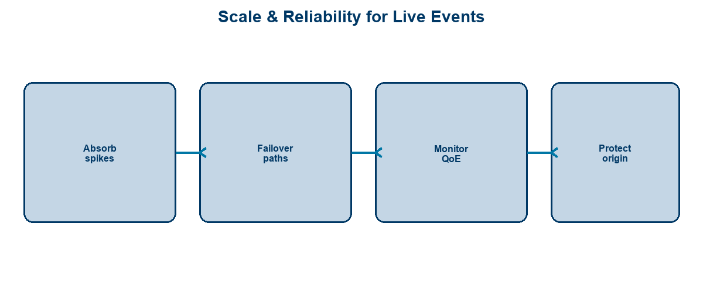

<!-- course-title: HCA: Live Streaming & Low-Latency Architecture -->
<!-- layout: title -->


# Live Streaming Platforms and
# Low-Latency Architecture

## From capture to playback—protocols, edge design, and reliability at scale

---

# Welcome!

- ROI leads the industry in designing and delivering customized technology and management training solutions
- Meet your instructor
  - Name
  - Background
  - Contact info
- Let’s get started!

---

# Course Objectives

- **Architect live audio/video delivery** with clear latency, scale, and reliability trade-offs
- Describe the end-to-end live streaming pipeline
- Explain the protocols and trade-offs behind low-latency delivery
- Identify architectural levers (edge, CDN, encoding) that reduce latency
- Recognize scaling and reliability considerations for live events

---

# Agenda

- Segment 1: The Live Streaming Pipeline (~20 min)
- Segment 2: Low-Latency Techniques (~25 min)
- Segment 3: Scale and Reliability (~15 min)
- Q&A (~15 min)

---

# Who Should Attend

- Solution architects designing media platforms
- Platform engineers operating streaming infrastructure
- Technical media / product teams shipping live experiences
- Cloud engineers supporting large live events

---

# Prerequisites

- General familiarity with networking concepts (DNS, HTTP, CDN)
- General familiarity with cloud architecture patterns
- Helpful: exposure to video formats or event broadcasting
- Helpful: awareness of HLS / DASH terminology

---
<!-- layout: navigation -->
# Course Roadmap

- **The Live Streaming Pipeline**
- Low-Latency Techniques
- Scale and Reliability

---

# Why Latency Matters

- Live sports, auctions, betting, and interactive classes punish delay
- Chat and second-screen experiences drift when video lags
- “Live” is a product SLA—define **glass-to-glass** targets up front
- Lower latency usually costs complexity, capacity, or resilience margin

> [!NOTE]
> Pick a latency budget first (e.g. &lt;2s interactive vs 5–15s broadcast-scale), then choose protocols.

---
<!-- layout: title-image -->
# Capture to Playback



---
<!-- layout: 3-column -->
# Pipeline Stages

### Ingest
- Camera / encoder
- RTMP, SRT, WHIP
- Contribution link

### Process
- Transcode ladders
- Package manifests
- Origin / packager

### Deliver
- CDN / edge
- ABR playback
- Player buffering

---
<!-- layout: title-image -->
# Where Latency Accumulates



---

# Typical Delay Contributors

| Stage | What adds delay |
| :--- | :--- |
| Capture / ingest | Device buffers, uplink jitter handling |
| Encode | GOP length, look-ahead, multi-rendition |
| Package | Segment duration, playlist depth |
| CDN | Cache miss, origin fetch, regional hop |
| Player | Startup buffer, rebuffer safety margin |

> [!TIP]
> Optimizing only the CDN won’t fix a 6-second segment + large player buffer.

---
<!-- layout: 2-column -->
# Encode, Package, Deliver

### Encode & Package
- Bitrate ladder for devices/networks
- Segment or chunk the stream
- Publish to an origin

### Deliver & Play
- CDN fans out to viewers
- Player picks rendition (ABR)
- Buffer trades smoothness vs delay

---
<!-- layout: navigation -->
# Course Roadmap

- The Live Streaming Pipeline
- **Low-Latency Techniques**
- Scale and Reliability

---
<!-- layout: title-image -->
# Protocols and Trade-offs



---
<!-- layout: 2-column -->
# Protocol Landscape

### WebRTC (and peers)
- Sub-second / interactive
- Great for calls, auctions, classrooms
- Harder fan-out at huge scale

### LL-HLS / LL-DASH
- Seconds-scale “broadcast low latency”
- CDN-friendly HTTP delivery
- Partial segments / chunked transfer

---

# Classic HLS vs Low-Latency HLS

- Classic HLS: longer segments → simpler scale, higher delay
- LL-HLS: shorter parts, blocking playlist reads, tuned players
- Same family of HTTP delivery—different latency posture
- Always validate with **your** player stack, not just origin config

> [!IMPORTANT]
> Protocol choice is a product decision: interactivity needs ≠ stadium-scale one-to-many.

---
<!-- layout: title-image -->
# Architectural Levers



---
<!-- layout: 3-column -->
# Encoding Trade-offs

### Faster
- Shorter GOP
- Lower latency presets
- Fewer fancy tools

### Cost / Quality
- More CPU/GPU
- Bitrate efficiency ↓
- Visual quality risk

### Design Rule
- Match encode to SLA
- Don’t over-optimize
  unused interactivity

---
<!-- layout: 2-column -->
# Edge, CDN, and Player

### Edge / CDN
- PoPs near audiences
- Shield origins
- Prefetch / mid-gress tuning
- Anycast & regional failover

### Player
- Minimal safe buffer
- Fast startup vs rebuffer risk
- LL-capable player required
- ABR logic that doesn’t chase

---

# Putting Low-Latency Techniques Together

```text
Tight encode  →  short segments/parts  →  edge near viewers
                                         →  LL-capable player
                                         →  monitor glass-to-glass
```

- Optimize the **largest buffer first**
- Measure end-to-end—not only CDN TTFB
- Accept that ultra-low latency narrows your operational margin

---
<!-- layout: navigation -->
# Course Roadmap

- The Live Streaming Pipeline
- Low-Latency Techniques
- **Scale and Reliability**

---
<!-- layout: title-image -->
# Running Live at Scale



---
<!-- layout: 2-column -->
# Handling Spikes

### Demand Spikes
- Pre-warm CDN / capacity
- Regional load shedding
- Cap concurrent starts
- Queue join / waiting room

### Publish Spikes
- Redundant ingest paths
- Auto-scale transcoders
- Protect origin with shield
- Degrade renditions gracefully

---

# Failover Patterns

- Dual ingest (primary / backup contribution)
- Hot-standby packagers and origins
- Multi-CDN or multi-region edge strategies
- Automated cutover with health checks—not only human panic

> [!WARNING]
> Failover that isn’t rehearsed will fail on the main event. Game-day runbooks need dry runs.

---
<!-- layout: 3-column -->
# Monitor Quality of Experience

### Integrity
- Ingest health
- Encode errors
- Manifest freshness

### Delivery
- CDN cache hit
- Error rates 4xx/5xx
- Startup failures

### Experience
- Join time
- Rebuffer ratio
- Glass-to-glass lag
- Audience complaints

---

# Reliability Checklist for Live Events

| Area | Ready when… |
| :--- | :--- |
| Capacity | Peak + headroom modeled and tested |
| Redundancy | Dual path ingest & origin failover proven |
| Observability | QoE dashboards + on-call alerts live |
| Degrade mode | Lower ladder / higher latency fallback defined |
| Comms | Status page / stakeholder updates prepared |

---

# What You Learned

- Described the end-to-end live streaming pipeline from capture to playback
- Explained protocol trade-offs for low-latency delivery (WebRTC, LL-HLS, peers)
- Identified encoding, edge/CDN, and player levers that reduce latency
- Recognized scaling, failover, and QoE monitoring needs for live events

---

# Q&A

Questions?
