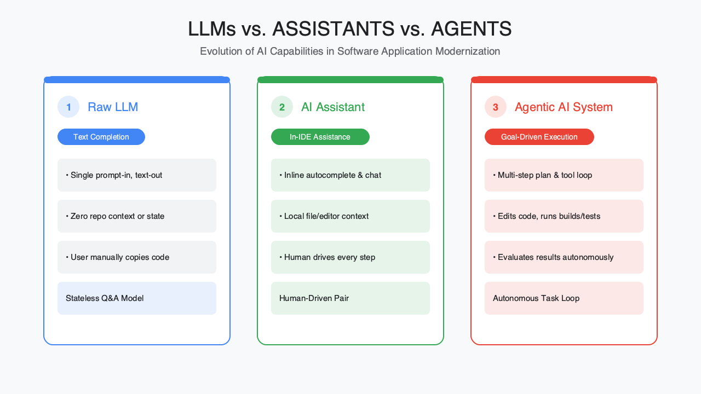
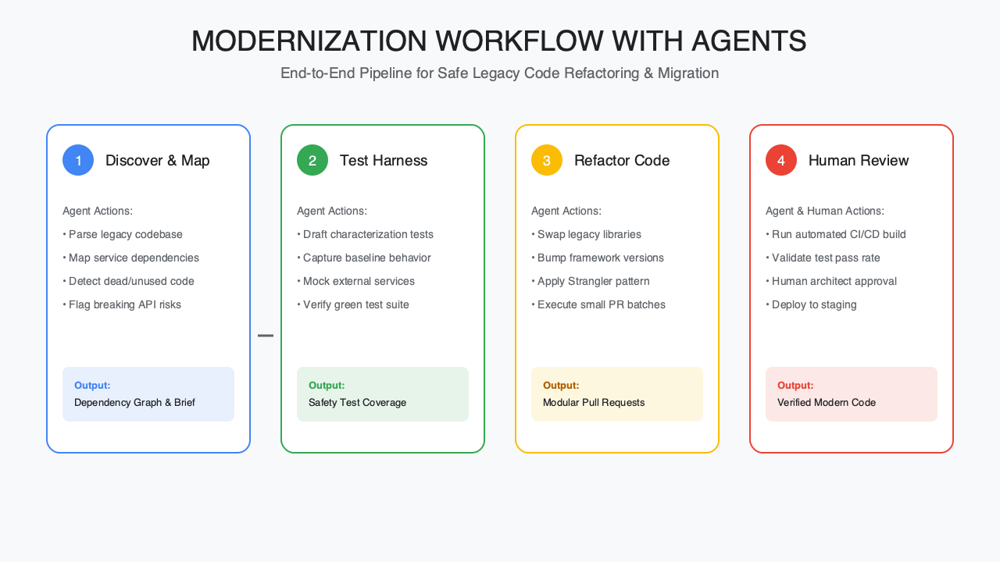
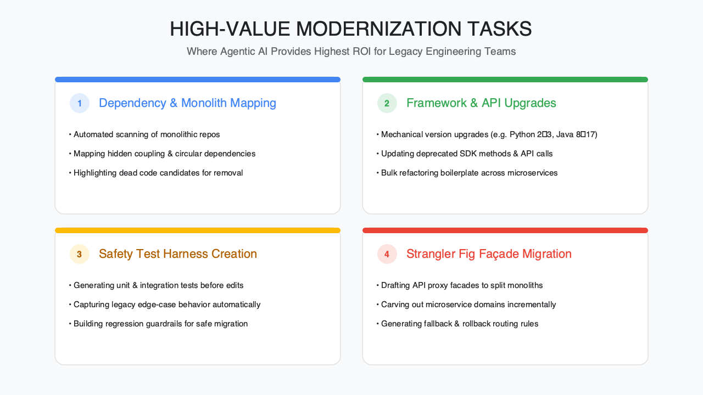
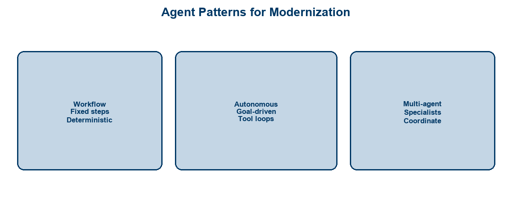
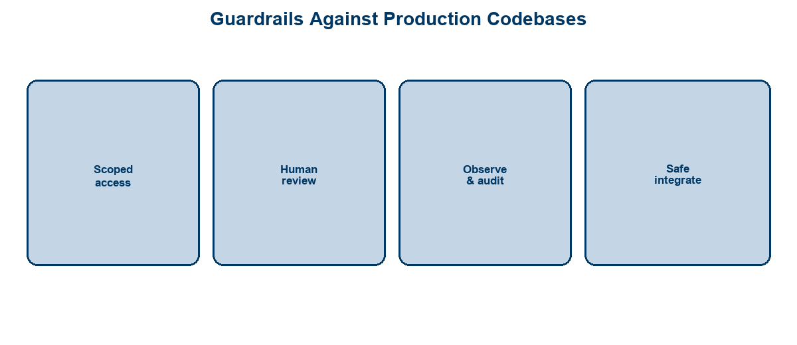

<!-- course-title: HCA: Modernizing Apps with Agentic AI -->
<!-- layout: title -->

# Modernizing Applications
# Using Agentic AI

## Agents that understand legacy code, plan refactors, and accelerate migration—safely

---

# Welcome!

- ROI leads the industry in designing and delivering customized technology and management training solutions
- Meet your instructor
  - Name
  - Background
  - Contact info
- Let’s get started!

---

# Course Objectives

- **Apply agentic AI patterns to application modernization** with clear value zones and production guardrails
- Describe agentic AI and how it differs from simple code assistants
- Identify modernization tasks where agents add the most value
- Recognize agent patterns (workflow, autonomous, multi-agent) for modernization
- Outline guardrails for using agents against production codebases

---

# Agenda

- Segment 1: Agentic AI, Briefly (~20 min)
- Segment 2: Agents in a Modernization Workflow (~25 min)
- Segment 3: Doing It Safely (~15 min)
- Questions and Answers (~15 min)

---

# Who Should Attend

- Application developers on modernization programs
- Architects designing target platforms and strangler patterns
- Modernization / migration leads
- Engineering managers funding AI-assisted transformation

---

# Prerequisites

- Familiarity with software development practices
- Helpful: generative AI / LLM basics
- Helpful: experience with legacy systems or large refactors
- Helpful: Git-based PR review workflows

---
<!-- layout: navigation -->
# Course Roadmap

- **Agentic AI, Briefly**
- Agents in a Modernization Workflow
- Doing It Safely

---

# The Modernization Bottleneck

- Legacy estates are large, poorly documented, and risky to touch
- Experts spend weeks on discovery before a single safe change
- Simple copilots help locally; programs need **multi-step, tool-using** help
- Agentic AI targets discovery → plan → change → verify loops

> [!NOTE]
> Agents accelerate modernization; they do not remove architecture ownership or release accountability.

---
<!-- layout: title-image -->
# LLMs vs. Assistants vs. Agents

---
<!-- layout: 2-column -->
# What Makes It “Agentic”

### Beyond Chat
- Holds a goal across steps
- Calls tools (repo, tests, tickets)
- Observes results and continues
- May coordinate specialists

### Still Not Magic
- Can hallucinate plans
- Needs scoped permissions
- Requires human checkpoints
- Quality varies by codebase signal

---
<!-- layout: 3-column -->
# Agent Types You’ll Hear About

### Workflow
- Predetermined stages
- Predictable handoffs
- Great for repeatable migrations

### Autonomous
- Goal + tool loop
- Flexible path
- Needs tight guardrails

### Multi-Agent
- Analyst / coder / tester roles
- Parallel discovery
- Coordinator merges results

---

# Why Agents Suit Modernization Work

- Modernization is a **pipeline of tasks**, not one prompt
- Repos, build systems, linters, and tests are natural **tools**
- Maps, inventories, and draft PRs are high-leverage artifacts
- Humans stay on risk decisions; agents grind the repetitive analysis

---
<!-- layout: navigation -->
# Course Roadmap

- Agentic AI, Briefly
- **Agents in a Modernization Workflow**
- Doing It Safely

---
<!-- layout: title-image -->
# Modernization Workflow with Agents

---
<!-- layout: title-image -->
# High-Value Modernization Tasks

---
<!-- layout: 2-column -->
# Code Understanding and Mapping

### Agents Can Draft
- Module / service maps
- Dependency graphs
- Dead code candidates
- “How does X work?” briefs

### Humans Still Decide
- Target architecture
- Boundary cuts
- Risk ranking
- What not to touch yet

---

# Refactoring, Migration, and Tests

- Draft mechanical refactors (API swaps, framework bumps, package moves)
- Generate characterization tests before risky changes
- Propose strangler façade steps with rollback notes
- Produce migration checklists tied to build/test evidence

> [!TIP]
> Best ROI: **discover + test harness + small PR batches**—not “rewrite the monolith overnight.”

---
<!-- layout: title-image -->
# Workflow, Autonomous, Multi-Agent

---
<!-- layout: 3-column -->
# Choosing a Pattern

### Use Workflow When
- Steps are known
- Compliance needs audit
- Same migration × N apps

### Use Autonomous When
- Exploration-heavy
- Tool feedback is rich
- Scope is sandboxed

### Use Multi-Agent When
- Parallel specialties help
- Large repo coverage
- Clear coordinator role

---

# Demo: Agents on a Legacy Slice

**Time:** ~10–12 minutes (instructor-led)

**Demo guide:** [Placeholder — modernization agent demo](https://example.com/hca/demos/agentic-modernization)

- Ask an agent to summarize a legacy module and dependencies
- Generate a refactor plan with risks and test gaps
- Draft characterization tests and a small code change
- Show a multi-step / multi-agent handoff (analyst → implementer → reviewer)

---
<!-- layout: navigation -->
# Course Roadmap

- Agentic AI, Briefly
- Agents in a Modernization Workflow
- **Doing It Safely**

---
<!-- layout: title-image -->
# Production Guardrails

---
<!-- layout: 2-column -->
# Human-in-the-Loop Review

### Require Approval For
- Writes outside a branch
- Dependency upgrades
- Auth / data-path changes
- Prod config & secrets

### Automate Freely
- Read-only analysis
- Doc drafts
- Test suggestions
- PR descriptions

---

# Observability for Agent Runs

- Log prompts, tool calls, file touches, and test results per run
- Tie agent output to a ticket / change record
- Capture failures (wrong API, flaky plan) to improve playbooks
- Treat agent sessions like CI jobs—reproducible when possible

> [!WARNING]
> An agent with broad write access and no audit trail is an incident waiting to happen.

---
<!-- layout: 2-column -->
# Interoperability and Integration

### Integrate With
- Source control & PR checks
- Issue trackers
- CI test gates
- Architecture decision records

### Avoid
- One-off chat with no artifacts
- Bypassing branch protection
- Unreviewed direct-to-main
- Shadow copies of prod data

---

# Safe Operating Model

| Control | Practice |
| :--- | :--- |
| **Access** | Least privilege; non-prod first |
| **Change size** | Small PRs; feature flags |
| **Verification** | Tests + human review required |
| **Secrets** | Never in prompts; vaulted configs |
| **Stop conditions** | Budget, step limits, escalate |

---

# What You Learned

- Described agentic AI and how it differs from simple code assistants
- Identified modernization tasks where agents add the most value
- Recognized workflow, autonomous, and multi-agent patterns
- Outlined guardrails for using agents against production codebases

---

# Quiz 1 of 3

**What primarily distinguishes an agentic AI system from a simple code assistant?**

- A. It always uses a larger language model
- B. It holds a goal across steps, calls tools, and iterates on results
- C. It never needs human review or approval
- D. It only works on greenfield applications

---

# Quiz 1 — Answer

**What primarily distinguishes an agentic AI system from a simple code assistant?**

**Correct: B.** It holds a goal across steps, calls tools, and iterates on results

- Agents pursue a goal: plan → act → observe → continue
- Tools (repo, tests, tickets) and iteration are the shift—not model size alone
- Agents still need scoped permissions and human checkpoints
- Agentic patterns apply to legacy modernization as much as new code

---

# Quiz 2 of 3

**Your modernization program wants agent help with the highest ROI and lowest risk. Which approach fits best?**

- A. Grant the agent production write access so it can finish the rewrite overnight
- B. Skip characterization tests to move faster on the monolith rewrite
- C. Rely on one-off chat with no PR artifacts or ticket linkage
- D. Discover + draft a test harness + ship small PR batches with review

---

# Quiz 2 — Answer

**Your modernization program wants agent help with the highest ROI and lowest risk. Which approach fits best?**

**Correct: D.** Discover + draft a test harness + ship small PR batches with review

- Best ROI: discovery, tests, and small reviewed PRs—not overnight rewrites
- Broad prod write access without audit is an incident waiting to happen
- Characterization tests reduce risk before mechanical refactors
- Artifacts in source control and tickets keep changes reviewable

---
<!-- layout: 2-column -->
# Quiz 3 of 3 — Discussion

### Prompt
Pick one legacy module your team might modernize with an agent (for example: dependency map, strangler step, or framework bump).

### Discuss
- Which pattern fits—workflow, autonomous, or multi-agent—and why?
- What must a human approve before any write lands outside a branch?
- How would you log and verify the agent run like a CI job?

---
<!-- layout: 2-column -->
# Quiz 3 — Discussion Points

**Pick one legacy module your team might modernize with an agent (for example: dependency map, strangler step, or framework bump).**

### Strong Answers Mention
- Pattern matched to known steps vs. exploration vs. parallel specialties
- Approval for auth/data-path changes, deps, secrets, and prod config
- Least privilege; non-prod first; small PRs with tests
- Logging prompts, tool calls, and test results per run

### Watch For
- “Just let the agent rewrite the monolith”
- Unbounded write access with no audit trail
- Bypassing branch protection or PR review

---
<!-- layout: title-image -->
# Questions and Answers

