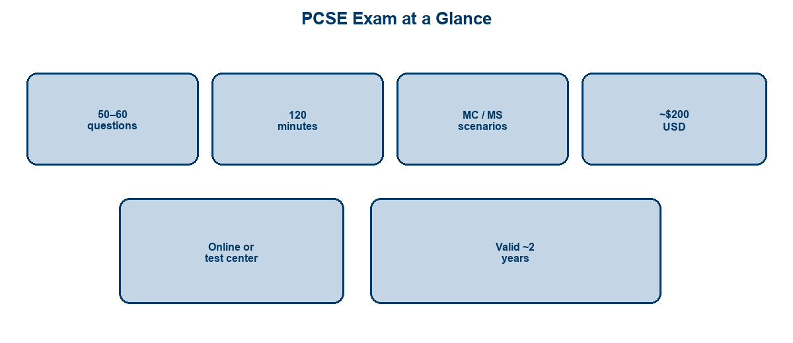
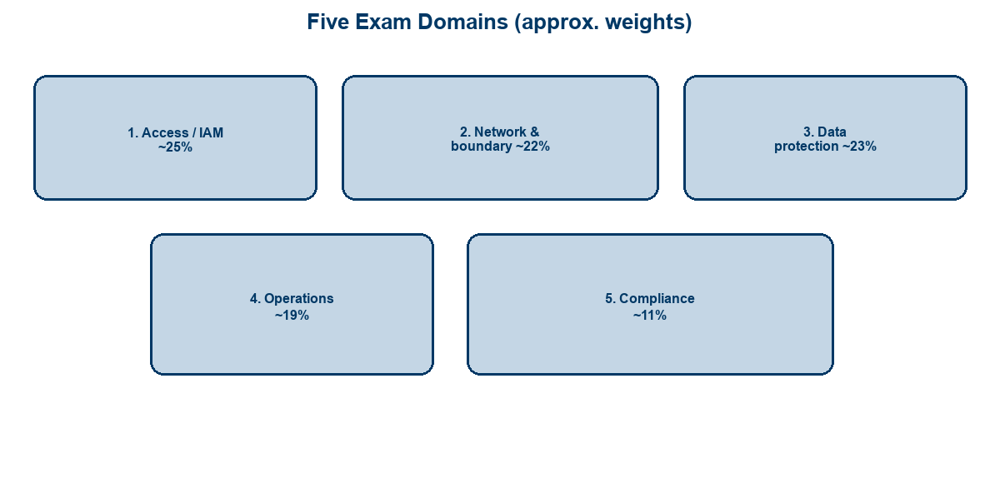
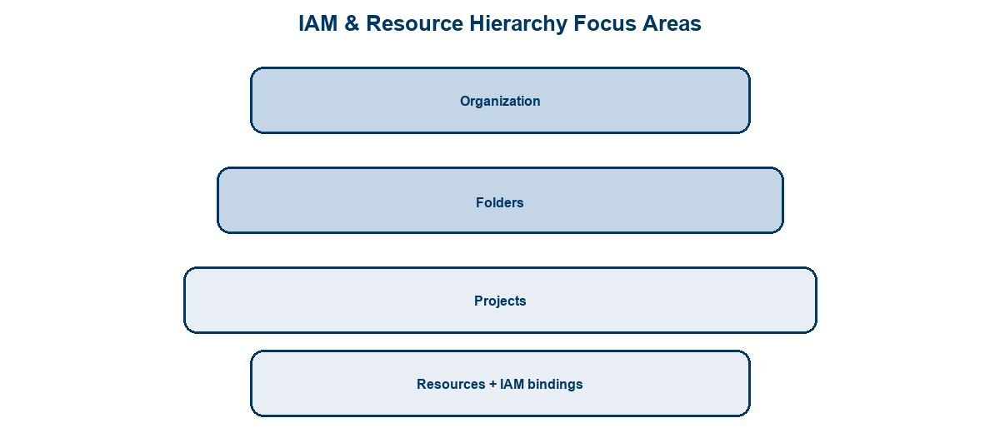
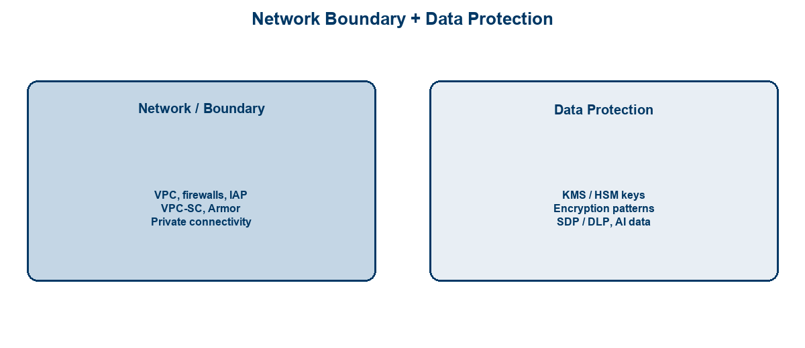
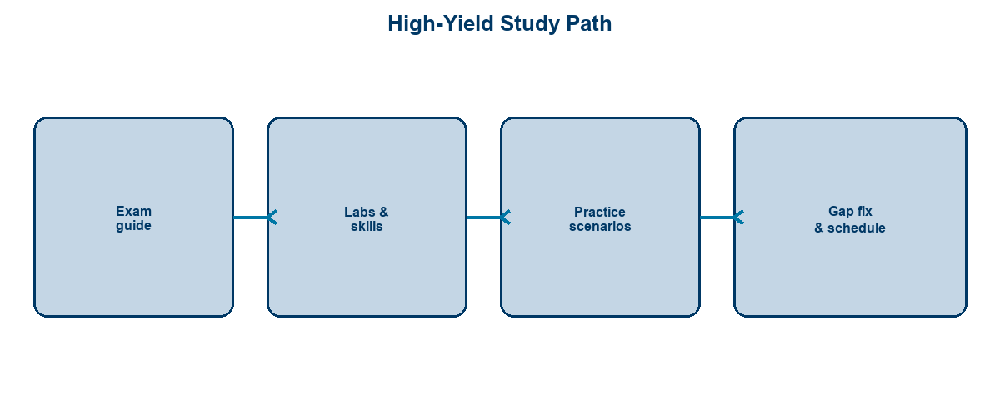

<!-- course-title: HCA: Professional Cloud Security Engineer Cert -->
<!-- layout: title -->


# Professional Cloud Security Engineer
# Certification

## Exam scope, domain tour, and a practical preparation path

---

# Welcome!

- ROI leads the industry in designing and delivering customized technology and management training solutions
- Meet your instructor
  - Name
  - Background
  - Contact info
- Let’s get started!

---

# Course Objectives

- **Orient to the Google Professional Cloud Security Engineer (PCSE) exam**—scope, domains, and how to prepare
- Describe the certification’s scope, format, and exam expectations
- Summarize the core exam domains and what each tests
- Identify the highest-yield preparation resources and study path
- Recognize where hands-on experience is required to pass

---

# Agenda

- Segment 1: Exam Overview (~20 min)
- Segment 2: Core Domains Tour (~25 min)
- Segment 3: Operations, Compliance, and Prep (~15 min)
- Q&A (~15 min)

---

# Who Should Attend

- Cloud security engineers preparing for PCSE
- Security architects validating Google Cloud depth
- Platform engineers expanding into security ownership
- Candidates with Google Cloud project experience seeking a study map

---

# Prerequisites

- Prior Google Cloud experience (projects, IAM, networking basics)
- Foundational security knowledge (identity, encryption, logging)
- Helpful: Associate Cloud Engineer or equivalent hands-on background
- Helpful: exposure to Security Command Center and VPC design

---
<!-- layout: navigation -->
# Course Roadmap

- **Exam Overview**
- Core Domains Tour
- Operations, Compliance, and Prep

---

# What the Certification Validates

- Ability to **design, implement, and manage** secure Google Cloud infrastructure
- Scenario judgment across identity, network, data, operations, and compliance
- Product-aware decisions (which control solves which risk)—not trivia memorization
- Readiness to operate security alongside development and platform teams

> [!NOTE]
> Always verify details against the current official Google Cloud exam guide—blueprints refresh over time.

---
<!-- layout: title-image -->
# Exam at a Glance



---
<!-- layout: 2-column -->
# Format and Registration

### What to Expect
- ~50–60 multiple-choice / multiple-select
- ~120 minutes
- Scenario-style questions
- Online proctoring or test center

### Logistics
- Register via Google Cloud certification
- English (and other languages as listed)
- Typical fee ~USD $200 + tax
- Recertify on Google’s published cycle

---

# Recommended Prior Experience

- Google commonly recommends **~3+ years** industry experience
- Including **~1+ year** designing/managing solutions on Google Cloud
- Strongest predictors of success: real IAM, VPC, KMS, and logging work
- Reading alone rarely replaces console/`gcloud` muscle memory

> [!IMPORTANT]
> If you have not configured VPC Service Controls, CMEK, or SCC findings in a project, schedule labs before the exam date.

---
<!-- layout: title-image -->
# Domain Map (Approximate Weights)



---
<!-- layout: navigation -->
# Course Roadmap

- Exam Overview
- **Core Domains Tour**
- Operations, Compliance, and Prep

---
<!-- layout: title-image -->
# Domain 1: Access / IAM (~25%)



---

# What Access Questions Test

- Resource hierarchy: org → folders → projects → resources
- Least privilege with predefined/custom roles and conditions
- Service accounts, impersonation, and keyless patterns
- Federation / workforce identity concepts at a design level
- Organization Policy constraints that enforce guardrails

| Theme | Example decision |
| :--- | :--- |
| Hierarchy | Where to bind a role for inheritance |
| SA security | Avoid user-managed keys when possible |
| Org policy | Restrict public IPs / SA key creation |

---
<!-- layout: title-image -->
# Domains 2–3: Network and Data



---
<!-- layout: 2-column -->
# Network & Boundary (~22%)

### Expect Coverage Of
- VPC firewalls / NGFW ideas
- Segmentation (Shared VPC, peering)
- IAP for admin access patterns
- Cloud Armor / edge protections
- Private Google Access, PSC, VPN/Interconnect
- VPC Service Controls perimeters

### Mindset
- Identity + network together
- Default-deny where sensible
- Private paths over public exposure

---
<!-- layout: 2-column -->
# Data Protection (~23%)

### Expect Coverage Of
- Encryption at rest / in transit
- Cloud KMS, CMEK, HSM patterns
- Envelope encryption concepts
- Sensitive Data Protection / DLP
- Dataset access patterns (e.g. BigQuery)
- Securing AI / ML data paths (newer emphasis)

### Mindset
- Who holds keys?
- Where does data leave?
- How is sensitive data discovered?

---

# “Big Rocks” Study Priorities

- Spend the most hours on **Access + Data + Network** (majority of the exam)
- Build one reference architecture that includes hierarchy, private networking, CMEK, and logging
- Practice “choose the control” scenarios—not product feature laundry lists
- Revisit VPC-SC and KMS until trade-offs feel automatic

> [!TIP]
> If time is short, deepen IAM + VPC-SC + KMS before niche product edges.

---
<!-- layout: navigation -->
# Course Roadmap

- Exam Overview
- Core Domains Tour
- **Operations, Compliance, and Prep**

---

# Domain 4: Managing Operations (~19%)

- Detect and respond using Google Cloud security operations tooling
- **Security Command Center** findings, priorities, and remediation workflows
- Logging, monitoring, and detection design (what to log; where to sink)
- Incident-oriented scenarios: investigate → contain → improve controls

| Ops theme | Why it’s tested |
| :--- | :--- |
| SCC | Centralize posture & findings |
| Logging | Evidence + detection inputs |
| Automation | Scale response consistently |

---
<!-- layout: 2-column -->
# Domain 5: Compliance (~11%)

### What It Covers
- Mapping controls to requirements
- Shared responsibility clarity
- Assured / compliance-oriented offerings at a conceptual level
- Evidence from configs, logs, and policies

### How to Study
- Know *which GCP controls* support common goals
- Don’t memorize every regulation clause
- Tie answers back to hierarchy, network, data, ops

---
<!-- layout: title-image -->
# High-Yield Study Path



---

# Highest-Yield Preparation Resources

1. **Official exam guide** — source of truth for domains and task statements  
2. **Google Cloud skill boosts / labs** — IAM, networking, KMS, SCC, VPC-SC  
3. **Architecture center security patterns** — private, perimeter, encryption designs  
4. **Practice exams / sample questions** — timing and scenario stamina  
5. **Your production scars** — postmortems and real configs beat flashcards  

> [!WARNING]
> Outdated third-party dumps miss newer topics (e.g. AI workload security). Prefer official + recent labs.

---

# Where Hands-On Experience Is Required

- Creating custom roles and conditional IAM bindings
- Designing VPC segmentation and private connectivity
- Standing up CMEK and understanding key rotation/impact
- Configuring SCC and interpreting findings
- Sketching a VPC Service Controls perimeter for a sensitive project set

```text
Study loop: read task → build in a sandbox → explain the trade-off out loud
```

---

# Sample 4–6 Week Prep Outline

| Week | Focus |
| :--- | :--- |
| 1 | Exam guide + IAM / hierarchy labs |
| 2 | Network boundary + VPC-SC scenarios |
| 3 | KMS / encryption + data protection |
| 4 | SCC, logging, ops playbooks |
| 5 | Compliance mapping + practice exam |
| 6 | Gap remediation + light review |

---

# What You Learned

- Described PCSE scope, format, and exam expectations
- Summarized the five core domains and what each tests
- Identified high-yield resources and a practical study path
- Recognized where hands-on Google Cloud experience is required to pass

---

# Q&A

Questions?
