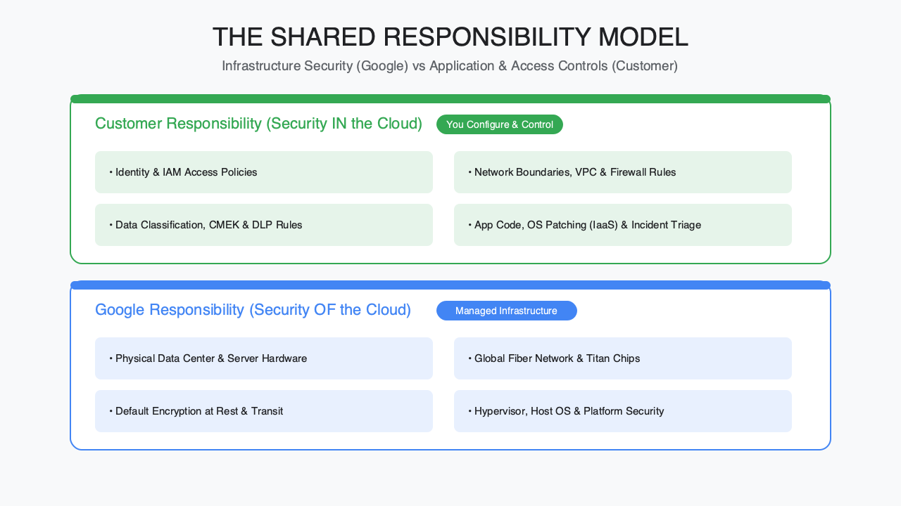
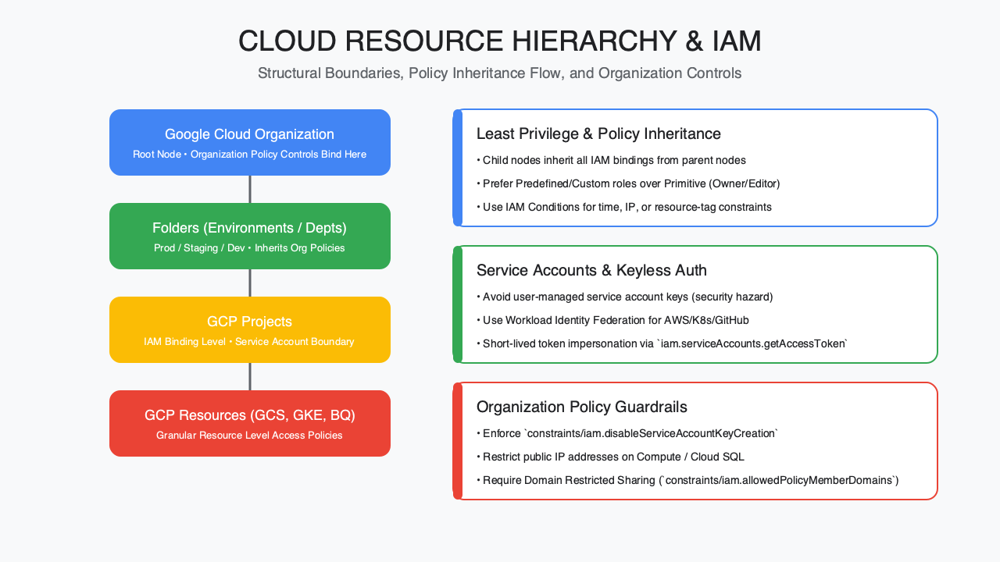
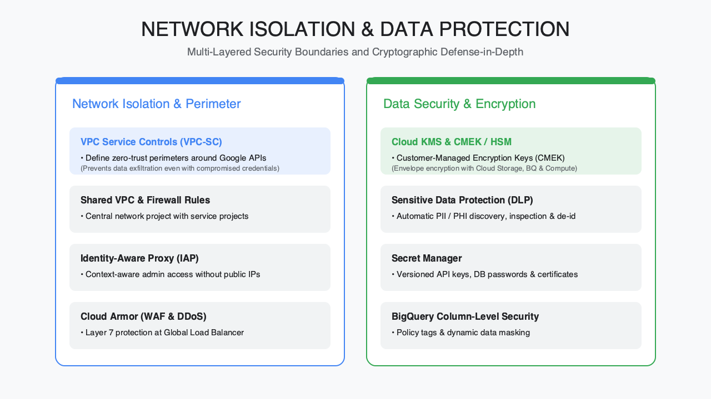
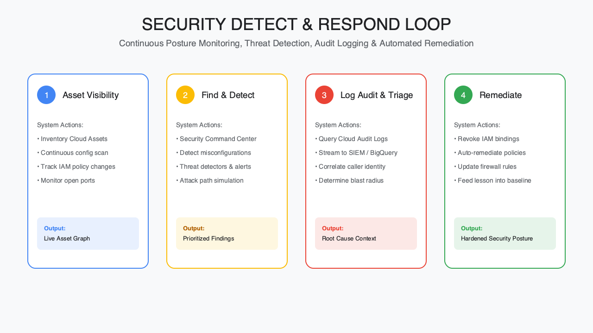

<!-- course-title: HCA: Security in Google Cloud -->
<!-- layout: title -->

# Security in
# Google Cloud

## Shared responsibility, identity, network isolation, and threat detection

---

# Welcome!

- ROI leads the industry in designing and delivering customized technology and management training solutions
- Meet your instructor
  - Name
  - Background
  - Contact info
- Let's get started!

---

# Course Objectives

- **Secure workloads on Google Cloud** using the shared responsibility model, IAM, network controls, and monitoring
- Describe Google Cloud's shared security responsibility model
- Explain identity and access management with Cloud IAM
- Recognize network security controls (VPCs, firewalls, VPC Service Controls)
- Identify monitoring, logging, and threat-detection options

---

# Agenda

- Segment 1: Foundations and Identity (~25 min)
- Segment 2: Network and Data Security, with demo (~35 min)
- Segment 3: Detect and Respond (~20 min)
- Q&A (~10 min)

---

# Who Should Attend

- Cloud security analysts
- Cloud security architects
- Cloud security engineers

---

# Prerequisites

- Foundational Google Cloud knowledge (projects, resources, console/`gcloud` basics)
- Foundational information-security knowledge (identity, encryption, networking concepts)

---
<!-- layout: navigation -->
# Course Roadmap

- **Foundations and Identity**
- Network and Data Security
- Detect and Respond

---

# Getting the Basics Right

- Security in Google Cloud is a partnership, not a handoff
- The fundamentals still apply: least privilege, defense in depth, and good logging
- Google secures the infrastructure; you configure and operate what runs on it
- Getting identity, networking, and data protection right early prevents most incidents

---
<!-- layout: title-image -->
# The Shared Responsibility Model

---
<!-- layout: 2-column -->
# Who Secures What

### Google Secures
- Physical data centers & hardware
- Global network infrastructure
- Hypervisor & host OS

### You Secure
- Identity & access management
- Network configuration (VPCs, firewalls)
- Data classification and encryption choices

---

# Responsibility Shifts by Service Type

| Service type | Example | You manage |
| :--- | :--- | :--- |
| IaaS | Compute Engine | OS, patches, network config, data |
| PaaS / Serverless | Cloud Run, App Engine | App code, IAM, data |
| Managed service | BigQuery, Cloud SQL | Access config, data, queries |

> [!NOTE]
> Even fully managed services still require you to manage IAM and data classification.

---

# Cloud Identity: Your Organization's Foundation

- Cloud Identity provides the organization node that anchors your resource hierarchy
- Manages users, groups, and devices independent of any single project
- Sync from an existing directory (e.g. Google Workspace or Active Directory) or manage natively
- Groups are the practical unit for granting access at scale

---
<!-- layout: title-image -->
# Cloud Resource Hierarchy

---

# IAM Essentials: Who Can Do What

- An IAM policy binds **members** to **roles** on a **resource**
- Members: Google/Cloud Identity accounts, groups, service accounts, or domains
- Roles: bundles of permissions—basic, predefined, or custom
- Policies attach to resources and inherit down the hierarchy

---
<!-- layout: 2-column -->
# Choosing the Right Role

### Role Types
- Basic: Owner / Editor / Viewer (broad—avoid in production)
- Predefined: scoped to a service (e.g. `roles/compute.instanceAdmin`)
- Custom: precise permission sets you define

### Best Practices
- Grant least privilege at the smallest useful scope
- Prefer groups over individual user bindings
- Use IAM conditions for time- or attribute-based access

---

# Service Accounts: Identity for Workloads

- Service accounts let applications and VMs authenticate as an identity, not a person
- Avoid long-lived downloaded keys where possible
- Prefer **impersonation** and **workload identity federation**
- Grant a service account only the roles its workload actually needs

> [!WARNING]
> A service account with Owner or Editor is a common source of over-privileged access. Scope it down.

---
<!-- layout: navigation -->
# Course Roadmap

- Foundations and Identity
- **Network and Data Security**
- Detect and Respond

---

# Isolation and Protection

- Network security narrows the blast radius before an incident, not after
- Two big questions: what can talk to what, and can data leave the perimeter?
- Google Cloud gives you software-defined boundaries at multiple layers
- Pair network isolation with strong data protection—neither replaces the other

---
<!-- layout: title-image -->
# Network and Data Protection Layers

---

# VPCs: Your Private Network

- A VPC is a global, software-defined network scoped to your project (or shared across projects)
- Subnets are regional; resources get internal IPs from the subnet range
- Use **Shared VPC** to centralize network administration across many projects
- Private Google Access lets internal-only VMs reach Google APIs without a public IP

---

# Firewalls: Default-Deny by Design

- VPC firewall rules control traffic by IP range, tag, or service account—not just IP
- New VPCs start with **deny-all** ingress; you allow only what's needed
- Prefer narrow, tag- or service-account-scoped rules over broad `0.0.0.0/0`
- Hierarchical firewall policies enforce guardrails from the org or folder down

---
<!-- layout: 2-column -->
# Layering Network Controls

### Perimeter & Access
- Cloud Armor: edge / WAF protection
- Identity-Aware Proxy: admin access without a VPN
- Cloud NAT: outbound-only internet access

### Segmentation
- VPC Service Controls perimeters
- Private Service Connect
- Peering vs. Shared VPC design

---

# VPC Service Controls: Data Exfiltration Boundary

- Creates a **service perimeter** around sensitive resources (e.g. BigQuery, Cloud Storage)
- Blocks data from leaving the perimeter, even with valid credentials
- Stops copy-to-a-different-project or public-bucket style exfiltration
- Complements IAM—IAM says *who*, VPC Service Controls says *where data can go*

> [!IMPORTANT]
> IAM alone cannot stop an authorized user from moving data to an unapproved destination. VPC Service Controls closes that gap.

---

# Demo: Building a Secure Network Perimeter

**Time:** ~10 minutes

- Create a VPC with default-deny firewall rules
- Add a scoped allow rule using a service account tag
- Walk through a VPC Service Controls perimeter around a Cloud Storage bucket

---

# Encryption: On by Default, Configurable by You

- All data at rest is encrypted by default; encryption in transit is standard for Google APIs
- **Google-managed keys**: zero setup, Google controls rotation
- **CMEK** (Customer-Managed Encryption Keys): you control the key in Cloud KMS
- **CSEK** (Customer-Supplied Encryption Keys): you hold and supply the key material yourself

---
<!-- layout: 2-column -->
# Cloud KMS at a Glance

### What It Manages
- Symmetric & asymmetric keys
- Key rings and rotation schedules
- HSM-backed keys for higher assurance

### Design Questions
- Who can *use* vs. who can *manage* a key?
- What's your rotation policy?
- Which datasets need CMEK vs. default encryption?

---

# Sensitive Data Protection (DLP): Find and De-Identify

- Scans data for PII, PHI, and secrets across Cloud Storage, BigQuery, and streams
- **Inspect**: classify what sensitive data exists and where
- **De-identify**: mask, tokenize, or redact before wider use
- Feeds findings into governance and Security Command Center

> [!TIP]
> Run inspection jobs before opening a dataset to broader IAM access, not after.

---
<!-- layout: navigation -->
# Course Roadmap

- Foundations and Identity
- Network and Data Security
- **Detect and Respond**

---

# Visibility: You Can't Protect What You Can't See

- Detection depends on centralized visibility across projects and services
- Google Cloud's operations suite provides logs, metrics, and traces by default
- The goal: catch misconfigurations and active threats before they become incidents
- Pair automated detection with a clear escalation path

---
<!-- layout: title-image -->
# Detect and Respond Loop

---

# Security Command Center: Centralized Posture

- Aggregates findings across projects: misconfigurations, vulnerabilities, active threats
- **Standard tier**: asset inventory plus a baseline set of detectors
- **Premium / Enterprise tier**: deeper threat detection, compliance monitoring, attack path simulation
- Findings can route to ticketing or SIEM tools for response workflows

---
<!-- layout: 2-column -->
# What Security Command Center Surfaces

### Misconfigurations
- Public buckets or overly broad IAM
- Open firewall rules
- Missing encryption settings

### Threats
- Anomalous IAM activity
- Malware / crypto-mining signals
- Data exfiltration attempts

---

# Cloud Logging and Monitoring

- Cloud Logging collects logs from Google Cloud services, apps, and infrastructure
- Cloud Monitoring turns metrics into dashboards and alerting policies
- Log-based metrics let you alert on patterns Monitoring wouldn't catch alone
- Route logs to BigQuery or Cloud Storage for long-term retention and analysis

---

# Audit Logs: Who Did What, When

- **Admin Activity logs**: configuration changes—always on, cannot be disabled
- **Data Access logs**: reads/writes to data—off by default for most services
- **System Event** and **Policy Denied** logs round out the picture
- Audit logs are often the first place investigators look during an incident

> [!IMPORTANT]
> Data Access logs are not enabled by default. Turn them on for sensitive datasets before you need them, not during an investigation.

---

<!-- layout: 2-column -->
# Putting It Together

### Detect & Triage
- SCC findings and log-based alerts surface anomalies
- Audit logs establish who, what, and when

### Contain & Improve
- IAM revocation, firewall updates, VPC Service Controls adjustments
- Feed findings back into policy and monitoring coverage

---

# What You Learned

- Described Google Cloud's shared security responsibility model
- Explained identity and access management with Cloud IAM
- Recognized network security controls (VPCs, firewalls, VPC Service Controls)
- Identified monitoring, logging, and threat-detection options

---

# Quiz 1 of 3

**In Google Cloud’s shared responsibility model, which statement is most accurate for a managed service like BigQuery?**

- **A.** You still manage access configuration, data classification, and who can query the data
- **B.** Google manages IAM bindings and data classification for you automatically
- **C.** You only manage the hypervisor and physical hardware
- **D.** Shared responsibility does not apply once a service is fully managed

---

# Quiz 1 — Answer

**Correct: A**

- Google secures infrastructure; you configure IAM, network, and data choices
- Even managed services require you to manage access and data classification
- Hypervisor/hardware are Google’s side, not yours on BigQuery
- Partnership, not a handoff—responsibility shifts by service type, it doesn’t disappear

---

# Quiz 2 of 3

**Why enable Data Access audit logs for a sensitive dataset before an incident, not during one?**

- **A.** Admin Activity logs are off by default and cannot be enabled later
- **B.** Data Access logs replace the need for Security Command Center
- **C.** Data Access logs (reads/writes) are off by default for most services and investigators need that evidence
- **D.** Enabling them automatically blocks all exfiltration attempts

---

# Quiz 2 — Answer

**Correct: C**

- Admin Activity logs are always on; Data Access logs are typically off by default
- Investigators rely on who-read-what evidence that must already be collected
- SCC and audit logs complement each other—they don’t replace one another
- Logging provides visibility; VPC Service Controls and IAM enforce boundaries

---
<!-- layout: 2-column -->
# Quiz 3 of 3 — Discussion

### Prompt
You are hardening a project that holds regulated data in Cloud Storage and BigQuery.

### Discuss
- How would you combine IAM, VPC firewalls, and VPC Service Controls?
- Which encryption key model (Google-managed vs. CMEK) would you choose and why?
- What would Security Command Center and audit logs need to show for a healthy detect-and-respond loop?

---
<!-- layout: 2-column -->
# Quiz 3 — Discussion Points

### Strong Answers Mention
- IAM = who; VPC-SC = where data can go; firewalls = what can talk to what
- CMEK when you need key ownership/rotation control; default encryption when not required
- SCC for misconfigs/threats; Admin + Data Access logs for investigation
- Feed findings back into policy and monitoring coverage

### Watch For
- “IAM alone is enough for exfiltration”
- Leaving Data Access logs disabled on sensitive data
- Over-privileged service accounts (Owner/Editor)

---
<!-- layout: title-image -->
# Q&A

