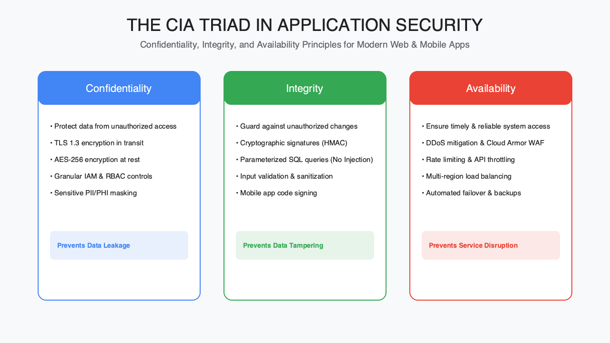
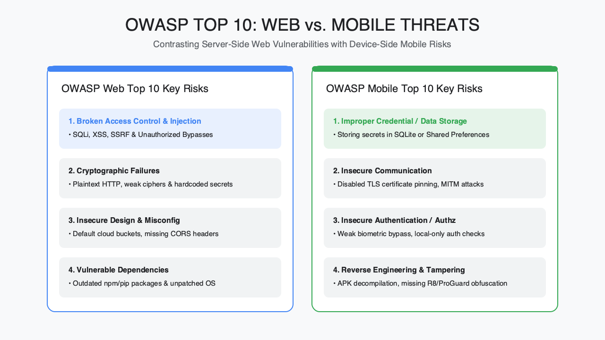
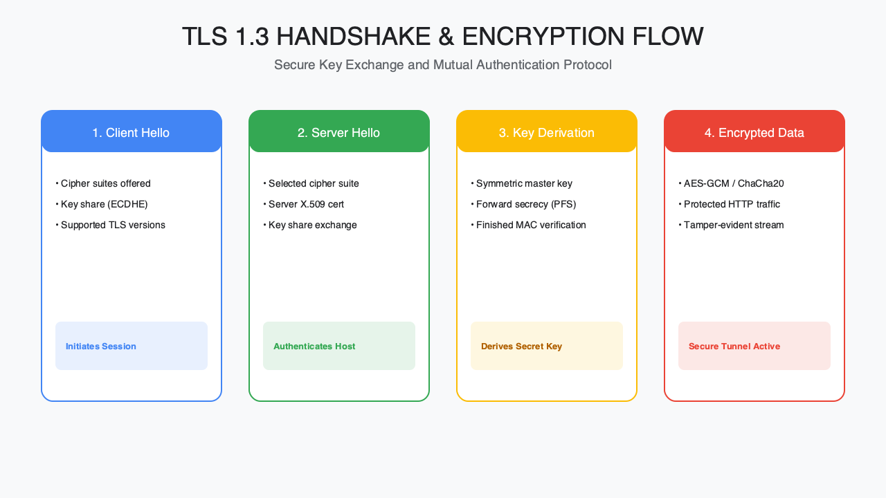

<!-- course-title: HCA: Web and Mobile App Security -->
<!-- layout: title -->

# Web and Mobile
# Application Security

## Secure design, the OWASP Top 10, and the encryption and testing that keep apps safe

---

# Welcome!

- ROI leads the industry in designing and delivering customized technology and management training solutions
- Meet your instructor
  - Name
  - Background
  - Contact info
- Let's get started!

---

# Course Objectives

- **Secure web and mobile applications** against common vulnerabilities using sound design, encryption, and testing
- Describe the fundamentals of securing web and mobile applications
- Identify the most common web and mobile vulnerabilities (OWASP Top 10)
- Explain how encryption protects confidentiality and integrity
- Recognize automated tools for testing application vulnerabilities

---

# Agenda

- Segment 1: Security Fundamentals (~20 min)
- Segment 2: The OWASP Top 10, web and mobile (~35 min)
- Segment 3: Defenses and Testing, with demo (~25 min)
- Q&A (~10 min)

---

# Who Should Attend

- Developers building web or mobile applications
- Security staff and technical leads
- Some development familiarity is helpful—not required

---

# Prerequisites

- No prior security experience required
- Basic familiarity with web or mobile development is helpful, but not required

---
<!-- layout: navigation -->
# Course Roadmap

- **Security Fundamentals**
- The OWASP Top 10
- Defenses and Testing

---

# Groundwork: Why Application Security Matters

- Most breaches trace back to application-layer weaknesses, not just network perimeter failures
- Security is cheapest to fix at design time and most expensive after release
- Every application has two attack surfaces: the code, and the people who use it
- This segment sets the shared vocabulary the rest of the course builds on

---
<!-- layout: title-image -->
# The CIA Triad

---

# Confidentiality, Integrity, Availability

- **Confidentiality**: only authorized users and systems can read the data
- **Integrity**: data and code aren't altered without detection
- **Availability**: the app stays usable under normal load and under attack
- Most vulnerabilities you'll see today map back to breaking one of these three properties

---
<!-- layout: 2-column -->
# Secure Code vs. Secure Users

### Secure Code
- Validate and sanitize all input
- Fail closed, not open
- Least privilege by default

### Secure Users
- Clear security prompts, not dark patterns
- Sensible defaults for risky settings
- Educate without blaming

---

# Where Security Fits in the Lifecycle

| Stage | Security activity |
| :--- | :--- |
| Design | Threat modeling |
| Build | Secure coding standards, code review |
| Test | Automated (SAST / DAST) scanning |
| Release | Dependency and configuration checks |
| Operate | Monitoring and patching |

---

# Introducing OWASP

- OWASP (Open Worldwide Application Security Project) is a nonprofit community publishing free, vendor-neutral security guidance
- Best known for the **OWASP Top 10**—a ranked list of the most critical risks, refreshed periodically
- Separate Top 10 lists exist for web applications and for mobile applications
- Treat it as a floor, not a ceiling—passing the Top 10 doesn't mean an app is fully secure

> [!NOTE]
> The OWASP Top 10 is a snapshot of common risk categories, not an exhaustive checklist.

---
<!-- layout: navigation -->
# Course Roadmap

- Security Fundamentals
- **The OWASP Top 10**
- Defenses and Testing

---

# Know the Threats

- The OWASP Top 10 groups real-world vulnerabilities into risk categories, not a trivia list
- Each category represents a pattern of exploits, not a single bug
- We'll walk the web list first, then the mobile-specific list
- Watch for the categories that show up in both

---
<!-- layout: title-image -->
# OWASP Top 10: Web vs. Mobile

---

# Injection

- Untrusted input reaches an interpreter (SQL, OS command, LDAP, etc.) as code, not data
- Classic example: string-concatenated SQL queries built from user input
- Defense: parameterized queries and prepared statements, strict input validation
- Still one of the most damaging—and most preventable—vulnerability classes

---

# Cross-Site Scripting (XSS)

- Untrusted input is rendered back into a page without proper escaping
- Lets an attacker run JavaScript in another user's browser session
- Three types: stored, reflected, and DOM-based
- Defense: output encoding, Content Security Policy, framework auto-escaping

---
<!-- layout: 2-column -->
# Broken Access Control & Authentication

### Broken Access Control
- Users can act outside their intended permissions
- Common cause: trusting client-side checks alone

### Broken Authentication
- Weak session handling, credential stuffing, missing MFA
- Common cause: rolling your own auth instead of a vetted library

---

# More Web Categories to Know

| Category | Risk pattern |
| :--- | :--- |
| Security Misconfiguration | Default credentials, verbose errors, open cloud storage |
| Vulnerable & Outdated Components | Unpatched libraries with known CVEs |
| Software & Data Integrity Failures | Unsigned updates, insecure CI/CD pipelines |

> [!NOTE]
> The exact ranking and names shift with each OWASP Top 10 refresh—know the patterns, not just the current list.

---

# Mobile Apps: Same Principles, Different Surface

- Mobile adds a local device, app store, and platform layer to the same core risks
- Data at rest on the device is now part of your attack surface
- Users can't patch instantly; app-store review cycles slow response
- The OWASP Mobile Top 10 reflects these differences

---
<!-- layout: 2-column -->
# Mobile Top Risks: Storage & Communication

### Insecure Data Storage
- Sensitive data cached in plaintext—local databases, logs, temp files
- Defense: platform secure storage (Keychain / Keystore); avoid caching secrets

### Insecure Communication
- Data sent over HTTP, or TLS misconfigured or unvalidated
- Defense: enforce TLS everywhere; certificate pinning for high-risk apps

---

# Insecure Authentication (Mobile)

- Weak or missing device-level authentication (PIN, biometrics)
- Client-side-only checks that a jailbroken or rooted device can bypass
- Hardcoded API keys or tokens embedded in the app binary
- Defense: enforce authorization on the server for every sensitive action—never trust the client

---
<!-- layout: 2-column -->
# Web and Mobile: Shared Lessons

### What Repeats
- Never trust client-side input or checks
- Least privilege for every account and API call
- Patch and update on a schedule, not "eventually"

### What Differs
- Mobile adds on-device data and app-store review cycles
- Web adds session and cookie-specific risks
- Both need server-side enforcement as the real control

---
<!-- layout: navigation -->
# Course Roadmap

- Security Fundamentals
- The OWASP Top 10
- **Defenses and Testing**

---

# Protecting Apps: From Detection to Defense

- Segments 1 and 2 covered what breaks; this segment covers what to build and test
- Two complementary layers: protect data and traffic, then verify with testing
- No single control is sufficient—defense in depth applies to applications too
- We'll close with a demo of a real testing tool

---

# Encryption: Confidentiality and Integrity in Practice

- **Encryption at rest**: protects stored data if a disk, backup, or device is exposed
- **Encryption in transit**: TLS protects data moving between client and server
- **Hashing** (not encryption) verifies integrity—passwords should be hashed, never encrypted
- Strong, current algorithms and libraries matter more than a custom implementation

---
<!-- layout: title-image -->
# TLS Handshake at a Glance

---

# Securing the Server: TLS Configuration

- Terminate TLS with current protocol versions; disable deprecated ones (SSLv3, TLS 1.0/1.1)
- Use valid certificates from a trusted CA and automate renewal
- Redirect all HTTP traffic to HTTPS; use HSTS to enforce it
- Rotate and protect private keys—treat them as secrets

---
<!-- layout: 2-column -->
# Firewalls and Intrusion Detection

### Firewalls
- Filter traffic by port, protocol, and address
- Web Application Firewalls (WAF) inspect HTTP-layer traffic for known attack patterns

### Intrusion Detection / Prevention
- IDS monitors and alerts on suspicious activity
- IPS actively blocks traffic matching known attack signatures

---

# Defense in Depth for Applications

| Layer | Example control |
| :--- | :--- |
| Network | Firewall, IDS / IPS |
| Transit | TLS, HSTS |
| Application | Input validation, secure frameworks |
| Data | Encryption at rest, hashing |

---

# Why Test, Not Just Design

- Secure design reduces risk; testing confirms it actually holds up
- Automated tools catch known patterns fast and repeatably
- Manual testing (penetration testing) finds logic flaws automation misses
- Testing belongs in the pipeline, not just before a big release

---
<!-- layout: 2-column -->
# Security Testing Tool Categories

### Automated Scanning
- **SAST** (Static): scans source code without running it
- **DAST** (Dynamic): attacks a running app like a real attacker—e.g. OWASP ZAP

### Broader Coverage
- **SCA**: flags vulnerable third-party dependencies
- Mobile-specific scanners check app binaries and platform configuration

---

# Demo: Scanning with OWASP ZAP

**Time:** ~10 minutes

- Launch an automated scan against a deliberately vulnerable test application
- Walk through a flagged finding (e.g. reflected XSS) and its evidence
- Show how a finding maps back to an OWASP Top 10 category

---

# Closing the Loop

- Fundamentals (Segment 1) + known threats (Segment 2) + defenses and testing (Segment 3) form one continuous practice
- Testing findings should feed back into secure coding standards, not just a one-time fix list
- Treat the OWASP Top 10 as a recurring checklist across the whole lifecycle, not a one-time gate

---

# What You Learned

- Described the fundamentals of securing web and mobile applications
- Identified the most common web and mobile vulnerabilities (OWASP Top 10)
- Explained how encryption protects confidentiality and integrity
- Recognized automated tools for testing application vulnerabilities

---

# Quiz 1 of 3

**Which defense best prevents classic SQL injection when building queries from user input?**

- A. Trusting client-side JavaScript validation alone
- B. Disabling HTTPS so payloads are easier to inspect
- C. Storing passwords with reversible encryption instead of hashing
- D. Parameterized queries / prepared statements plus server-side validation

---

# Quiz 1 — Answer

**Which defense best prevents classic SQL injection when building queries from user input?**

**Correct: D.** Parameterized queries / prepared statements plus server-side validation

- Injection happens when untrusted input reaches an interpreter as code
- Parameterized queries keep input as data, not executable SQL
- Client-side checks are bypassable; enforce controls on the server
- HTTPS protects transit—it does not stop injection in query construction

---

# Quiz 2 of 3

**Your pipeline needs both “scan source without running it” and “attack a running app.” Which pairing matches SAST and DAST?**

- A. SAST = dependency CVE feed only; DAST = certificate pinning
- B. SAST = static source analysis; DAST = dynamic testing of a live app (e.g. OWASP ZAP)
- C. SAST = firewall rules; DAST = OS patching
- D. SAST and DAST are interchangeable names for the same scanner

---

# Quiz 2 — Answer

**Your pipeline needs both “scan source without running it” and “attack a running app.” Which pairing matches SAST and DAST?**

**Correct: B.** SAST = static source analysis; DAST = dynamic testing of a live app (e.g. OWASP ZAP)

- SAST analyzes source without executing the app
- DAST probes a running application like an attacker
- SCA covers third-party dependencies; it is related but distinct
- Use both in the lifecycle—design reduces risk; testing confirms it

---
<!-- layout: 2-column -->
# Quiz 3 of 3 — Discussion

### Prompt
Compare securing a browser web app vs. a native mobile app that stores a session token on-device.

### Discuss
- Which OWASP-style risks overlap, and which are mobile-specific?
- Where must authorization be enforced—client, server, or both?
- How would encryption at rest, TLS, and testing tools differ by platform?

---
<!-- layout: 2-column -->
# Quiz 3 — Discussion Points

**Compare securing a browser web app vs. a native mobile app that stores a session token on-device.**

### Strong Answers Mention
- Never trust client-side checks; server enforces every sensitive action
- Mobile adds insecure local storage and app-store patch lag
- Web adds session/cookie risks; both need least privilege and patching
- SAST/DAST/SCA (and mobile binary scanners) feed coding standards

### Watch For
- Hardcoded API keys in the mobile binary
- “HTTPS means the app is secure”
- Treating OWASP Top 10 as a one-time gate, not a recurring checklist

---
<!-- layout: title-image -->
# Questions and Answers

