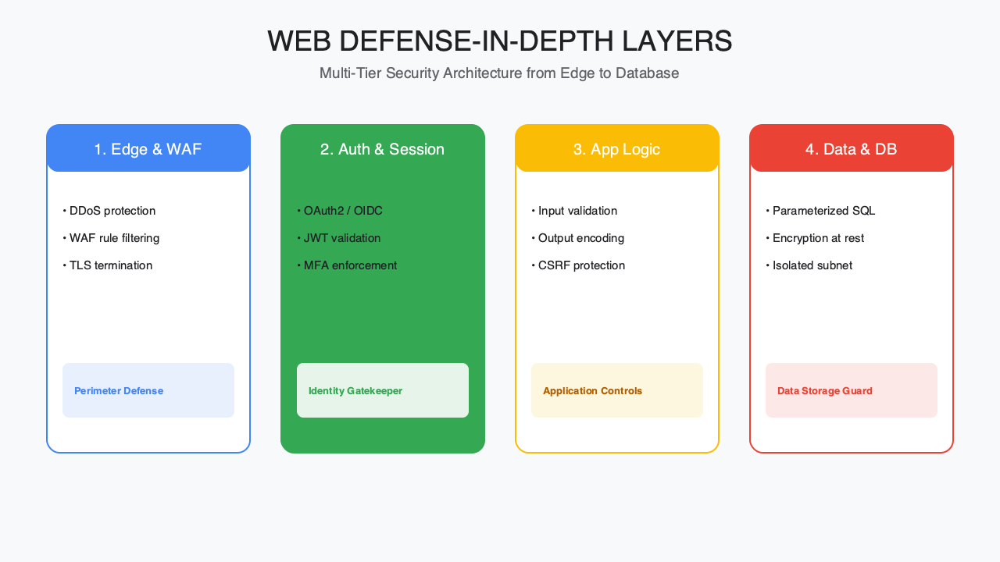
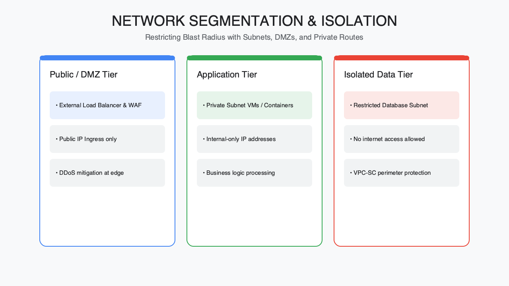
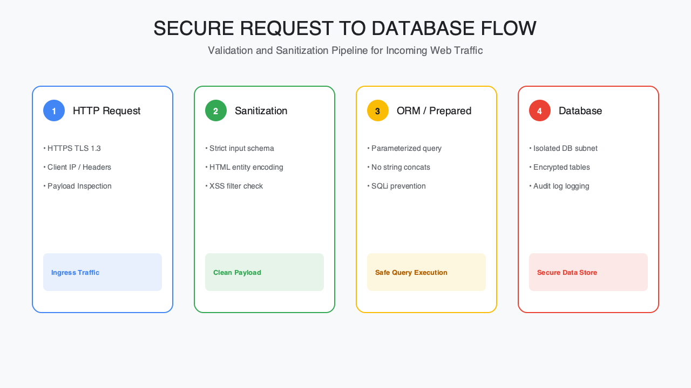

<!-- course-title: HCA: Web Security Foundations -->
<!-- layout: title -->

# Web Security
# Foundations

## Areas of security, cryptography and PKI, and hardening the OS, network, and web server

---

# Welcome!

- ROI leads the industry in designing and delivering customized technology and management training solutions
- Meet your instructor
  - Name
  - Background
  - Contact info
- Let's get started!

---

# Course Objectives

- **Secure a web server platform end to end**—from foundational concepts through OS, network, and application hardening
- Identify the key areas of web/server security
- Explain cryptography and PKI fundamentals (symmetric, asymmetric, hashing, certificates)
- Recognize OS- and network-level hardening practices for web servers
- Describe securing web server communication with SSL/TLS

---

# Agenda

- Segment 1: Security Fundamentals (~25 min)
- Segment 2: Hardening the Stack (~35 min)
- Segment 3: Safe Processing (~20 min)
- Q&A (~10 min)

---

# Who Should Attend

- Security administrators
- System and network administrators
- Web developers responsible for server-side code

---

# Prerequisites

- Experience administering Windows or Linux systems
- Basic familiarity with HTML

---
<!-- layout: navigation -->
# Course Roadmap

- **Security Fundamentals**
- Hardening the Stack
- Safe Processing

---

# The Landscape: Where Web Security Lives

- A web server isn't one thing to secure—it's a stack: OS, network, services, and application code
- An attacker only needs one weak layer; defenders need all of them
- This segment maps the layers, then builds the cryptography vocabulary you'll need for the rest of the course
- Segments 2 and 3 return to harden each layer in turn

---
<!-- layout: title-image -->
# Areas of Web/Server Security

---
<!-- layout: 2-column -->
# Four Areas to Secure

### Platform
- Operating system hardening
- Running services (only what's needed)

### Communication
- Network configuration & segmentation
- Protocols (HTTP/S, DNS, SSH, etc.)

---

# Why Cryptography Matters Here

- Every layer above eventually depends on cryptography to protect something: passwords, sessions, traffic, certificates
- Three building blocks recur everywhere: symmetric encryption, asymmetric encryption, and hashing
- PKI ties those building blocks to trust—proving a key belongs to who it claims to
- Get comfortable with these before Segment 2's TLS discussion

---
<!-- layout: 2-column -->
# Symmetric vs. Asymmetric Encryption

### Symmetric
- One shared secret key encrypts and decrypts
- Fast—used for bulk data (e.g. AES)
- Challenge: securely distributing the key

### Asymmetric
- A public/private key pair; encrypt with one, decrypt with the other
- Slower—used to exchange keys, not bulk data
- Solves the distribution problem (share the public key freely)

---

# Hashing: Integrity, Not Secrecy

- A hash is a one-way fingerprint of data—the same input always produces the same output
- Used to verify integrity (did this file change?) and to store passwords (never store them in plaintext)
- A good hash function is fast to compute but infeasible to reverse
- Password hashing adds a **salt** so identical passwords don't produce identical hashes

---
<!-- layout: title-image -->
# How PKI Establishes Trust

---

# Certificates in Practice

- A certificate binds a public key to an identity (a domain, a person, an organization)
- Signed by a Certificate Authority (CA) that clients already trust
- Expiration and revocation limit the damage if a key is compromised
- A browser's padlock means "this certificate chains to a trusted CA," not "this site is safe"

> [!TIP]
> Automate certificate renewal (e.g. ACME / Let's Encrypt)—expired certificates are one of the most common self-inflicted outages.

---
<!-- layout: navigation -->
# Course Roadmap

- Security Fundamentals
- **Hardening the Stack**
- Safe Processing

---

# Locking It Down

- Segment 1 gave you the vocabulary; now we apply it layer by layer
- Hardening is about reducing the attack surface—turning off what you don't need
- Start at the OS, move to the network, then the web server itself
- Small, boring changes (patching, disabling defaults) stop more attacks than clever ones

---

# Operating System Hardening

- Apply security patches on a regular, tested schedule
- Disable or remove unused services, accounts, and default credentials
- Enforce least privilege for service accounts—no web server running as root/Administrator
- Enable host-based logging and file integrity monitoring

---
<!-- layout: 2-column -->
# Reducing the OS Attack Surface

### Remove
- Default sample apps and accounts
- Unused protocols and services
- Unneeded local admin rights

### Enforce
- Strong password / key-based auth
- Automatic security updates
- Centralized log collection

---

# Network-Level Security

- Segment the network—the web server shouldn't sit next to sensitive internal systems
- Firewalls should default-deny and allow only required ports (typically 443, sometimes 80 for redirect)
- Use a DMZ, or equivalent boundary, between the internet and internal networks
- Monitor with an IDS/IPS for known attack signatures

---
<!-- layout: title-image -->
# Network Segmentation for a Web Server

---

# Securing the Web Server Itself

- Run the web server process with the least privilege necessary
- Disable directory listing, remove default/sample content, and hide version banners
- Turn off unused modules and HTTP methods (e.g. TRACE, PUT if not needed)
- Set secure HTTP response headers (HSTS, X-Content-Type-Options, CSP)

---

# Enabling SSL/TLS on the Web Server

- Install a certificate from a trusted CA and configure the server to present it
- Disable outdated protocol versions (SSLv3, TLS 1.0/1.1) and weak cipher suites
- Redirect all HTTP requests to HTTPS
- Test the configuration with an external scanner, not just "it loads"

---
<!-- layout: 2-column -->
# TLS Configuration Checklist

### Get Right
- Strong cipher suites, forward secrecy
- HSTS enabled
- Complete certificate chain, not self-signed in production

### Common Mistakes
- Expired or mismatched certificates
- Mixed content (HTTP resources on an HTTPS page)
- Leaving legacy protocol versions enabled "just in case"

---

# Hardening Recap

| Layer | Key hardening action |
| :--- | :--- |
| OS | Patch, remove unused services, least privilege |
| Network | Segment, default-deny firewall, IDS/IPS |
| Web server | Disable defaults, secure headers, TLS-only |

> [!IMPORTANT]
> Hardening isn't a one-time checklist—re-verify configuration after every deployment or platform update.

---
<!-- layout: navigation -->
# Course Roadmap

- Security Fundamentals
- Hardening the Stack
- **Safe Processing**

---

# Application Layer: Where Logic Meets Risk

- Even a perfectly hardened OS, network, and TLS setup can be undone by unsafe server-side code
- Server-side processing (scripts, APIs, database calls) is where user input becomes action
- This segment focuses on the coding and data-access practices that keep that translation safe
- Same theme as before: never trust input, enforce control on the server

---

# Risks of Server-Side Processing

- Dynamic scripts execute with the privileges of the web server process—a flaw there inherits that access
- File uploads, includes, and command execution are common entry points for remote code execution
- Debug or verbose error output can leak stack traces, file paths, or credentials
- Third-party scripts and plugins expand the attack surface as much as your own code

---

# Secure Web Coding Practices

- Validate and sanitize all input on the server, even if the client already checks it
- Use output encoding appropriate to context (HTML, URL, JavaScript)
- Keep frameworks, libraries, and plugins patched—most exploited code isn't yours
- Handle errors gracefully; log details server-side, not in the response

---
<!-- layout: title-image -->
# From Request to Database

---

# Securing Database Connections

- Use parameterized queries or prepared statements—never build SQL by concatenating input
- Connect with a low-privilege database account, not an admin/root credential
- Store connection credentials outside source code (a secrets manager or environment config)
- Encrypt the connection between the application and the database, not just the browser and server

> [!WARNING]
> A web application talking to its database with an admin-level account turns any injection flaw into full database compromise.

---
<!-- layout: 2-column -->
# Application Layer Checklist

### Code
- Server-side validation & output encoding
- Least-privilege database accounts
- Patched frameworks & dependencies

### Operations
- Secrets kept out of source code
- Verbose errors disabled in production
- Logging without exposing sensitive data

---

# What You Learned

- Identified the key areas of web/server security
- Explained cryptography and PKI fundamentals
- Recognized OS- and network-level hardening practices for web servers
- Described securing web server communication with SSL/TLS

---

# Quiz 1 of 3

**Which statement correctly describes hashing in a web security context?**

- **A.** Hashing is a reversible encryption method for bulk traffic
- **B.** A public/private key pair is required to compute any hash
- **C.** A hash is a one-way fingerprint used for integrity and password storage (with salt)
- **D.** Certificates replace the need for hashing entirely

---

# Quiz 1 — Answer

**Which statement correctly describes hashing in a web security context?**

- **A.** Hashing is a reversible encryption method for bulk traffic
- **B.** A public/private key pair is required to compute any hash
- **C.** A hash is a one-way fingerprint used for integrity and password storage (with salt)
- **D.** Certificates replace the need for hashing entirely

**Correct: C**

- Hashes are one-way fingerprints—same input, same output; not for secrecy of bulk data
- Password storage uses hashing plus salt; don’t store plaintext or reversible “encryption” of passwords
- Symmetric/asymmetric encryption solve different problems than hashing
- PKI/certificates bind keys to identity; they don’t eliminate hashing

---

# Quiz 2 of 3

**When hardening a public web server, which practice is most aligned with least privilege and a reduced attack surface?**

- **A.** Run the web process without root/Administrator, disable unused modules/methods, and enforce TLS-only with a trusted certificate
- **B.** Leave sample apps and directory listing enabled for easier troubleshooting
- **C.** Keep SSLv3 and TLS 1.0 enabled “just in case” old clients connect
- **D.** Connect the app to the database with an admin account for convenience

---

# Quiz 2 — Answer

**When hardening a public web server, which practice is most aligned with least privilege and a reduced attack surface?**

- **A.** Run the web process without root/Administrator, disable unused modules/methods, and enforce TLS-only with a trusted certificate
- **B.** Leave sample apps and directory listing enabled for easier troubleshooting
- **C.** Keep SSLv3 and TLS 1.0 enabled “just in case” old clients connect
- **D.** Connect the app to the database with an admin account for convenience

**Correct: A**

- Least privilege for the service account and disabled unused surface stop many attacks
- Sample content, banners, and directory listing aid attackers
- Disable legacy protocols and weak ciphers; redirect HTTP to HTTPS
- Low-privilege DB accounts limit blast radius if injection occurs

---
<!-- layout: 2-column -->
# Quiz 3 of 3 — Discussion

### Prompt
Walk the stack for a new public web app: OS → network/DMZ → web server TLS → server-side code talking to a database.

### Discuss
- What hardening step belongs at each layer?
- How do parameterized queries and secrets handling fit “safe processing”?
- How would you verify TLS and config after each deployment?

---
<!-- layout: 2-column -->
# Quiz 3 — Discussion Points

**Walk the stack for a new public web app: OS → network/DMZ → web server TLS → server-side code talking to a database.**

- What hardening step belongs at each layer?
- How do parameterized queries and secrets handling fit “safe processing”?
- How would you verify TLS and config after each deployment?

### Strong Answers Mention
- OS: patch, remove unused services, least privilege, logging
- Network: segment/DMZ, default-deny firewall, IDS/IPS
- Web server: secure headers, no defaults, strong TLS/HSTS
- App/DB: server-side validation, parameterized queries, secrets out of source

### Watch For
- Hardening as a one-time checklist never re-verified
- Admin DB credentials from the web tier
- Self-signed or expired certs in production; mixed content

---
<!-- layout: title-image -->
# Q&A

