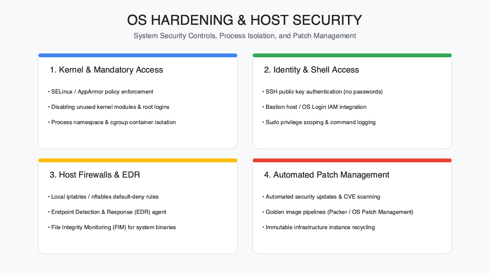
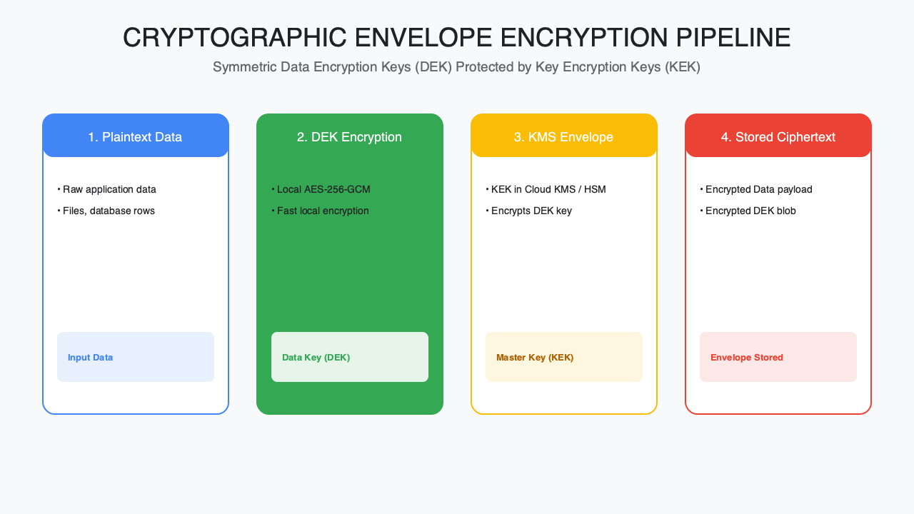
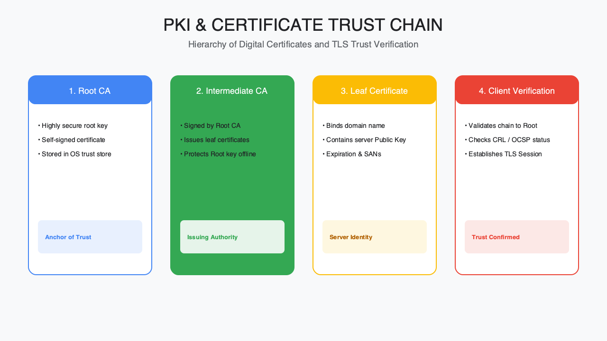

<!-- course-title: HCA: Practical Security & Cryptography -->
<!-- layout: title -->

# Practical Security
# and Cryptography

## CIAA foundations, applied cryptography, and defending the network and OS against real attacks

---

# Welcome!

- ROI leads the industry in designing and delivering customized technology and management training solutions
- Meet your instructor
  - Name
  - Background
  - Contact info
- Let's get started!

---

# Course Objectives

- **Apply security and cryptography fundamentals** to defend real networks and operating systems
- Describe security foundations (confidentiality, integrity, availability, authentication)
- Explain applied cryptography: symmetric, asymmetric, and hashing
- Recognize how security tools incorporate cryptography (VPNs, SSL/TLS, SSH)
- Identify common network and OS attacks and their defenses

---

# Agenda

- Segment 1: Security Problems and Tools (~25 min)
- Segment 2: Applied Cryptography, with demo (~35 min)
- Segment 3: Attacks and Defense (~20 min)
- Q&A (~10 min)

---

# Who Should Attend

- Managers, administrators, and developers needing applied security knowledge
- Networking and OS familiarity assumed
- Useful as a foundation for CISSP study

---

# Prerequisites

- Understanding of TCP/IP networking
- Experience with operating system administration

---
<!-- layout: navigation -->
# Course Roadmap

- **Security Problems and Tools**
- Applied Cryptography
- Attacks and Defense

---

# The Landscape: What We're Actually Defending

- Every attack targets a component: the network, the operating system, or the people and processes around them
- Before picking a tool, you need a shared model of what "secure" means and who you're defending against
- This segment sets that model, then Segments 2 and 3 apply it
- We'll close with the enemy's perspective—internal vs. external threats

---
<!-- layout: title-image -->
# Network and OS Components

---

# CIAA: Extending the Triad

- **Confidentiality**: only authorized parties can read data
- **Integrity**: data and systems aren't altered without detection
- **Availability**: systems and data stay usable when needed
- **Authentication**: proving an identity is who it claims to be—the fourth pillar this course adds

---
<!-- layout: 2-column -->
# Why Authentication Gets Its Own Pillar

### Without It
- Confidentiality and integrity controls trust whoever is authenticated
- A broken login makes every other control moot

### With It
- Strong authentication anchors access decisions
- Sets up everything Segment 3 covers: 2FA, VPNs, SSH keys

---

# Knowing the Enemy

- Effective defense starts with a realistic threat model, not a generic checklist
- Attackers vary in skill, motive, and access—commodity malware differs from a targeted intrusion
- Not every control matters equally against every threat; prioritize based on who's actually likely to attack you
- The next slide splits threats by where they originate

---
<!-- layout: 2-column -->
# Internal vs. External Threats

### Internal
- Employees, contractors, or compromised insider accounts
- Already has some legitimate access—harder to detect
- Often unintentional (misconfiguration, phishing victim)

### External
- Attackers with no starting access
- Must breach a perimeter—network, application, or credential
- Ranges from opportunistic scans to targeted campaigns

---

# Setting Up Segment 2

- CIAA gives us the goals; cryptography gives us the tools to achieve them
- Confidentiality relies on encryption; integrity relies on hashing; authentication relies on both
- Segment 2 builds the cryptographic building blocks from the ground up
- We'll close with a live demo of these concepts in action

---
<!-- layout: navigation -->
# Course Roadmap

- Security Problems and Tools
- **Applied Cryptography**
- Attacks and Defense

---

# The Core: Cryptography in Practice

- Three building blocks do almost all the work: symmetric encryption, asymmetric encryption, and hashing
- Each solves a different problem—know which one applies before reaching for a tool
- PKI ties asymmetric crypto to real-world trust
- We'll close this segment with a hands-on demo

---

# Symmetric Encryption

- One shared secret key both encrypts and decrypts
- Fast and efficient—the workhorse for bulk data (e.g. AES)
- The hard problem: getting the key to the other party securely without exposing it
- Used inside VPNs, disk encryption, and TLS sessions once a key is established

---

# Asymmetric Encryption

- A mathematically linked key pair: a public key and a private key
- Data encrypted with one key can only be decrypted with the other
- Slower than symmetric—typically used to exchange a symmetric key, not bulk data
- The public key can be shared freely; the private key never leaves its owner

---
<!-- layout: title-image -->
# Symmetric + Asymmetric + Hashing

---

# Hashing

- A one-way function: easy to compute forward, infeasible to reverse
- The same input always produces the same output; any change produces a completely different hash
- Verifies integrity (has this file or message changed?) and secures stored passwords (with salting)
- Not encryption—there's no key, and it can't be "decrypted" back to the original

---
<!-- layout: 2-column -->
# Choosing the Right Tool

### Use Symmetric When
- Encrypting large volumes of data
- Speed matters more than key distribution

### Use Asymmetric When
- You need to exchange a key securely
- You need to prove identity (digital signatures)

---

# Public/Private Key Cryptography in Practice

- Encrypt with the recipient's public key → only their private key can decrypt (confidentiality)
- Sign with your own private key → anyone with your public key can verify it came from you (authentication + integrity)
- Digital signatures combine hashing and asymmetric crypto: hash the message, then encrypt the hash with the private key
- This pairing underlies TLS, SSH, code signing, and email encryption

---
<!-- layout: title-image -->
# PKI: Binding Keys to Identity

---

# Demo: Cryptography in Action

**Time:** ~10 minutes

- Generate a symmetric key and encrypt/decrypt a short message
- Generate a public/private key pair and sign a file
- Verify the signature and inspect a real TLS certificate's chain

---
<!-- layout: navigation -->
# Course Roadmap

- Security Problems and Tools
- Applied Cryptography
- **Attacks and Defense**

---

# In Practice: From Concepts to Controls

- Segments 1 and 2 gave us goals (CIAA) and tools (crypto); this segment applies them to real network and OS defenses
- Every control below either encrypts something, authenticates someone, or restricts access—often more than one
- We'll close with the two OS-level defenses most likely to stop a real attack: patching discipline and multi-factor authentication
- Same rule as always: no single control is sufficient on its own

---

# Securing the Network: Firewalls

- Filters traffic by port, protocol, and address; default-deny is the safe starting posture
- Network firewalls sit at the perimeter; host-based firewalls add a second layer per machine
- Doesn't inspect encrypted payloads by default—pair it with other controls for application-layer traffic
- Still the first control most network security programs implement

---
<!-- layout: 2-column -->
# IPSec/VPN and SSL/TLS

### IPSec / VPN
- Encrypts traffic at the network layer, often site-to-site or remote access
- Builds a private tunnel across an untrusted network

### SSL / TLS
- Encrypts traffic at the application/transport layer
- Secures a specific connection (e.g. HTTPS), not the whole network path

---

# SSH: Secure Remote Access

- Encrypts remote administration traffic—the encrypted successor to Telnet
- Supports both password and public-key authentication; prefer key-based
- Also tunnels other traffic (port forwarding) securely across an untrusted network
- Disable password authentication where key-based access is available

---
<!-- layout: title-image -->
# Layers of Network Defense

---

# OS Attacks: Malware

- Malware ranges from opportunistic (commodity ransomware) to targeted (custom tooling)
- Common entry points: phishing attachments, drive-by downloads, unpatched vulnerabilities
- Defenses: endpoint protection, patching, least privilege, and application allowlisting
- Detection matters as much as prevention—assume something eventually gets through

---

# Authentication and 2FA

- Passwords alone are a single point of failure—reused, guessed, or phished
- Two-factor authentication (2FA) adds a second, independent proof: something you have or something you are
- Even a phished password becomes far less useful to an attacker without the second factor
- Apply 2FA first to the accounts with the most access: admins, VPN, and email

> [!IMPORTANT]
> Multi-factor authentication is one of the highest-impact, lowest-cost defenses available—prioritize it before more exotic controls.

---

# What You Learned

- Described security foundations (confidentiality, integrity, availability, authentication)
- Explained applied cryptography: symmetric, asymmetric, and hashing
- Recognized how security tools incorporate cryptography (VPNs, SSL/TLS, SSH)
- Identified common network and OS attacks and their defenses

---
<!-- layout: title-image -->
# Q&A

