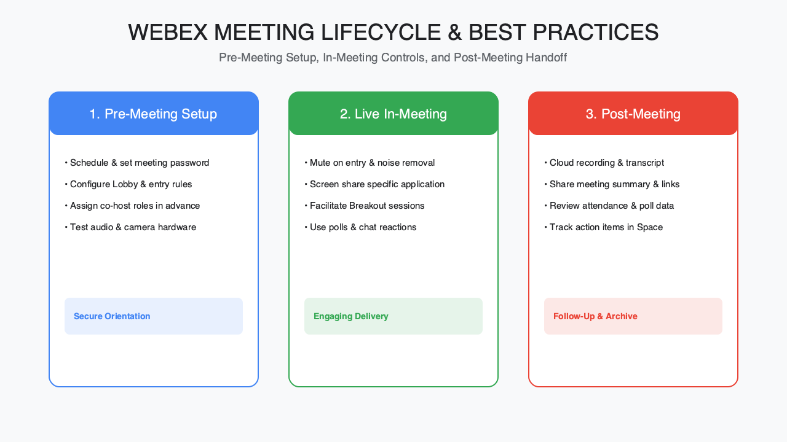
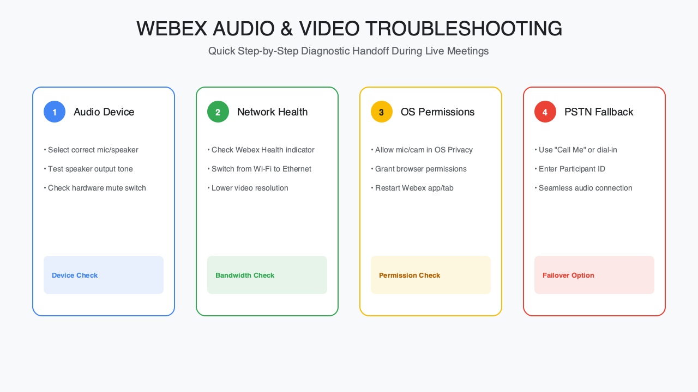

<!-- course-title: HCA: Webex Tips and Tricks -->
<!-- layout: title -->

# Webex
# Tips and Tricks

## Meetings, messaging, and collaboration features most users never discover

---

# Welcome!

- ROI leads the industry in designing and delivering customized technology and management training solutions
- Meet your instructor
  - Name
  - Background
  - Contact info
- Let's get started!

---

# Course Objectives

- **Get more out of Webex**—meetings, messaging, and collaboration features most users never discover
- Navigate key Webex meeting and messaging features with confidence
- Apply productivity features (scheduling, recordings, breakouts, whiteboarding)
- Use collaboration and etiquette best practices for better meetings
- Troubleshoot the most common audio/video/connection issues

---

# Agenda

- Segment 1: Meetings Done Right, with demo (~30 min)
- Segment 2: Collaboration Beyond Meetings, with demo (~25 min)
- Segment 3: Smooth and Reliable, with demo (~25 min)
- Questions and Answers (~10 min)

---

# Who Should Attend

- All Webex users, from occasional to daily
- No technical background required

---

# Prerequisites

- No prior Webex experience required

---
<!-- layout: navigation -->
# Course Roadmap

- **Meetings Done Right**
- Collaboration Beyond Meetings
- Smooth and Reliable

---

# Core Features: Getting the Most from Every Meeting

- Most people use maybe 20% of what Webex actually offers
- This segment covers the full meeting lifecycle: schedule, join, present, and follow up
- We'll demo the features live as we go—feel free to follow along in your own Webex
- Small habits here save real time across dozens of meetings a week

---
<!-- layout: title-image -->
# The Meeting Lifecycle

---

# Scheduling Smarter

- Schedule directly from Webex, Outlook, or Google Calendar—pick whichever fits your workflow
- Use meeting templates to standardize recurring formats (standups, 1:1s, all-hands)
- Set a default meeting duration shorter than 60 or 30 minutes—most meetings expand to fill the time given
- Enable the lobby/waiting room for anything with external guests

---

# Joining Like a Pro

- One-click join from your calendar invite—avoid hunting for meeting numbers
- Test audio and video before an important meeting, not during it
- Join from the desktop or mobile app for full features; the web app is a solid fallback
- Preview your camera and background before joining, not after

---
<!-- layout: title-image -->
# In-Meeting Controls at a Glance

<!-- TODO IMAGE: Screenshot of the Webex in-meeting toolbar highlighting mute, video, reactions, share, record, and breakout controls -->

---

# In-Meeting Controls Worth Knowing

- Reactions and raise hand keep large meetings orderly without interrupting the speaker
- Virtual backgrounds and background noise removal reduce distractions for everyone
- Screen share with "share sound" when presenting video or audio content
- Lock the meeting once everyone expected has joined, for sensitive discussions

---
<!-- layout: 2-column -->
# Recordings and Transcripts

### Recordings
- Cloud recordings are shareable and searchable
- Set recording to start automatically for recurring meetings that need one

### Transcripts
- Auto-generated transcripts save note-taking time
- Searchable after the meeting—jump straight to the part you need

---

# Breakout Sessions

- Split a large meeting into smaller, focused discussion groups
- Assign manually for intentional groupings, or let Webex assign randomly for speed
- Broadcast a message to all breakout rooms without ending them
- Set a timer so breakouts return to the main session automatically

---

# Demo: Scheduling and Running a Meeting

**Time:** ~10 minutes

- Schedule a meeting with a template and a waiting room enabled
- Walk through in-meeting controls: reactions, virtual background, screen share
- Start a recording and preview the auto-generated transcript

---
<!-- layout: navigation -->
# Course Roadmap

- Meetings Done Right
- **Collaboration Beyond Meetings**
- Smooth and Reliable

---

# Messaging and Sharing: Life Between Meetings

- Most collaboration doesn't happen in a scheduled meeting—it happens in the moments around it
- Webex Spaces keep conversations, files, and context together instead of scattered across email and chat
- This segment covers the async tools that reduce how many meetings you need in the first place
- We'll demo creating a Space and sharing a file live

---

# Spaces: Your Team's Home Base

- A Space is a persistent room for a team, project, or topic—not a one-off chat thread
- Everything shared in a Space stays searchable and organized by conversation
- Pin important messages so they don't get buried
- Turn any meeting into a Space afterward to keep the conversation going

---
<!-- layout: title-image -->
# Spaces and Messaging Layout

<!-- TODO IMAGE: Screenshot of a Webex Space showing the message thread, pinned messages, and file panel -->

---

# Messaging Features Worth Knowing

- Threaded replies keep side conversations from cluttering the main channel
- @mentions notify specific people without pinging the whole Space
- Message status shows who's read what—useful for confirming important updates landed
- Search works across messages, files, and even meeting transcripts

---
<!-- layout: 2-column -->
# File Sharing and Co-Editing

### File Sharing
- Drag and drop files directly into a Space
- Files stay attached to the conversation where they were shared

### Co-Editing
- Edit shared Office documents together in real time
- Changes sync automatically—no more emailing versions back and forth

---

# Whiteboarding

- A persistent digital whiteboard for brainstorming, diagrams, and planning
- Works inside a meeting or as a standalone async space
- Sticky notes, shapes, and freehand drawing support real collaborative sessions
- Boards save automatically and stay accessible after the meeting ends

---

# Demo: Spaces, Files, and Whiteboarding

**Time:** ~8 minutes

- Create a Space and pin an important message
- Share and co-edit a document live
- Open a whiteboard and add a few sticky notes together

---
<!-- layout: navigation -->
# Course Roadmap

- Meetings Done Right
- Collaboration Beyond Meetings
- **Smooth and Reliable**

---

# Etiquette and Troubleshooting: Making Meetings Work for Everyone

- Great tools still need good habits—etiquette prevents most bad-meeting complaints
- Accessibility isn't an add-on; small defaults make meetings work for more people
- The second half of this segment covers fixing the audio/video issues that derail meetings
- We'll close with a live troubleshooting demo

---
<!-- layout: 2-column -->
# Meeting Etiquette Basics

### Before and During
- Join a minute early, muted by default
- Use video when you can—it builds engagement
- Mute when not speaking, especially in larger groups

### Presenting
- Say who you are before speaking in large or new groups
- Stop sharing your screen when you're done, not mid-transition
- Watch the chat and reactions—someone may be trying to get your attention

---

# Accessibility Features Worth Turning On

- Live captions display spoken words in real time for anyone who needs or prefers them
- Closed captioning can be translated into another language during the meeting
- Keyboard shortcuts make Webex fully navigable without a mouse
- Recordings and transcripts double as accessibility tools after the fact

---
<!-- layout: title-image -->
# Troubleshooting Flow

---

# Fixing Audio Issues

- No audio? Check you've joined the meeting's audio (computer audio vs. phone call-in)
- Others can't hear you? Check the correct microphone is selected, not muted at the OS level
- Echo or feedback? Only one device per person should have audio on in the same room
- Background noise? Turn on background noise removal in audio settings

---

# Fixing Video and Connection Issues

- No video? Confirm Webex has camera permission at the OS level, not just in-app
- Choppy video or audio? Switch to "optimize for low bandwidth" or turn off your own video
- Can't join at all? Try the web app as a fallback if the desktop app won't connect
- Persistent issues? Restart the app before restarting the whole machine

---

# Demo: Diagnosing a Meeting Problem

**Time:** ~7 minutes

- Walk through the audio and video settings panel
- Simulate a common issue (wrong microphone selected) and fix it live
- Show where to find connection quality indicators during a meeting

---

# What You Learned

- Navigated key Webex meeting and messaging features with confidence
- Applied productivity features (scheduling, recordings, breakouts, whiteboarding)
- Used collaboration and etiquette best practices for better meetings
- Troubleshot the most common audio/video/connection issues

---

# Quiz 1 of 3

**What best describes a Webex Space?**

- A. A one-time chat thread that disappears when the meeting ends
- B. A persistent room for a team, project, or topic where messages, files, and context stay searchable
- C. Only a whiteboard that cannot hold messages or files
- D. A calendar invite template used only for scheduling

---

# Quiz 1 — Answer

**What best describes a Webex Space?**

**Correct: B.** A persistent room for a team, project, or topic where messages, files, and context stay searchable

- Spaces are persistent homes for a team, project, or topic—not one-off chats
- Shared content stays searchable and organized with the conversation
- You can pin important messages and continue after a meeting
- Async Spaces reduce how many meetings you need in the first place

---

# Quiz 2 of 3

**You and a colleague hear loud echo in a hybrid room. What should you check first?**

- A. Turn everyone’s video off permanently
- B. Delete the Space and recreate the meeting
- C. Disable live captions for all attendees
- D. Ensure only one device per person has meeting audio on in that room

---

# Quiz 2 — Answer

**You and a colleague hear loud echo in a hybrid room. What should you check first?**

**Correct: D.** Ensure only one device per person has meeting audio on in that room

- Echo/feedback usually means multiple open mics/speakers in the same room
- Keep one device’s audio active per person; mute or leave audio on others
- Background noise removal helps noise, but not classic dual-device echo
- Fix audio path before restarting machines or redesigning the meeting

---
<!-- layout: 2-column -->
# Quiz 3 of 3 — Discussion

### Prompt
Think of a recurring meeting you lead or join (standup, all-hands, or project sync).

### Discuss
- Which features would improve it most—templates, lobby, breakouts, recordings/transcripts, or Spaces?
- What etiquette or accessibility defaults should become team norms?
- How would you diagnose the audio/video issue that most often derails that meeting?

---
<!-- layout: 2-column -->
# Quiz 3 — Discussion Points

**Think of a recurring meeting you lead or join (standup, all-hands, or project sync).**

### Strong Answers Mention
- Lifecycle habits: schedule well, join early muted, present cleanly, follow up in a Space
- Captions, transcripts, and recordings as accessibility—and productivity—tools
- Isolate then fix: right mic/camera, bandwidth, web app fallback
- Lock/lobby for external guests; stop sharing when done

### Watch For
- Treating Webex as “video only” and ignoring Spaces/whiteboards
- Jumping to reboot before checking mute, mic selection, or dual-device audio
- Skipping etiquette (late join unmuted, abandoned screen share)

---
<!-- layout: title-image -->
# Questions and Answers

