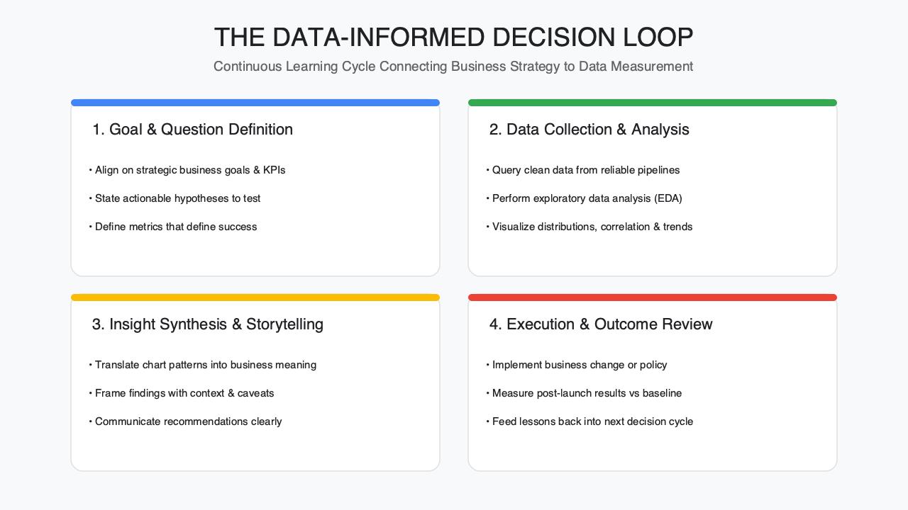
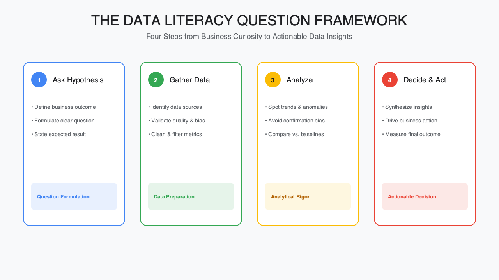

<!-- course-title: HCA: Data Literacy -->
<!-- layout: title -->

# Data Literacy:
# Making Better Decisions

## Reading data critically to support safer care, smarter operations, and better decisions

---

# Welcome!

- ROI leads the industry in designing and delivering customized technology and management training solutions
- Meet your instructor
  - Name
  - Background
  - Contact info
- Let's get started!

---

# Course Objectives

- **Build practical data literacy** to read, question, and act on data with confidence
- Describe the building blocks of data literacy: types of data, sources, and quality
- Interpret charts, dashboards, and statistics without common misreadings
- Apply a practical framework for asking good questions of data before deciding
- Recognize data pitfalls and biases that commonly mislead healthcare decisions

---

# Agenda

- Segment 1: Foundations of Data Literacy (~20 min)
- Segment 2: Reading and Interpreting Data (~35 min)
- Segment 3: From Data to Decisions (~25 min)
- Q&A (~10 min)

---

# Who Should Attend

- Unit and department managers who use quality or operational dashboards
- Clinical and administrative staff making data-informed decisions
- Anyone who reads reports, metrics, or scorecards as part of their role

---

# Prerequisites

- No statistics or analytics background required
- Comfortable reading basic charts and tables

---
<!-- layout: navigation -->
# Course Roadmap

- **Foundations of Data Literacy**
- Reading and Interpreting Data
- From Data to Decisions

---

# Why Data Literacy Matters Here

- Every shift produces data: vitals, throughput times, staffing ratios, satisfaction scores, safety events
- Decisions made on misread data can affect patient safety, staffing, and cost—not just a spreadsheet
- Data literacy isn't about becoming a statistician—it's about asking the right questions before you act
- The goal today: read data more critically, not more mathematically

---
<!-- layout: title-image -->
# What Data Literacy Involves

---

# Types of Data You'll See

- **Quantitative**: numbers—counts, rates, times (e.g. length of stay, readmission rate)
- **Qualitative**: descriptions—patient comments, incident narratives, survey free-text
- **Structured**: fits neatly in a field (a diagnosis code, a lab value)
- **Unstructured**: free text, images, notes—harder to summarize, easy to lose in a table

---
<!-- layout: 2-column -->
# Where Healthcare Data Comes From

### Clinical & Operational
- EHR (vitals, orders, diagnoses)
- Scheduling & staffing systems
- Quality and safety event reports

### Experience & Financial
- Patient satisfaction surveys
- Claims and billing data
- Cost and utilization reports

---

# Data Quality: Garbage In, Garbage Out

- **Completeness**: is anything missing, and does that missingness mean something?
- **Accuracy**: was it recorded correctly at the source, not just entered correctly downstream?
- **Timeliness**: how stale is this number by the time you're looking at it?
- A perfectly formatted report built on bad data is still a bad report

> [!WARNING]
> A clean-looking dashboard doesn't guarantee clean data underneath it. Always ask where the numbers came from.

---

# Data Literacy in One Sentence

- Data literacy is the ability to find, understand, question, and use data appropriately for a decision
- It's a practical skill, not a technical credential—everyone in this room already does parts of it
- The rest of this course builds the "question" and "use" parts, since "find" and "understand" usually come with training on your specific systems

---
<!-- layout: navigation -->
# Course Roadmap

- Foundations of Data Literacy
- **Reading and Interpreting Data**
- From Data to Decisions

---

# From Numbers to Understanding

- This segment is the practical core: how to read a chart, a rate, or a report without being misled
- Every example here is a pattern you'll recognize in a real dashboard next week
- We'll work through a few "spot the problem" examples together
- None of this requires math beyond what you already use daily

---

# Averages Hide the Story

- An average collapses a whole distribution into one number—and hides the spread
- Two units can have the same average wait time with very different experiences: one steady, one wildly inconsistent
- Ask: what's the range? Are there outliers pulling the average up or down?
- A median is often more representative than a mean when a few extreme values exist

---

# Worked Example: Same Average, Different Story

| Unit | Avg wait (min) | Range |
| :--- | :--- | :--- |
| Unit A | 22 | 18–26 |
| Unit B | 22 | 5–65 |

> [!NOTE]
> Same average—very different patient experience. Unit B needs a different fix than Unit A.

---
<!-- layout: 2-column -->
# Charts Can Mislead—On Purpose or Not

### Common Tricks
- Y-axis that doesn't start at zero, exaggerating a small change
- A cherry-picked date range that hides the bigger trend
- Two different scales on one chart, invited to be compared

### Your Defense
- Check the axis before you react to the slope
- Ask "what happened right before this window starts?"
- Compare the chart to a longer time frame

---

# Small Numbers, Big Swings

- A unit with 20 patients a month can swing from a 0% to a 15% readmission rate on just a couple of cases
- Small sample sizes make month-to-month changes look dramatic even when nothing really changed
- Look for a trend over several periods, not a single data point, before reacting
- Ask how many cases are behind a percentage before treating it as a signal

---

# Correlation Is Not Causation

- Two metrics moving together doesn't mean one caused the other
- A third factor can drive both—like seasonal patient volume affecting both wait times and satisfaction scores
- Before acting on "X caused Y," ask what else changed at the same time
- The stronger the claim, the more it deserves a second look

---

# Worked Example: What Actually Changed?

- Readmissions dropped 3 points the same month a new discharge process launched
- Also that month: flu season ended, and two high-risk-mix skilled nursing partners closed for renovation
- Which explanation is right? Possibly all three, in some combination
- The lesson isn't "ignore the process change"—it's "don't credit it alone without checking"

---
<!-- layout: 2-column -->
# Statistical vs. Practical Significance

### Statistically Significant
- Unlikely to be due to chance
- Says nothing about size or importance
- Can apply to a tiny, meaningless difference

### Practically Significant
- Large enough to matter for a decision
- Can exist even with weaker statistical confidence
- The real question: "worth acting on?"

---

# Risk Adjustment: Comparing Apples to Apples

- Raw outcome numbers don't account for how sick or complex a patient population already was
- A unit with sicker patients will show worse raw outcomes even with excellent care
- Risk-adjusted or case-mix-adjusted numbers try to level that playing field
- Always check whether a comparison between units or facilities is adjusted before drawing conclusions

> [!TIP]
> When comparing outcomes across units or facilities, ask "is this risk-adjusted?" before drawing any conclusion.

---
<!-- layout: navigation -->
# Course Roadmap

- Foundations of Data Literacy
- Reading and Interpreting Data
- **From Data to Decisions**

---

# From Reading to Deciding

- Segments 1 and 2 built the skills to read data critically; this segment turns that into a repeatable habit
- Good data-informed decisions follow a pattern you can reuse on any report or dashboard
- We'll close with common pitfalls to watch for and a practical starting point for your team
- None of this requires more tools—just better questions

---
<!-- layout: title-image -->
# A Framework for Asking Good Questions

---

# Define the Question Before You Look at the Data

- What decision does this data actually need to inform?
- A vague question ("how are we doing?") invites a vague, unreliable answer
- A specific question ("did wait times improve after the new triage process?") points you to the right comparison
- If you can't state the decision, you're not ready to look at the number yet

---

# Check the Source and the Comparison

- Where did this number come from, and how current is it?
- What is it being compared to—last month, a target, another unit, itself a year ago?
- A number without a comparison point is just a number, not information
- Make sure the comparison is apples-to-apples (same population, same time window, same definition)

---

# Check for Bias

- **Confirmation bias**: noticing the data that supports what you already believed
- **Cherry-picking**: choosing the time window or metric that tells the story you want
- **Simpson's paradox**: a trend that appears in several groups can reverse when the groups are combined
- Ask: would I trust this number if it disagreed with me?

> [!CAUTION]
> The moment a number confirms exactly what you expected, that's exactly when it deserves a second look.

---
<!-- layout: 2-column -->
# Building a Data-Informed Team

### Encourage
- Asking "what's this compared to?" out loud in meetings
- Treating a surprising number as a question, not a verdict
- Sharing the "why," not just the chart

### Avoid
- Reacting to a single data point without a trend
- Letting one dashboard replace clinical or operational judgment
- Presenting data without its source or definition

---

# What to Do Monday Morning

- Pick one recurring report or dashboard you already use
- Apply the framework: define the question, check the source, check the comparison, check for bias
- Ask one clarifying question in your next meeting instead of accepting a number at face value
- Data literacy builds through repetition, not a single training session

---

# What You Learned

- Described the building blocks of data literacy: types of data, sources, and quality
- Interpreted charts, dashboards, and statistics without common misreadings
- Applied a practical framework for asking good questions of data before deciding
- Recognized data pitfalls and biases that commonly mislead healthcare decisions

---
<!-- layout: title-image -->
# Q&A

