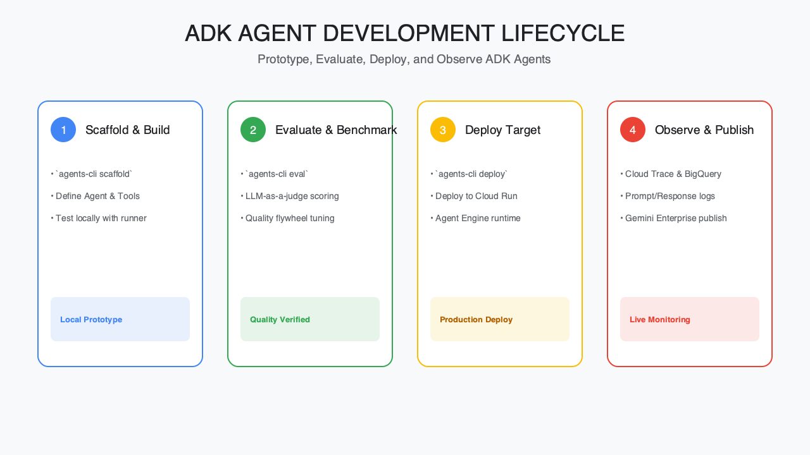
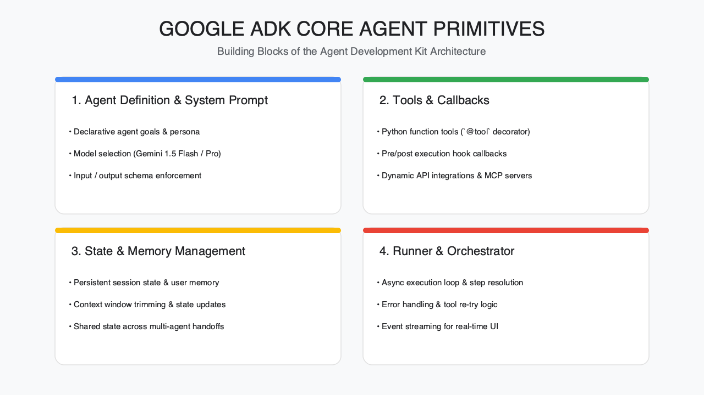
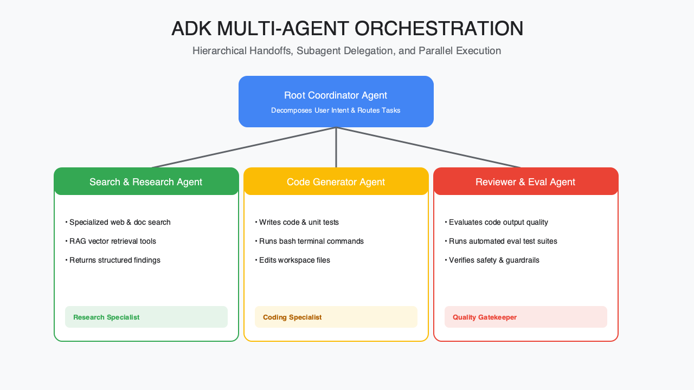
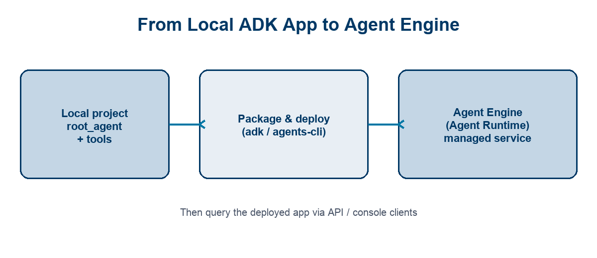

<!-- course-title: HCA: Agentic Development with ADK -->
<!-- layout: title -->


# Agentic Development
# with ADK

## Defining agents and tools, composing multi-agent systems, and deploying them with Google ADK

---

# Welcome!

- ROI leads the industry in designing and delivering customized technology and management training solutions
- Meet your instructor
  - Name
  - Background
  - Contact info
- Let’s get started!


---

# Course Objectives

- **Apply Google’s Agent Development Kit (ADK)** to define, compose, evaluate, and deploy agents
- Describe how ADK compares to other agent frameworks (Gen AI SDK, LangChain)
- Build a simple agent with tools using ADK
- Explain multi-agent patterns (parent-child relationships and flows)
- Outline how ADK agents deploy to Agent Engine and how to evaluate them

---

# Agenda

- Segment 1: Getting Started with ADK (~20 min)
- Segment 2: Tools and Multi-Agent Systems (~25 min)
- Segment 3: Deploy and Evaluate (~15 min)
- Q&A (~15 min)


---

# Who Should Attend

- Machine learning engineers
- GenAI / LLM application engineers
- Software engineers moving from prompts and tools into agent systems
- Technical leads evaluating ADK for team standards


---

# Prerequisites

- **Python:** Comfortable reading and writing functions, modules, and type hints
- **Prompt engineering:** Intermediate experience shaping LLM instructions
- **Tool use:** Familiarity with function-calling / tool-using GenAI apps
- **Optional:** Prior exposure to LangChain, LangGraph, or the Google Gen AI SDK


---
<!-- layout: navigation -->
# Course Roadmap

- **Getting Started with ADK**
- Tools and Multi-Agent Systems
- Deploy and Evaluate

---

# What Is ADK?

- **Agent Development Kit** — open-source, code-first toolkit from Google
- Build **conversational and non-conversational** agents in Python (and other languages)
- Designed for the full loop: **build → evaluate → deploy**
- Optimized for Gemini, flexible enough for other models

> [!NOTE]
> This session is a fast engineering tour—enough to build, extend, and ship your own ADK agents.

---
<!-- layout: title-image -->
# The ADK Development Loop



---

# Foundations: Core Primitives

- **Agent** — worker unit (`LlmAgent` or deterministic workflow agents)
- **Tool** — callable capability (APIs, search, code, other agents)
- **Session / State** — one conversation’s history and working memory
- **Runner** — execution engine that drives events and orchestration
- **Event** — atomic unit of what happened (user turn, tool call, reply)



---
<!-- layout: 3-column -->
# ADK vs. Other Agent Tools

### Gen AI SDK
- Direct model / chat APIs
- Great for single-call or simple tool use
- You own orchestration yourself

### LangChain / LangGraph
- Broad ecosystem & integrations
- Graphs and chains as first-class
- Framework-heavy abstraction surface

### Google ADK
- Agent-native primitives & multi-agent
- Built-in eval + deploy paths
- Deep fit with Gemini & Agent Engine

---

# When ADK Is the Right Fit

- You want **hierarchical multi-agent** apps without reinventing runners
- You need **evaluation** (trajectory + response) in the same toolkit
- You plan to **deploy** to Vertex AI Agent Engine / Agent Runtime
- Your team prefers **code-first** agents over low-code builders

> [!TIP]
> Treat Gen AI SDK as the model layer; treat ADK as the agent application layer.

---

# Parameters for Building an Agent

| Parameter | Role |
| :--- | :--- |
| `name` | Stable ID used in logs, transfers, and evals |
| `model` | LLM that powers reasoning (e.g. Gemini) |
| `instruction` | System behavior, rules, and tool-use policy |
| `description` | How *other* agents decide to delegate here |
| `tools` | Functions / MCP / AgentTool capabilities |
| `sub_agents` | Children for transfer or workflow composition |

> [!IMPORTANT]
> In multi-agent systems, a clear `description` is as critical as a good `instruction`.

---

# Minimal ADK Agent

- Start from a `root_agent` module your Runner / `adk web` can load
- Keep the first agent **one job + few tools**

```python
from google.adk.agents import Agent

def get_weather(city: str) -> dict:
    """Return current weather for a city."""
    return {"city": city, "temp_c": 22, "condition": "sunny"}

root_agent = Agent(
    name="weather_agent",
    model="gemini-2.5-flash",
    instruction="Help users check weather. Use get_weather.",
    description="Answers weather questions for a city.",
    tools=[get_weather],
)
```

---
<!-- layout: 2-column -->
# Local Developer Loop

### Iterate Fast
- `adk web` for interactive runs
- Inspect events, state, and tool calls
- Tighten instructions before adding agents

### Keep It Testable
- Small focused tools
- Deterministic return shapes (`dict`)
- Capture sessions early for eval datasets

---
<!-- layout: navigation -->
# Course Roadmap

- Getting Started with ADK
- **Tools and Multi-Agent Systems**
- Deploy and Evaluate

---

# Empowering Agents

- An LLM alone **talks**; tools let it **act**
- Tools bridge agents to APIs, data, code, and other agents
- Good tools are **narrow, typed, and documented**
- Bad tools are vague, side-effect heavy, or undocumented

> [!WARNING]
> Over-broad tools encourage hallucinated arguments and unsafe actions—scope each tool to one job.

---

# Providing Tools: Docstrings and Typing

- ADK turns Python callables into model-visible tool schemas
- **Type hints** become parameter types the model must satisfy
- **Docstrings** become the tool description the model reads
- Prefer structured returns (`dict` / Pydantic) over free-form strings

```python
def lookup_ticket(ticket_id: str, include_comments: bool = False) -> dict:
    """Fetch a support ticket by ID.

    Args:
        ticket_id: Stable ticket identifier (e.g. INC-1042).
        include_comments: When True, include comment thread.
    """
    return {"ticket_id": ticket_id, "status": "open"}
```

---
<!-- layout: 2-column -->
# Tool Design Heuristics

### Do
- One capability per tool
- Explicit argument names
- Success / error fields in returns
- Idempotent reads when possible

### Avoid
- Giant “do_anything” tools
- Hidden required globals
- Returning huge blobs to the model
- Side effects without confirmation

---

# Agent with Multiple Tools

```python
from google.adk.agents import Agent

root_agent = Agent(
    name="sdlc_helper",
    model="gemini-2.5-flash",
    instruction=(
        "You help engineers with tickets and docs. "
        "Call tools instead of inventing IDs or statuses."
    ),
    tools=[lookup_ticket, search_runbooks],
)
```

> [!TIP]
> Instructions should say *when* to call tools—not restate the entire API docs.

---
<!-- layout: title-image -->
# Parent–Child Multi-Agent Pattern



---
<!-- layout: 2-column -->
# Flow Options Between Agents

### LLM Transfer
- Coordinator routes via reasoning
- Uses `sub_agents` + descriptions
- Flexible; less deterministic

### Agent as Tool
- Parent calls child via `AgentTool`
- Parent stays in control
- Great for “ask a specialist, then continue”

---
<!-- layout: 3-column -->
# Workflow Agents (Deterministic Flows)

### SequentialAgent
- Run children in order
- Pass state forward
- Pipelines & handoffs

### ParallelAgent
- Run children together
- Distinct `output_key`s
- Fan-out gather patterns

### LoopAgent
- Repeat until stop
- Max iterations / escalate
- Refine–evaluate loops

---

# Composing a Small Team

```python
from google.adk.agents import Agent

researcher = Agent(
    name="researcher",
    model="gemini-2.5-flash",
    description="Researches APIs and docs.",
    instruction="Gather concise technical facts.",
)

coder = Agent(
    name="coder",
    model="gemini-2.5-flash",
    description="Drafts small code changes.",
    instruction="Propose minimal, correct patches.",
)

root_agent = Agent(
    name="tech_lead",
    model="gemini-2.5-flash",
    instruction="Delegate research vs coding work.",
    sub_agents=[researcher, coder],
)
```

---

# Demo: Build a Tool-Using Agent

**Time:** ~10–12 minutes (instructor-led)

**Demo guide:** [ADK multi-tool / agent team tutorial](https://adk.dev/tutorials/index.md)

- Define a tool with docstring + types
- Wire it into an `Agent`
- Run locally with `adk web`
- Optional stretch: add a specialist `sub_agent`

---
<!-- layout: navigation -->
# Course Roadmap

- Getting Started with ADK
- Tools and Multi-Agent Systems
- **Deploy and Evaluate**

---

# Shipping Agents

- Local demos are not production
- Packaging must include **code + dependencies**
- Prefer managed runtimes when you want scale and governance
- Keep the same `root_agent` contract from laptop → cloud



---

# Deploying to Agent Engine

- **Agent Engine** (Vertex AI) hosts agents as managed **Agent Runtime**
- Upload agent code and declared dependencies
- Runtime supplies the serving stack for Python ADK apps
- Paths: console / ADK CLI, or accelerated **agents-cli** with CI/CD

> [!NOTE]
> Product docs increasingly say “Agent Runtime”; many teams still say “Agent Engine.” Same deployment destination for this course.

---
<!-- layout: 2-column -->
# Querying a Deployed App

### After Deploy
- Obtain the Agent Engine resource ID / endpoint
- Call the managed query / stream APIs
- Authenticate with Google Cloud credentials

### Validate
- Smoke-test the same prompts used locally
- Confirm tools still reach approved backends
- Watch latency, errors, and tool failures

---

# Why Evaluate Agents?

- LLM agents are **probabilistic**—unit asserts alone are not enough
- Evaluate both **final response** and **trajectory** (steps / tools)
- Automate early so regressions show up in CI, not in production

| Focus | Question |
| :--- | :--- |
| Trajectory | Did it call the right tools in a sensible order? |
| Response | Is the answer correct, grounded, and useful? |

---
<!-- layout: 2-column -->
# Evaluating Agents within ADK

### What You Prepare
- Eval cases (user turns + expectations)
- Optional tool-trajectory ground truth
- Criteria thresholds (`adk eval` / UI)

### How You Run
- `adk web` Eval tab while iterating
- `adk eval` for automation
- `pytest` + `AgentEvaluator` in CI

---

# Practical Eval Starter Set

- Start with **tool trajectory** match for critical paths
- Add **response match** / semantic judges for wording variance
- Promote chat sessions from `adk web` into eval sets
- Re-run after instruction, tool, or model changes

```bash
adk eval path/to/agent_module path/to/eval_set.json
```

> [!IMPORTANT]
> If you only ship demos, skip eval. If you ship products, eval is part of the SDLC—not a nice-to-have.

---

# What You Learned

- Described how ADK compares to the Gen AI SDK and LangChain-style frameworks
- Built the mental model (and starter code) for a simple ADK agent with tools
- Explained parent-child multi-agent patterns and flow options
- Outlined deploy-to-Agent-Engine and ADK evaluation practices

---
<!-- layout: title-image -->
# Q&A


