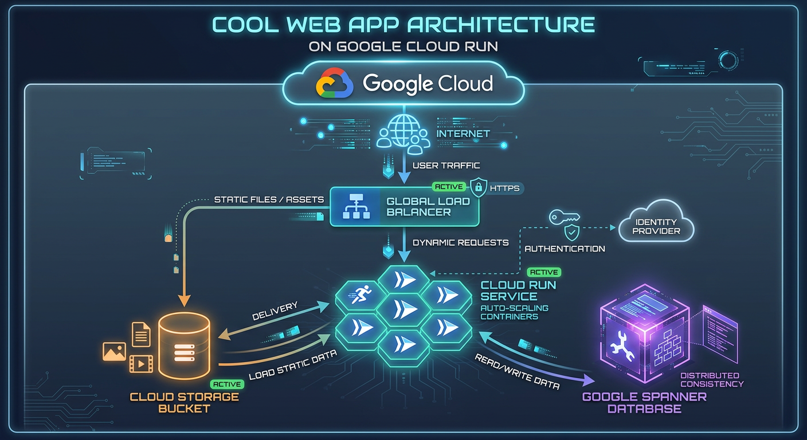

# 815: Hands-On Terraform

### Chapter 1: Infrastructure as Code & Multi-Cloud Provisioning

**ROI Training** — Authoritative Technical Training

---

# Chapter Objectives

In this chapter, you will:

- Learn how Terraform is used to provide Infrastructure as Code (IaC)
- Install and configure Terraform for use with AWS, Azure, and Google Cloud
- Understand state management, plan validation, and provider architecture

---

# Infrastructure Architecture Diagram

- **Declarative Configuration**: Define target cloud resources in HCL files
- **State Management**: Track deployed resources in local or remote state backends
- **Execution Plan**: Preview resource additions, modifications, and deletions before applying



---

# Collaborative Infrastructure Teams

- **Team Coordination**: Enable multiple engineers to work on infrastructure safely
- **Code Review**: PR-based workflow for infrastructure changes
- **Automated Testing**: Validate syntax and security policies in CI/CD pipelines


---

# Terraform Configuration Syntax

Terraform uses HashiCorp Configuration Language (HCL) to define resources:

```hcl
provider "google" {
  project = "roi-training-demo"
  region  = "us-central1"
}

resource "google_compute_instance" "default" {
  name         = "terraform-instance"
  machine_type = "e2-medium"
  zone         = "us-central1-a"

  boot_disk {
    initialize_params {
      image = "debian-cloud/debian-11"
    }
  }

  network_interface {
    network = "default"
  }
}
```

> [!TIP]
> Use `terraform fmt` to automatically format HCL files according to standard conventions.

---

# Cloud Provider Ecosystem

Terraform supports all major cloud platforms through Provider plugins:

| Cloud Provider | Primary Use Case | Popular Resources |
| :--- | :--- | :--- |
| **Google Cloud** | Compute Engine, GKE, BigQuery | `google_compute_instance`, `google_container_cluster` |
| **AWS** | EC2, S3, EKS, Lambda | `aws_instance`, `aws_s3_bucket` |
| **Microsoft Azure** | Virtual Machines, AKS, Blob Storage | `azurerm_virtual_machine`, `azurerm_storage_account` |

---

# Summary & Hands-On Lab

### What We Covered:
1. Core concepts of Infrastructure as Code
2. HCL syntax and resource declaration
3. Multi-cloud provider integration

> [!IMPORTANT]
> Next, switch to **Lab 1: Installing and Configuring Terraform** in your lab manual to complete the hands-on exercises!
